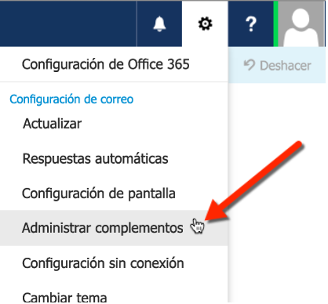
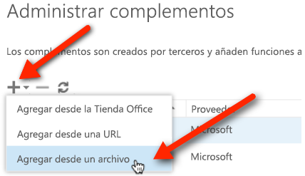

# Transferir localmente complementos de Outlook para pruebas

Puede usar la transferencia local para instalar un complemento de Outlook para pruebas sin tener que ponerlo primero en un catálogo de complementos.

 >**Nota** También puede transferir localmente complementos para otras aplicaciones del conjunto de aplicaciones de Office. Para obtener más información, consulte [Transferir localmente complementos de Office para pruebas](create-a-network-shared-folder-catalog-for-task-pane-and-content-add-ins.md).

## Para transferir localmente complementos de Outlook

1. Vaya a [Outlook Web App](https://outlook.office365.com).
    
2. Elija el icono del engranaje en la sección superior derecha y seleccione  **Administrar complementos**.
    
    

3. En la página  **Administrar complementos**, seleccione el icono  **+** y luego seleccione **Agregar desde un archivo**.
    
    

4. Busque el archivo de manifiesto correspondiente al complemento personalizado e instálelo. Acepte todos los mensajes que aparezcan durante la instalación.
    
Cuando acabe, seleccione un correo electrónico existente y verá una barra horizontal debajo del encabezado de correo electrónico que incluye el complemento. Luego cree un correo electrónico, elija el elemento de menú  **Complementos** (o **Aplicaciones**) para mostrar el panel de tareas. Cuando seleccione el complemento, este aparecerá en el panel de tareas.

    
