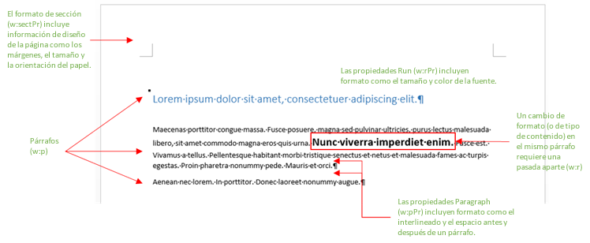

# Crear mejores complementos para Word con Office Open XML

 **Proporcionado por:**    Stephanie Krieger, Microsoft Corporation | Juan Balmori Labra, Microsoft Corporation

Si está creando Office Add-ins que se ejecuten en Word, es probable que sepa que la API de JavaScript API para Office (Office.js) ofrece varios formatos para leer y escribir contenido de documento. Se conocen como tipos de coerción e incluyen texto sin formato, tablas, HTML y Office Open XML.

Así que, ¿cuáles son las opciones a la hora de agregar contenido enriquecido a un documento, como imágenes, tablas con formato, gráficos o incluso simplemente texto con formato? Puede usar HTML para insertar algunos tipos de contenido enriquecido, tales como imágenes. Dependiendo del escenario, puede haber inconvenientes para la coerción de HTML, tales como las limitaciones en las opciones de formato y posición disponibles para el contenido.
Dado que Office Open XML es el lenguaje en el que se escriben los documentos de Word (como .docx y .dotx), puede insertar prácticamente cualquier tipo de contenido que un usuario puede agregar a un documento de Word, con prácticamente cualquier tipo de formato que el usuario pueda aplicar. Determinar el marcado de Office Open XML que necesita es más fácil de lo que parece.

 >**Nota**  Office Open XML es, asimismo, el lenguaje tras los documentos de PowerPoint y Excel (y de Office 2013, Visio). Sin embargo, actualmente, solo puede convertir contenido como Office Open XML en complementos para Office creados para Word. Para más información sobre Office Open XML, incluida toda la documentación sobre la referencia del lenguaje, consulte [Recursos adicionales](../../docs/word/create-better-add-ins-for-word-with-office-open-xml.md#additional-resources).

Para comenzar, eche un vistazo a algunos de los tipos de contenido que puede insertar con la coerción de Office Open XML. Descargue el código de ejemplo [Word-Add-in-Load-and-write-Open-XML](https://github.com/OfficeDev/Word-Add-in-Load-and-write-Open-XML), que contiene el marcado de Office Open XML y el código de Office.js necesarios para insertar cualquiera de los ejemplos siguientes en Word.

 >**Nota**  En todo este artículo, los términos  **tipos de contenido** y **contenido enriquecido** hacen referencia a los tipos de contenido enriquecido que puede insertar en un documento de Word.


**Figura 1. Texto con formato directo.**


Puede usar formato directo para especificar exactamente la apariencia que tendrá el texto, independientemente del formato existente en el documento del usuario.

**Figura 2. Texto formateado con un estilo.**


Puede usar un estilo para coordinar automáticamente la apariencia que tendrá el texto que inserte con el documento del usuario.

**Figura 3. Una imagen sencilla.**


Puede usar el mismo método para insertar cualquier formato de imagen que sea compatible con Office.

**Figura 4. Una imagen formateada con efectos y estilos de imagen.**


Para agregar efectos y formato de gran calidad a sus imágenes necesita mucho menos marcado del que creería.

**Figura 5. Un control de contenido.**


Puede usar controles de contenido con su complemento para agregar contenido en una ubicación (limitada) determinada en lugar de hacerlo en la selección.

**Figura 6. Un cuadro de texto con formato de WordArt.**


Los efectos de texto están disponibles en Word para texto que se encuentre dentro de un cuadro de texto (como se muestra aquí) o para texto de cuerpo normal.

**Figura 7. Una forma.**


Puede insertar formas de dibujo personalizadas o integradas, con o sin texto y efectos de formato.

**Figura 8. Una tabla con formato directo.**


Puede incluir formato de texto, bordes, sombreado, tamaño de celda o cualquier otro formato que necesite.

**Figura 9. Una tabla formateada con un estilo de tabla.**


Puede usar estilos de tabla personalizados o integrados con la misma facilidad con la que usa un estilo de párrafo para texto.

**Figura 10. Un diagrama de SmartArt.**


Office 2013 ofrece una gran variedad de diseños para diagramas de SmartArt (y con Office Open XML puede crear el suyo propio).

**Figura 11. Un gráfico.**


Puede insertar gráficos de Excel como gráficos dinámicos en documentos de Word, lo que significa también que puede usarlos en el complemento para Word.
Como puede ver en los ejemplos anteriores, puede usar la coerción de Office Open XML para insertar básicamente cualquier tipo de contenido que un usuario pueda insertar en sus propios documentos.
Hay dos formas sencillas para obtener el marcado de Office Open XML que necesita. Puede agregar el contenido enriquecido a un documento en blanco de Word 2013 y, después, guardar el archivo en formato de documento XML de Word o usar un complemento de prueba con el método [getSelectedDataAsync](http://msdn.microsoft.com/en-us/library/fp142294.aspx) para tomar el marcado. Ambos enfoques proporcionan básicamente el mismo resultado.

    
 >**Nota** Un documento de Office Open XML es en realidad un paquete comprimido de archivos que representan el contenido del documento. Al guardar el archivo en el formato Documento XML de Word, se obtiene todo el paquete de Office Open XML comprimido en un archivo XML, que también es lo que se obtiene al usar **getSelectedDataAsync** para recuperar el marcado de Office Open XML.

Si guarda el archivo en un formato XML de Word, tenga en cuenta que hay dos opciones en la lista Guardar como tipo en el cuadro de diálogo Guardar como para archivos en formato .xml. Asegúrese de elegir **Documento XML de Word** y no la opción de Word 2003.
Descargue el código de ejemplo denominado [Word-Add-in-Get-Set-EditOpen-XML](https://github.com/OfficeDev/Word-Add-in-Get-Set-EditOpen-XML), que sirve como una herramienta para recuperar y probar su marcado.
¿Así que esto es todo lo que se puede hacer? Bueno, no exactamente. Sí, en muchos escenarios, podría usar el resultado plano completo de Office Open XML que se ve con cualquiera de los métodos anteriores y funcionaría. La buena noticia es que probablemente no necesita la mayoría de ese marcado.
Si usted es uno de los muchos desarrolladores de complementos que está viendo el marcado de Office Open XML por primera vez, intentar dar sentido a la gran cantidad de marcado que obtiene para la parte más sencilla del contenido puede resultar abrumador, pero no tiene por qué serlo.
En este tema, vamos a usar algunos escenarios comunes de los que hemos escuchado en la Comunidad de desarrolladores de complementos de Office para mostrar técnicas para simplificar Office Open XML para su uso en el complemento. Analizaremos el marcado para algunos tipos de contenido que se mostraron anteriormente junto con la información que necesita para minimizar la carga de Office Open XML. También veremos el código que necesita para insertar contenido enriquecido en un documento en la selección activa y cómo usar Office Open XML con el objeto de enlaces para agregar o reemplazar el contenido en las ubicaciones especificadas.

## Explorar el paquete de documentos de Office Open XML


Cuando use [getSelectedDataAsync](http://msdn.microsoft.com/en-us/library/fp142294.aspx) para recuperar Office Open XML para una selección de contenido (o cuando use el documento con formato Documento XML de Word), lo que obtiene no es solo el marcado que describe el contenido seleccionado, sino un documento completo con muchas opciones y configuraciones que, con casi toda seguridad, no necesita. De hecho, si usa ese método desde un documento que contenga un complemento de panel de tareas, el marcado que se obtiene incluirá el panel de tareas también.

Incluso un paquete de documentos de Word contiene elementos del documento, como propiedades, estilos, tema (configuración del formato), configuración web y fuentes, entre otros, además de los elementos del contenido real.

Por ejemplo, supongamos que únicamente quiere insertar un párrafo de texto con formato directo, como se mostró anteriormente en la figura 1. Cuando capte el Office Open XML del texto formateado con  **getSelectedDataAsync**, verá un gran cantidad de marcado. Este marcado incluye un elemento del paquete que representa un documento completo donde se incluyen varios elementos (normalmente se conocen como elementos de documento o, en Office Open XML, elementos del paquete), como puede ver en la figura 13. Cada elemento representa un archivo independiente del paquete.


 >**Sugerencia**  El marcado de Office Open XML se puede editar en un editor de texto como Bloc de notas. Si lo abre en Visual Studio 2015, puede usar  **Edición >Avanzadas> Dar formato al documento** (Ctrl+K, Ctrl+D) para dar formato al paquete y así poder editarlo con más facilidad. Luego se pueden contraer o expandir los elementos o las secciones del documento (tal y como se muestra en la figura 12) para que sea más fácil revisar y editar el contenido del paquete de Office Open XML. Cada uno de los elementos del documento empieza con una etiqueta **pkg:part**.


**Figura 12. Contraer y expandir los elementos de un paquete para editarlos con más facilidad en Visual Studio 2015**


**Figura 13. Los elementos incluidos en un paquete básico de documentos de Word Office Open XML**


Al ver esa cantidad de marcado, le sorprenderá descubrir que los únicos elementos que necesita en realidad para insertar el texto con formato de ejemplo son las unidades del elemento .rels y el elemento document.xml.


    
 >**Nota**  Las dos líneas de marcado que se encuentran sobre la etiqueta del paquete (las declaraciones XML para la versión y el identificador de programa de Office) se dan por sentado cuando usa el tipo de coerción de Office Open XML, por lo que no hace falta incluirlas. Manténgalas si quiere abrir el marcado que ha editado como un documento de Word para probarlo.

Algunos de los otros tipos de contenido que se muestran al inicio de este tema requieren otros elementos también (diferentes a los que aparecen en la figura 13). Se hará referencia a ellos más adelante en este tema y, mientras tanto, se muestra a continuación un rápido resumen de para qué sirve cada uno de estos elementos y cuándo los necesitará:


- Dentro de la etiqueta del paquete, el primer elemento es el archivo .rels, que define las relaciones entre los elementos del nivel superior del paquete (normalmente son las propiedades del documento, miniatura (en caso de haberla) y el cuerpo principal del documento). Parte del contenido de este elemento hace falta siempre en el marcado para poder definir la relación del elemento del documento principal (donde reside el contenido) con el paquete del documento.
    
- El elemento document.xml.rels define las relaciones de los elementos adicionales que requiere el elemento document.xml (cuerpo principal), si existe. 
    

    
 >**Importante**  Los archivos .rels del paquete (como los .rels del nivel superior, document.xml.rels y otros que se pueden ver en determinados tipos de contenido) son una herramienta sumamente importante que se puede usar como una guía para ayudarle a editar el paquete de Office Open XML. Para obtener más información sobre cómo hacerlo, consulte [Crear su propio marcado: procedimientos recomendados](../../docs/word/create-better-add-ins-for-word-with-office-open-xml.md#creating-your-own-markup-best-practices) más adelante en este tema.


- El elemento document.xml es el contenido del cuerpo principal del documento. Los elementos que lo conforman son evidentemente necesarios puesto que es ahí donde aparece el contenido, pero no todo lo que aparece en este elemento. Más adelante se tratará este punto en mayor profundidad.
    
- Muchos elementos se ignoran automáticamente con los métodos Set cuando se inserta contenido en un documento mediante la coerción Office Open XML, por lo que también se pueden eliminar. Estos incluyen el archivo theme1.xml (el tema de formato del documento), los elementos de propiedades del documento (core, add-in, y thumbnail) y los archivos de configuración (incluidos settings, webSettings y fontTable).
    
- En el ejemplo de la ilustración 1, el formato de texto se aplica directamente (es decir, cada configuración de formato de párrafo y fuente se aplica individualmente). Pero, si usa un estilo (por ejemplo, si quiere que el texto herede automáticamente el formato del estilo Título 1 en el documento de destino), como se mostró anteriormente en la ilustración 2, necesitará parte del elemento styles.xml y una definición de relación. Para más información, vea la sección del tema [Agregar objetos que usan otros elementos de Office Open XML](../../docs/word/create-better-add-ins-for-word-with-office-open-xml.md#adding-objects-that-use-additional-office-open-xml-parts).
    

## Insertar contenido del documento en la selección


Veamos el marcado de Office Open XML mínimo que se precisa para el ejemplo de texto de formato que aparece en la figura 1 y el JavaScript necesario para insertarlo en la selección activa del documento.


### Marcado de Office Open XML simplificado

Hemos editado el ejemplo de Office Open XML que se muestra aquí, como se describe en la sección anterior, para dejar únicamente los elementos del documento y los elementos dentro de estos que son necesarios. En la próxima sección del tema, se indicarán todos los pasos que hay que realizar para editar el marcado uno mismo (además de explicar algo más de las piezas que se mantienen).


```XML
<pkg:package xmlns:pkg="http://schemas.microsoft.com/office/2006/xmlPackage">
  <pkg:part pkg:name="/_rels/.rels" pkg:contentType="application/vnd.openxmlformats-package.relationships+xml" pkg:padding="512">
    <pkg:xmlData>
      <Relationships xmlns="http://schemas.openxmlformats.org/package/2006/relationships">
        <Relationship Id="rId1" Type="http://schemas.openxmlformats.org/officeDocument/2006/relationships/officeDocument" Target="word/document.xml"/>
      </Relationships>
    </pkg:xmlData>
  </pkg:part>
  <pkg:part pkg:name="/word/document.xml" pkg:contentType="application/vnd.openxmlformats-officedocument.wordprocessingml.document.main+xml">
    <pkg:xmlData>
      <w:document xmlns:w="http://schemas.openxmlformats.org/wordprocessingml/2006/main" >
        <w:body>
          <w:p>
            <w:pPr>
              <w:spacing w:before="360" w:after="0" w:line="480" w:lineRule="auto"/>
              <w:rPr>
                <w:color w:val="70AD47" w:themeColor="accent6"/>
                <w:sz w:val="28"/>
              </w:rPr>
            </w:pPr>
            <w:r>
              <w:rPr>
                <w:color w:val="70AD47" w:themeColor="accent6"/>
                <w:sz w:val="28"/>
              </w:rPr>
              <w:t>This text has formatting directly applied to achieve its font size, color, line spacing, and paragraph spacing.</w:t>
            </w:r>
          </w:p>
        </w:body>
      </w:document>
    </pkg:xmlData>
  </pkg:part>
</pkg:package>
```


 >**Nota**  Si agrega el marcado que se muestra aquí a un archivo XML junto con las etiquetas de declaración XML para la versión y la aplicación MSO en la parte superior del archivo (en la figura 13), podrá abrirlo en Word como si fuera un documento de Word. O bien sin esas etiquetas, podrá abrirlo mediante  **Archivo> Abrir** en Word. Aparecerá **Modo de compatibilidad** en la barra de título de Word 2013, puesto que ha eliminado la configuración que le indica a Word que se trata de un documento de 2013. Al agregar este marcado a un documento de Word 2013 existente, el contenido no resultará afectado en absoluto.


### JavaScript para usar setSelectedDataAsync


Una vez que haya guardado el Office Open XML anterior como un archivo XML al que pueda acceder desde su solución, podrá usar la siguiente función para establecer el contenido de texto con formato del documento con la coerción de Office Open XML. 

En esta función, observe que todo excepto la última línea se usa para que el marcado guardado se use en la llamada del método [setSelectedDataAsync](http://msdn.microsoft.com/en-us/library/fp142145.aspx) al final de la función. **setSelectedDataASync** solo requiere que especifique el contenido que se va a insertar y el tipo de coerción.


 >**Nota**  Reemplace  _yourXMLfilename_ por el nombre y la ruta del archivo XML que usó al guardarlo en la solución. Si no está seguro de en qué lugar de la solución debe incluir los archivos XML o cómo se hace referencia a ellos en el código, consulte el código de ejemplo [Word-Add-in-Load-and-write-Open-XML](https://github.com/OfficeDev/Word-Add-in-Load-and-write-Open-XML) para ver ejemplos de ello y un ejemplo de trabajo del marcado y JavaScript que se muestran aquí.


```js
function writeContent() {
    var myOOXMLRequest = new XMLHttpRequest();
    var myXML;
    myOOXMLRequest.open('GET', 'yourXMLfilename', false);
    myOOXMLRequest.send();
    if (myOOXMLRequest.status === 200) {
        myXML = myOOXMLRequest.responseText;
    }
    Office.context.document.setSelectedDataAsync(myXML, { coercionType: 'ooxml' });
}
```


## Crear su propio marcado: procedimientos recomendados


Vamos a examinar con más detenimiento el marcado que necesita para insertar el ejemplo de texto de formato anterior.

Para este ejemplo, comience eliminando todos los elementos del documento del paquete excepto .rels y document.xml. Después, editaremos estos dos elementos, que son los que necesitamos, para simplificarlo todo un poco más.


 >**Importante**  Use los elementos .rels como un mapa para evaluar rápidamente lo que está incluido en el paquete y determinar qué elementos se pueden eliminar completamente (es decir, los elementos que no están relacionados con el contenido o a los que este no hace referencia). No olvide que cada elemento de documento debe tener una relación definida en el paquete y esas relaciones aparecen en los archivos .rels. Por lo tanto, todos ellos deben aparecer en algún .rels, document.xml.rels o un archivo .rels específico del contenido.

El siguiente marcado muestra el elemento .rels necesario antes de editarlo. Puesto que vamos a eliminar los elementos de propiedad de documento add-in y core, y el elemento thumbnail, tendremos que eliminar esas relaciones de .rels también. Observe que de este modo solo se mantendrá la relación (con el identificador de relación "rID1" en el siguiente ejemplo) para document.xml.


```XML
  <pkg:part pkg:name="/_rels/.rels" pkg:contentType="application/vnd.openxmlformats-package.relationships+xml" pkg:padding="512">
    <pkg:xmlData>
      <Relationships xmlns="http://schemas.openxmlformats.org/package/2006/relationships">
        <Relationship Id="rId3" Type="http://schemas.openxmlformats.org/package/2006/relationships/metadata/core-properties" Target="docProps/core.xml"/>
        <Relationship Id="rId2" Type="http://schemas.openxmlformats.org/package/2006/relationships/metadata/thumbnail" Target="docProps/thumbnail.emf"/>
        <Relationship Id="rId1" Type="http://schemas.openxmlformats.org/officeDocument/2006/relationships/officeDocument" Target="word/document.xml"/>
        <Relationship Id="rId4" Type="http://schemas.openxmlformats.org/officeDocument/2006/relationships/extended-properties" Target="docProps/app.xml"/>
      </Relationships>
    </pkg:xmlData>
  </pkg:part>
```


 >**Importante** Quite las relaciones (es decir, la etiqueta **Relationship**) de los elementos que eliminó por completo del paquete. Si incluye un elemento sin su relación correspondiente, o si excluye un elemento y deja la relación en el paquete, se producirá un error.

En el siguiente marcado se muestra el elemento document.xml (que incluye el contenido de ejemplo de texto con formato) antes de editarlo.


```XML
<pkg:part pkg:name="/word/document.xml" pkg:contentType="application/vnd.openxmlformats-officedocument.wordprocessingml.document.main+xml">
    <pkg:xmlData>
      <w:document mc:Ignorable="w14 w15 wp14" xmlns:wpc="http://schemas.microsoft.com/office/word/2010/wordprocessingCanvas" xmlns:mc="http://schemas.openxmlformats.org/markup-compatibility/2006" xmlns:o="urn:schemas-microsoft-com:office:office" xmlns:r="http://schemas.openxmlformats.org/officeDocument/2006/relationships" xmlns:m="http://schemas.openxmlformats.org/officeDocument/2006/math" xmlns:v="urn:schemas-microsoft-com:vml" xmlns:wp14="http://schemas.microsoft.com/office/word/2010/wordprocessingDrawing" xmlns:wp="http://schemas.openxmlformats.org/drawingml/2006/wordprocessingDrawing" xmlns:w10="urn:schemas-microsoft-com:office:word" xmlns:w="http://schemas.openxmlformats.org/wordprocessingml/2006/main" xmlns:w14="http://schemas.microsoft.com/office/word/2010/wordml" xmlns:w15="http://schemas.microsoft.com/office/word/2012/wordml" xmlns:wpg="http://schemas.microsoft.com/office/word/2010/wordprocessingGroup" xmlns:wpi="http://schemas.microsoft.com/office/word/2010/wordprocessingInk" xmlns:wne="http://schemas.microsoft.com/office/word/2006/wordml" xmlns:wps="http://schemas.microsoft.com/office/word/2010/wordprocessingShape">
        <w:body>
          <w:p>
            <w:pPr>
              <w:spacing w:before="360" w:after="0" w:line="480" w:lineRule="auto"/>
              <w:rPr>
                <w:color w:val="70AD47" w:themeColor="accent6"/>
                <w:sz w:val="28"/>
              </w:rPr>
            </w:pPr>
            <w:r>
              <w:rPr>
                <w:color w:val="70AD47" w:themeColor="accent6"/>
                <w:sz w:val="28"/>
              </w:rPr>
              <w:t>This text has formatting directly applied to achieve its font size, color, line spacing, and paragraph spacing.</w:t>
            </w:r>
            <w:bookmarkStart w:id="0" w:name="_GoBack"/>
            <w:bookmarkEnd w:id="0"/>
          </w:p>
          <w:p/>
          <w:sectPr>
            <w:pgSz w:w="12240" w:h="15840"/>
            <w:pgMar w:top="1440" w:right="1440" w:bottom="1440" w:left="1440" w:header="720" w:footer="720" w:gutter="0"/>
            <w:cols w:space="720"/>
          </w:sectPr>
        </w:body>
      </w:document>
    </pkg:xmlData>
  </pkg:part>
```

Puesto que document.xml es el elemento de documento principal donde se coloca el contenido, vamos a revisar rápidamente ese elemento. (En la figura 14, que sigue a esta lista, se ofrece una referencia visual donde se muestra cómo algunas de las etiquetas de formato y de contenido básicas que se explican aquí se relacionan con lo que se ve en un documento de Word). 


- La etiqueta de apertura **w:document** incluye varias listas de espacios de nombres (**xmlns**). Muchos de esos espacios de nombres hacen referencia a tipos específicos de contenido y solo los necesita si son relevantes para su contenido.
    
    Observe que el prefijo de las etiquetas a lo largo de una parte del documento hace referencia a los espacios de nombres. En este ejemplo, el único prefijo usado en las etiquetas a lo largo de la parte document.xml es **w:**, por lo que el único espacio de nombres que tenemos que dejar en la etiqueta de apertura **w:document** es **xmlns:w**.
    

 >**Sugerencia** Si edita el marcado en Visual Studio 2015, revise todas las etiquetas del elemento después de eliminar los espacios de nombres. Si quitó un espacio de nombres que era necesario para el marcado, verá un subrayado ondulado rojo en el prefijo correspondiente de las etiquetas afectadas. Si quita el espacio de nombres **xmlns:mc**, también tendrá que quitar el atributo **mc:Ignorable** que precede a la lista de espacios de nombres.


- Dentro de la etiqueta body de apertura, verá una etiqueta de párrafo (**w:p**) con el contenido de muestra del ejemplo.
    
- La etiqueta **w:pPr** incluye propiedades del formato de párrafo que se aplica directamente, como el espacio antes o después del párrafo, la alineación de párrafo o la sangría. (El formato directo hace referencia a atributos que se aplican individualmente a contenido, en lugar de aplicarlos como parte de un estilo). Esta etiqueta también incluye formato de fuente directo que se aplica a todo el párrafo, en una etiqueta **w:rPr** anidada (ejecuta propiedades), que contiene el tamaño y el color de fuente configurados en el ejemplo.
    

 >**Nota** Puede que tenga la sensación de que los tamaños de fuente y algunas otras opciones de formato del marcado de Office Open XML de Word son el doble del tamaño real. Eso se debe a que el interlineado y el espacio entre párrafos, así como algunas propiedades de formato de sección que aparecen en el marcado anterior, se especifican en twips (la vigésima parte de un punto). Según los tipos de contenido con los que trabaje en Office Open XML, Es posible que vea otras unidades de medida, como las unidades métricas inglesas (914 400 EMU en una pulgada), que se usan para algunos valores (drawingML) de Office Art y 100 000 veces el valor real, que se usa tanto en el marcado drawingML como en el marcado de PowerPoint. PowerPoint también expresa algunos valores como 100 veces el real y Excel suele usar valores reales.


- Dentro de un párrafo, cualquier contenido con propiedades similares se incluye en un procesamiento (**w:r**), como es el caso del texto de ejemplo. Cada vez que hay un cambio en el formato o el tipo de contenido, se inicia un nuevo procesamiento. (Es decir, si solo una palabra del texto de ejemplo estaba en negrita, se separaría en su propio procesamiento). En este ejemplo, el contenido solo incluye el procesamiento de un texto.
    
    Tenga en cuenta que, dado que el formato incluido en esta muestra es formato de fuente (es decir, formato que se puede aplicar a incluso un carácter), también aparece en las propiedades del procesamiento individual. 
    
- Tenga en cuenta también las etiquetas del marcador oculto "_GoBack" (**w:bookmarkStart** y **w:bookmarkEnd**), que aparecen en los documentos de Word 2013 de forma predeterminada. Siempre podrá eliminar las etiquetas iniciales y finales del marcador GoBack del marcado.
    
- La última parte del cuerpo del documento es la etiqueta **w:sectPr** o las propiedades de la sección. Esta etiqueta incluye configuraciones como los márgenes y la orientación de página. El contenido que se inserta con **setSelectedDataAsync** usará de forma predeterminada las propiedades de sección activas del documento de destino. Por ello, a menos que el contenido incluya un salto de sección (en cuyo caso verá más de una etiqueta **w:sectPr**), puede eliminar esta etiqueta.
    

**Figura 14. Cómo las etiquetas comunes de document.xml se relacionan con el contenido y el diseño de un documento de Word.**


    
**Sugerencia:**  En el marcado que crea, puede haber otro atributo de varias etiquetas que incluye los caracteres **w:rsid**, que no aparecen en los ejemplos que se usan en este tema. Estos son identificadores de revisión. Se usan en Word en la característica Combinar documentos y están activados de manera predeterminada. Nunca serán necesarios en el marcado que está insertando con el complemento y, si los desactiva, el marcado será mucho más limpio. Puede quitar fácilmente etiquetas RSID existentes o deshabilitar la característica (como se describe en el procedimiento siguiente) para que no se agreguen al marcado para el nuevo contenido.
 
Tenga presente que si usa las funciones de co-autoría en Word (como la capacidad de editar simultáneamente documentos con otras personas), debe habilitar la característica de nuevo cuando termine de generar el marcado para su complemento.
   
Para desactivar atributos RSID en Word en documentos que cree más adelante, haga lo siguiente: 

1. En Word 2013, elija **Archivo** y, después, seleccione **Opciones**.
2. En el cuadro de diálogo Opciones de Word, elija **Centro de confianza** y, luego, **Configuración del Centro de confianza**.
3. En el cuadro de diálogo Centro de confianza, elija **Opciones de privacidad** y, después, deshabilite la opción **Guardar el número aleatorio para mejorar la precisión de combinación**.

Para quitar etiquetas RSID de un documento existente, pruebe con el siguiente método abreviado con el documento abierto en Office Open XML:


1. Con el punto de inserción en el cuerpo principal del documento, presione **Ctrl+Inicio** para ir a la parte superior del documento.
2. En el teclado, presione la **barra espaciadora**, **Suprimir**, **barra espaciadora**. Después, guarde el documento.

Una vez que hemos quitado la mayor parte del marcado de este paquete, nos hemos quedado con el marcado mínimo que hay que insertar en la muestra, como se muestra en la sección anterior.


## Usar la misma estructura de Office Open XML para diferentes tipos de contenido


Varios tipos de contenido enriquecido solo necesitan los componentes .rels y document.xml que se mostraron en el ejemplo anterior, incluidos los controles de contenido, los cuadros de texto y las formas de dibujo de Office, y las tablas (a menos que se aplique un estilo a la tabla). De hecho, puede reutilizar los mismos elementos del paquete editado y reemplazar solo el contenido de **body** de document.xml para el marcado del contenido.

Para echar un vistazo al marcado de Office Open XML de los ejemplos de cada uno de estos tipos de contenido que se mostraron anteriormente en las figuras de la 5 a la 8, examine el ejemplo de código [Word-Add-in-Load-and-write-Open-XML](https://github.com/OfficeDev/Word-Add-in-Load-and-write-Open-XML) que se menciona en la sección [Información general](../../docs/word/create-better-add-ins-for-word-with-office-open-xml.md#bk_Overview).

Antes de continuar, nos fijaremos en las diferencias que hay que tener en cuenta en un par de estos tipos de contenido y en cómo se reemplazan las partes que necesita.


### Comprender el marcado drawingML (gráficos de Office) en Word: ¿qué son las reservas?

Si el marcado de su forma o cuadro de texto tiene un aspecto bastante más complejo del que esperaba, hay un motivo para ello. A partir de Office 2007, se empezaron a usar los formatos Office Open XML y un nuevo motor gráfico de Office que PowerPoint y Excel adoptaron en su totalidad. En la versión de 2007, Word solo incorporó parte de ese motor gráfico (adoptó el motor gráfico de Excel actualizado, los elementos gráficos SmartArt y las herramientas de dibujo avanzadas). En el caso de formas y cuadros de texto, Word 2007 siguió usando los objetos de dibujo heredados (VML). Fue en la versión de 2010 donde se tomaron los pasos adicionales necesarios en Word en relación con el motor gráfico y se incorporaron las herramientas de dibujo y las formas actualizadas.

Por ello, para admitir formas y cuadros de texto en documentos de Word con formato Office Open XML cuando se abren en Word 2007, las formas (incluidos los cuadros de texto) necesitan el marcado VML de reserva.

Por lo general, como puede ver en los ejemplos de formas y cuadros de texto que se incluyen en el ejemplo de código [Word-Add-in-Load-and-write-Open-XML](https://github.com/OfficeDev/Word-Add-in-Load-and-write-Open-XML), es posible quitar el marcado de reserva. Word 2013 agrega automáticamente el marcado de reserva que falte para las formas cuando se guarda un documento. Sin embargo, si prefiere mantenerlo para admitir todos los posibles escenarios del usuario, hacerlo no provoca ningún problema.

Si agrupó los objetos de dibujo incluidos en su contenido, verá marcado adicional (y aparentemente repetitivo), pero este sí habrá que mantenerlo. Algunas partes del marcado para formas de dibujo se duplican cuando el objeto está incluido en un grupo.


 >**Importante**  Cuando trabaje con cuadros de texto y formas de dibujo, asegúrese de comprobar con cuidado los espacios de nombre antes de quitarlos de document.xml. (O bien si va a reusar el marcado de otro tipo de objeto, asegúrese de agregar de nuevo los espacios de nombres que sean necesarios y que se hayan quitado antes de document.xml). Una gran parte de los espacios de nombres que se incluyen de forma predeterminada en document.xml están ahí por requisitos del objeto de dibujo.


#### Acerca del posicionamiento de gráficos

En los ejemplos de código [Word-Add-in-Load-and-write-Open-XML](https://github.com/OfficeDev/Word-Add-in-Load-and-write-Open-XML) y [Word-Add-in-Get-Set-EditOpen-XML](https://github.com/OfficeDev/Word-Add-in-Get-Set-EditOpen-XML), el cuadro de texto y la forma se configuran con diferentes tipos de opciones para el ajuste de texto y el posicionamiento. (Tenga también en cuenta que los ejemplos de imagen de esos ejemplos de código se configuran en línea con el formato de texto, que coloca un objeto gráfico en la línea base del texto).

La forma en esos ejemplos de código se posiciona en relación a los márgenes de página inferior y derecho. El posicionamiento relativo le permite coordinarse de una manera más sencilla con la configuración de documento desconocida de un usuario, puesto que se ajustará a los márgenes del usuario y se reducirán los riesgos de que el resultado final sea tosco en cuanto a la configuración del tamaño del papel, la orientación o los márgenes. Para conservar la configuración de posicionamiento relativo cuando inserte un objeto gráfico, debe conservar la marca de párrafo (w:p) en la que se almacena el posicionamiento (en Word se conoce como un delimitador). Si inserta el contenido en una marca de párrafo existente en lugar de incluir la suya propia, debería poder conservar el mismo objeto visual inicial, pero podrían perderse muchos tipos de referencias relativas que habilitan el posicionamiento para que se ajuste automáticamente al diseño del usuario.


### Trabajar con controles de contenido

Los controles de contenido son una característica importante de Word 2013 que pueden mejorar enormemente el potencial de su complemento para Word de múltiples formas, incluida la posibilidad de insertar contenido en lugares designados en el documento en lugar de únicamente en la selección.

En Word, busque los controles de contenido en la pestaña Programador de la cinta de opciones, como se muestra aquí en la figura 15.


**Figura 15. El grupo Controles en la pestaña Programador de Word.**


Los tipos de controles de contenido en Word incluyen texto enriquecido, texto sin formato, imagen, galería de bloques de creación, casilla, lista desplegable, cuadro combinado, selector de fecha y sección de repetición. 


- Use el comando  **Propiedades**, que se muestran en la figura 15, para editar el título del control y para establecer preferencias como ocultar el contenedor de controles.
    
- Habilite  **Modo Diseño** para editar el marcador de posición del control.
    
Si su complemento funciona con una plantilla de Word, puede incluir controles en esa plantilla para mejorar el comportamiento del contenido. También puede usar el enlace de datos XML en un documento de Word para enlazar controles de contenido a datos, como propiedades del documento, para poder completar formularios de forma sencilla u otras tareas similares. (Busque controles que estén ya enlazados a las propiedades de documento integradas en Word en la pestaña  **Insertar**, en  **Elementos rápidos**).

Cuando se usan controles de contenido con el complemento, también se pueden ampliar enormemente las opciones de lo que este puede hacer mediante un tipo diferente de enlace. Se puede enlazar a un control de contenido desde el complemento y luego escribir el contenido en el enlace en lugar de hacerlo en la selección activa.


    
 >**Nota**  No hay que confundir el enlace de datos XML en Word con la posibilidad de establecer un enlace a un control a través de su complemento. Son características totalmente diferentes. Sin embargo, puede incluir controles de contenido con nombre en el contenido que inserte a través de su complemento con la coerción de OOXML y, después, usar código en el complemento para establecer un enlace a esos controles.

Tenga también en cuenta que tanto el enlace de datos XML como Office.js pueden interactuar con elementos XML personalizados en su aplicación (y, por lo tanto, se pueden integrar estas herramientas tan eficaces). Para aprender a trabajar con elementos XML personalizados en la API de JavaScript para Office, vea la sección [Recursos adicionales](../../docs/word/create-better-add-ins-for-word-with-office-open-xml.md#additional-resources) de este tema.

En la siguiente sección del tema se trata el trabajo con enlaces en su complemento de Word. En primer lugar, vamos a echar un vistazo a un ejemplo del Office Open XML que hace falta para insertar un control de contenido de texto enriquecido al que se puede enlazar con su complemento.


    
 >**Importante**  Los controles de texto enriquecido son el único tipo de control de contenido que puede usar para establecer un enlace a un control de contenido desde el complemento.


```XML
<pkg:package xmlns:pkg="http://schemas.microsoft.com/office/2006/xmlPackage">
  <pkg:part pkg:name="/_rels/.rels" pkg:contentType="application/vnd.openxmlformats-package.relationships+xml" pkg:padding="512">
    <pkg:xmlData>
      <Relationships xmlns="http://schemas.openxmlformats.org/package/2006/relationships">
        <Relationship Id="rId1" Type="http://schemas.openxmlformats.org/officeDocument/2006/relationships/officeDocument" Target="word/document.xml"/>
      </Relationships>
    </pkg:xmlData>
  </pkg:part>
  <pkg:part pkg:name="/word/document.xml" pkg:contentType="application/vnd.openxmlformats-officedocument.wordprocessingml.document.main+xml">
    <pkg:xmlData>
      <w:document xmlns:w="http://schemas.openxmlformats.org/wordprocessingml/2006/main" xmlns:w15="http://schemas.microsoft.com/office/word/2012/wordml" >
        <w:body>
          <w:p/>
          <w:sdt>
              <w:sdtPr>
                <w:alias w:val="MyContentControlTitle"/>
                <w:id w:val="1382295294"/>
                <w15:appearance w15:val="hidden"/>
                <w:showingPlcHdr/>
              </w:sdtPr>
              <w:sdtContent>
                <w:p>
                  <w:r>
                  <w:t>[This text is inside a content control that has its container hidden. You can bind to a content control to add or interact with content at a specified location in the document.]</w:t>
                </w:r>
                </w:p>
              </w:sdtContent>
            </w:sdt>
          </w:body>
      </w:document>
    </pkg:xmlData>
  </pkg:part>
 </pkg:package>
```

Como se mencionó anteriormente, los controles de contenido (como texto con formato) no necesitan elementos de documento adicionales, por lo que aquí solo se incluyen las versiones editadas de .rels y document.xml. 

La etiqueta **w:sdt** que ve dentro del cuerpo de document.xml representa el control de contenido. Cuando genere el marcado de Office Open XML para un control de contenido, verá que se eliminan varios atributos del ejemplo, como las propiedades de etiqueta y de elemento de documento. Solo se conservan elementos fundamentales (y un par de procedimientos recomendados), entre los que se incluyen los siguientes:


- El **alias** es la propiedad de título del cuadro de diálogo Propiedades del control de contenido de Word. Es una propiedad obligatoria (representa el nombre del elemento) si planea establecer un enlace al control desde el complemento.
    
- El **id** único es una propiedad obligatoria. Si se enlaza al control desde el complemento, ID es la propiedad que usa el enlace en el documento para identificar el control de contenido con nombre correspondiente.
    
- El atributo **appearance** se usa para ocultar el contenedor de controles y darle un aspecto más despejado. Es una característica nueva en Word 2013, como puede ver al usar el espacio de nombres w15. Como se usa esta propiedad, se mantendrá el espacio de nombres w15 al inicio del elemento document.xml.
    
- El atributo **showingPlcHdr** es una opción de configuración opcional que establece el contenido predeterminado que se incluye dentro del control (en este ejemplo, texto) como marcador de posición. De este modo, si el usuario hace clic o pulsa en el área de controles, se seleccionará todo el contenido, en lugar de comportarse como contenido editable donde el usuario puede realizar cambios.
    
- Aunque la marca de párrafo vacía (**w:p/**) que precede a la etiqueta **sdt** no es necesaria para agregar un control de contenido (y, en cambio, agregará espacio vertical encima del control en el documento de Word), garantiza que el control se coloque en su propio párrafo. Esto puede ser importante según el tipo y el formato de contenido que quiera agregar al control.
    
- Si quiere enlazar al control, el contenido predeterminado del control (lo que está dentro de la etiqueta **sdtContent**) tiene que incluir, como mínimo, un párrafo completo (como en este ejemplo) para que el enlace acepte contenido enriquecido de varios párrafos.
    

    
 >**Nota** El atributo de elemento de documento que se quitó de la etiqueta **w:sdt** de ejemplo podría aparecer en un control de contenido para hacer referencia a un elemento independiente del paquete, donde se puede almacenar la información del marcador de posición (elementos situados en un directorio de glosarios en el paquete de Office Open XML). Aunque "elemento de documento" es el término que se usa para los elementos XML (es decir, los archivos) dentro de un paquete de Office Open XML, el término "elementos de documento", como se usa en la propiedad sdt, hace referencia al mismo término de Word que se usa para describir algunos tipos de contenido, como los bloques de creación y los elementos rápidos de propiedad de documento (por ejemplo, los controles XML integrados enlazados a datos). Si ve elementos en un directorio de glosarios de su paquete de Office Open XML, es posible que tenga que conservarlos si el contenido que va a insertar incluye estas características. Pero no son necesarios para los controles de contenido habituales que se usan para establecer un enlace desde el complemento. Tan solo recuerde que, si elimina los elementos de glosario del paquete, también tendrá que quitar el atributo de elemento de documento de la etiqueta w:sdt.

En la siguiente sección, trataremos cómo se crean y se usan los enlaces en su complemento de Word.


## Insertar contenido en una ubicación designada


Ya hemos visto cómo se inserta contenido en la selección activa de un documento de Word. Si se enlaza a un control de contenido con nombre que esté en el documento, podrá insertar cualquiera de los mismos tipos de contenido en ese control. 

En ese caso, ¿cuándo podría ser útil ese enfoque?


- Cuando tenga que agregar o reemplazar contenido en determinadas ubicaciones de una plantilla, como, por ejemplo, para rellenar partes del documento desde una base de datos
    
- Cuando quiera tener la opción de reemplazar el contenido que esté insertando en la selección activa, como, por ejemplo, cuando se ofrecen opciones de elementos de diseño al usuario
    
- Cuando quiera que el usuario agregue datos en el documento a los que pueda acceder para usarlos con su complemento, como, por ejemplo, para rellenar campos en el panel de tareas basándose en la información que agregue el usuario en el documento
    
Descargue el ejemplo de código [Word-Add-in-JavaScript-AddPopulateBindings](https://github.com/OfficeDev/Word-Add-in-JavaScript-AddPopulateBindings), donde se proporciona un ejemplo de trabajo sobre cómo insertar y establecer un enlace a un control de contenido, y cómo rellenar el enlace.


### Agregar y establecer un enlace a un control de contenido con nombre


Cuando examine el JavaScript a continuación, tenga en cuenta los siguientes requisitos:


- Como se ha mencionado anteriormente, debe usar un control de contenido de texto enriquecido para poder establecer un enlace al control desde su complemento de Word.
    
- El control de contenido tiene que tener un nombre (es el campo **Título** del cuadro de diálogo Propiedades del control de contenido, que se corresponde con la etiqueta **Alias** del marcado de Office Open XML). Así es como el código identifica dónde se va a colocar el enlace.
    
- Puede tener varios controles con nombre y establecer enlaces a ellos en la medida que necesite. Use un nombre de control de contenido único, un identificador de control de contenido único y un identificador de enlace único.
    

```js
function addAndBindControl() {
        Office.context.document.bindings.addFromNamedItemAsync("MyContentControlTitle", "text", { id: 'myBinding' }, function (result) {
            if (result.status == "failed") {
                if (result.error.message == "The named item does not exist.")
                    var myOOXMLRequest = new XMLHttpRequest();
                    var myXML;
                    myOOXMLRequest.open('GET', '../../Snippets_BindAndPopulate/ContentControl.xml', false);
                    myOOXMLRequest.send();
                    if (myOOXMLRequest.status === 200) {
                        myXML = myOOXMLRequest.responseText;
                    }
                    Office.context.document.setSelectedDataAsync(myXML, { coercionType: 'ooxml' }, function (result) {
                        Office.context.document.bindings.addFromNamedItemAsync("MyContentControlTitle", "text", { id: 'myBinding' });
                    });
            }
            });
        }
```

El código que se muestra aquí lleva a cabo los siguientes pasos:


- Intenta establecer un enlace al control de contenido con nombre con [addFromNamedItemAsync](http://msdn.microsoft.com/en-us/library/fp123590.aspx). 
    
    Realice este paso en primer lugar si hay un escenario posible para el complemento donde el control con nombre ya podría existir en el documento cuando se ejecuta el código. Por ejemplo, necesitará hacerlo si se insertó y se guardó el complemento con una plantilla que se ha diseñado para trabajar con el complemento, donde se colocó el control de antemano. También debe hacerlo si necesita enlazar a un control que el complemento ha colocado anteriormente.
    
- La devolución de llamada en la primera llamada al método  **addFromNamedItemAsync** comprueba el estado del resultado para ver si se ha producido un error en el enlace porque el elemento con nombre no exista en el documento (es decir, el control de contenido llamado MyContentControlTitle en este ejemplo). En ese caso, el código agrega el control en el punto de selección activo (usando **setSelectedDataAsync** ) y después se enlaza a él.
    

 >**Nota**  Como se ha mencionado anteriormente y se muestra en el código anterior, el nombre del control de contenido se usa para determinar dónde se va a crear el enlace. Sin embargo, en el marcado de Office Open XML, el código agrega el enlace al documento usando tanto el nombre como el atributo ID del control de contenido.

Después de ejecutar el código, si examina el marcado del documento donde el complemento creó los enlaces, verá dos elementos en cada enlace. En el marcado del control de contenido donde se agregó un enlace (en document.xml), verá el atributo **w15:webExtensionLinked/**.

En el elemento de documento denominado webExtensions1.xml, verá una lista de los enlaces que ha creado. Cada uno se identifica con el identificador de enlace y el atributo ID del control correspondiente, como el siguiente, donde el atributo **appref** es el identificador del control de contenido: ** **we:binding id="myBinding" type="text" appref="1382295294"/**.


 >**Importante**  Debe agregar el enlace en el momento en el que intente actuar sobre él. No incluya el marcado del enlace en el Office Open XML para insertar el control de contenido, porque el proceso de inserción de ese marcado puede quitar el enlace.


### Rellenar un enlace


El código para escribir contenido en un enlace es similar al que se usa para escribir contenido en una selección.


```js
function populateBinding(filename) {
        var myOOXMLRequest = new XMLHttpRequest();
        var myXML;
        myOOXMLRequest.open('GET', filename, false);
            myOOXMLRequest.send();
            if (myOOXMLRequest.status === 200) {
                myXML = myOOXMLRequest.responseText;
            }
            Office.select("bindings#myBinding").setDataAsync(myXML, { coercionType: 'ooxml' });
        }
```

Al igual que ocurre con  **setSelectedDataAsync**, se especifica el contenido que se va a insertar y el tipo de coerción. El único requisito adicional a la hora de escribir en un enlace es que hay que identificar el enlace mediante un Id. Observe cómo el identificador de enlace que se usa en este código (bindings#myBinding) se corresponde con el identificador de enlace que se estableció (myBinding) cuando se creó el enlace en la función anterior.


 >**Nota**  Todo lo que necesita en un principio para rellenar o reemplazar el contenido en un enlace es el código anterior. Cuando inserte un contenido nuevo en una ubicación enlazada, el contenido de ese enlace se reemplazará automáticamente. Vea un caso en el ejemplo de código mencionado anteriormente [Word-Add-in-JavaScript-AddPopulateBindings](https://github.com/OfficeDev/Word-Add-in-JavaScript-AddPopulateBindings), donde se proporcionan dos ejemplos de código que puede usar indistintamente para rellenar el mismo enlace.


## Añadir objetos que usen elementos de Office Open XML adicionales


Muchos tipos de contenido precisan otros elementos de documento del paquete de Office Open XML, lo que significa que bien hacen referencia a información que se encuentra en otro elemento o bien el contenido en sí se almacena en uno o en varios elementos adicionales y se hace referencia a ellos en document.xml.

Por ejemplo, tenga en cuenta lo siguiente:


- El contenido que usa estilos de formato (como el texto con estilo que se muestra en la figura 2 o la tabla con estilo de la figura 9) necesita el elemento styles.xml.
    
- Las imágenes (como las que se muestran en las figuras 3 y 4) incluyen datos de imagen binarios en un elemento adicional (y, a veces, en dos).
    
- Los diagramas SmartArt (como los que se muestran en la figura 10) necesitan múltiples elementos adicionales para describir el diseño y el contenido.
    
- Los gráficos (como los que se muestran en la figura 11) necesitan múltiples elementos adicionales, incluido el elemento de su propia relación (.rels).
    
En el ejemplo de código [Word-Add-in-Load-and-write-Open-XML](https://github.com/OfficeDev/Word-Add-in-Load-and-write-Open-XML), mencionado también anteriormente, se pueden ver ejemplos editados del marcado para todos estos tipos de contenido. Todos ellos se pueden insertar con el mismo código JavaScript que se mostró anteriormente (y que se proporciona en los ejemplos de código mencionados) para insertar contenido en la selección activa y escribir contenido en una ubicación determinada mediante enlaces.

Antes de revisar los ejemplos, vamos a ver unas cuantas sugerencias que pueden ayudarle a la hora de trabajar con cada uno de estos tipos de contenido.


 >**Importante**  Recuerde que, si quiere conservar algunos elementos adicionales en document.xml, tendrá que conservar document.xml.rels y las definiciones de las relaciones que corresponden a esos elementos que está manteniendo, como styles.xml o un archivo de imagen.


### Trabajar con estilos

Cuando se usan estilos de párrafo o estilos de tabla para dar formato al contenido se aplica el mismo enfoque que se usa para editar el marcado que vimos en el ejemplo anterior con texto al que se da formato directamente. Sin embargo, el marcado para trabajar con estilos de párrafo es bastante más sencillo, por lo que es el que se describe aquí.


#### Editar el marcado para contenido con estilos de párrafo

El siguiente marcado representa el contenido del cuerpo para el ejemplo de texto con estilo de la figura 2.


```XML
<w:body>
  <w:p>
    <w:pPr>
      <w:pStyle w:val="Heading1"/>
    </w:pPr>
    <w:r>
      <w:t>This text is formatted using the Heading 1 paragraph style.</w:t>
    </w:r>
  </w:p>
</w:body>
```


 >**Nota**  Como puede ver, el marcado para texto con formato de document.xml es bastante más sencillo cuando se usa un estilo, puesto que este contiene todo el formato de párrafo y fuente al que, de otra manera, tendría que hacer referencia individualmente. Sin embargo, como también se explicó anteriormente, podría suceder que quiera usar estilos o formato directo por diferentes motivos: use el formato directo para especificar la apariencia de su texto independientemente del formato del documento del usuario; use un estilo de párrafo (en concreto un nombre de estilo de párrafo integrado, como el de Título 1 que se muestra aquí) para que el formato de texto se coordine automáticamente con el documento del usuario.

El uso de un estilo es un buen ejemplo de lo importante que es leer y comprender el marcado del contenido que va a insertar, porque no se indica de forma explícita que otro elemento de documento se mencione aquí. Si incluye la definición de estilo en este marcado y no incluye el elemento styles.xml, se omitirá la información de estilo en document.xml, independientemente de que ese estilo se use o no en el documento del usuario.

Sin embargo, si echa un vistazo al elemento styles.xml, verá que solo se necesitará una pequeña parte de este marcado tan largo cuando edite el marcado para usarlo en su complemento:


- El elemento styles.xml incluye varios espacios de nombres de forma predeterminada. Si solo va a conservar la información de estilo que necesita para su contenido, en la mayoría de casos solo tendrá que mantener el espacio de nombres **xmlns:w**.
    
- El contenido de la etiqueta **w:docDefaults** que se sitúa en la parte superior del elemento de estilos se omitirá cuando el marcado se inserte a través del complemento. En estos casos, se puede quitar.
    
- La cantidad más grande de marcado en un elemento styles.xml corresponde a la etiqueta **w:latentStyles**, que aparece después de docDefaults. Proporciona información (como los atributos de apariencia del panel Estilos y la galería Estilos) para cada estilo disponible. Esta información se ignorará también cuando inserte contenido a través del complemento y, por lo tanto, se puede quitar.
    
- Si sigue la información de estilos latentes, verá una definición por cada estilo que se use en el documento desde el que se haya generado el marcado. Esto incluye algunos estilos predeterminados que se estén usando al crear un documento nuevo y que podrían no ser relevantes para su contenido. Puede eliminar las definiciones para los estilos que no esté usando el contenido.
    

 >**Nota** Cada estilo de título integrado tiene un estilo de carácter asociado (es decir, una versión del estilo de carácter del mismo formato de título). A menos que haya aplicado el estilo de título como un estilo de carácter, puede quitarlo. Si el estilo se usa como un estilo de carácter, aparecerá en document.xml en una etiqueta de propiedades de ejecución (**w:rPr**), en lugar de una etiqueta de propiedades de párrafo (**w:pPr**). Esto solo pasará si aplica el estilo a solo una parte de un párrafo, aunque también puede suceder por error si el estilo no se aplicó correctamente.


- Si está usando un estilo integrado para su contenido, no tiene que incluir una definición completa. Solo debe incluir el nombre del estilo, el Id. de estilo y, al menos, un atributo de formato para que el Office Open XML obligatorio aplique el estilo a su contenido tras insertarlo.
    
    Pero es aconsejable incluir una definición de estilo completa (incluso si es el valor predeterminado para los estilos integrados). Si un estilo ya está en uso en el documento de destino, el contenido adoptará la definición residente para el estilo, independientemente de lo que incluya en styles.xml. Si el estilo todavía no está en uso en el documento de destino, el contenido usará la definición de estilo especificada en el marcado.
    
De este modo, por ejemplo, lo siguiente es lo único contenido que necesitábamos conservar del elemento styles.xml para el texto de ejemplo de la figura 2, al que se aplica formato con el estilo Título 1. 


 >**Nota**  En este ejemplo se ha conservado una definición completa de Word 2013 para el estilo Título 1.


```XML
<pkg:part pkg:name="/word/styles.xml" pkg:contentType="application/vnd.openxmlformats-officedocument.wordprocessingml.styles+xml">
  <pkg:xmlData>
    <w:styles xmlns:w="http://schemas.openxmlformats.org/wordprocessingml/2006/main" >
      <w:style w:type="paragraph" w:styleId="Heading1">
        <w:name w:val="heading 1"/>
        <w:basedOn w:val="Normal"/>
        <w:next w:val="Normal"/>
        <w:link w:val="Heading1Char"/>
        <w:uiPriority w:val="9"/>
        <w:qFormat/>
        <w:pPr>
          <w:keepNext/>
          <w:keepLines/>
          <w:spacing w:before="240" w:after="0" w:line="259" w:lineRule="auto"/>
          <w:outlineLvl w:val="0"/>
        </w:pPr>
        <w:rPr>
          <w:rFonts w:asciiTheme="majorHAnsi" w:eastAsiaTheme="majorEastAsia" w:hAnsiTheme="majorHAnsi" w:cstheme="majorBidi"/>
          <w:color w:val="2E74B5" w:themeColor="accent1" w:themeShade="BF"/>
          <w:sz w:val="32"/>
          <w:szCs w:val="32"/>
        </w:rPr>
      </w:style>
    </w:styles>
  </pkg:xmlData>
</pkg:part>
```


#### Editar el marcado para contenido usando estilos de tabla


Si el contenido usa un estilo de tabla, necesitará el mismo elemento relativo de styles.xml que se ha descrito para trabajar con estilos de párrafo. Es decir, solo necesita conservar la información del estilo que use en el contenido (que tiene que incluir el nombre, el identificador y, como mínimo, un atributo de formato), pero sería mucho mejor incluir una definición de estilo completa que permita abordar todos los escenarios del usuario posibles.

Sin embargo, cuando vea el marcado para la tabla en document.xml y para la definición de estilo de tabla en styles.xml, verá que la cantidad de marcado es mucho mayor que cuando trabajó con estilos de párrafo.


- En document.xml, el formato se aplica por celda incluso si está incluido en un estilo. Usar un estilo de tabla no reducirá el volumen de marcado. La ventaja que se obtiene al usar estilos de tabla para el contenido es que permite actualizar y coordinar fácilmente el aspecto de varias tablas.
    
- En styles.xml, verá una cantidad considerable de marcado para un solo estilo de tabla también, porque los estilos de tabla incluyen varios tipos de los atributos de formato posibles para cada una de las diversas áreas de la tabla, como son la tabla entera, las filas de título, las bandas en filas y columnas pares e impares (por separado), la primera columna, etc. 
    

### Trabajar con imágenes


El marcado de una imagen incluye una referencia al menos a un elemento que incluya los datos binarios para describir la imagen. En el caso de imágenes complejas, el marcado puede ocupar cientos de páginas y no se puede editar. Como los elementos binarios no se tienen que tocar nunca, solo tiene que contraerlos si está usando un editor estructurado, como Visual Studio, de manera que pueda seguir revisando y editando fácilmente el resto del paquete.

Si observa el marcado de ejemplo para la imagen sencilla que aparecía anteriormente en la ilustración 3, disponible en el ejemplo de código [Word-Add-in-Load-and-write-Open-XML](https://github.com/OfficeDev/Word-Add-in-Load-and-write-Open-XML) mencionado anteriormente, verá que el marcado de la imagen de document.xml incluye información sobre el tamaño y la posición, así como una referencia de relación al elemento que contiene los datos de imagen binarios. Esa referencia se incluye en la etiqueta **a:blip**, como se muestra a continuación:


```XML
<a:blip r:embed="rId4" cstate="print">
```

Tenga en cuenta que, como se usa una referencia de relación de forma explícita ( **r:embed="rID4"** ) y ese elemento relacionado se requiere para representar la imagen, si no incluye los datos binarios en el paquete de Office Open XML obtendrá un error. En este aspecto es diferente a styles.xml, explicado anteriormente, que no lanza ningún error si se omiten, puesto que no se hace referencia explícita a la relación y la relación es con un elemento que proporciona atributos al contenido (formato) en lugar de ser parte con el contenido en sí.


 >**Nota** Cuando revise el marcado, observe los espacios de nombres adicionales que se usan en la etiqueta a:blip. En document.xml, verá que el nombre de espacios **xlmns:a** (el nombre de espacios drawingML principal) se sitúa de forma dinámica donde se empiezan a usar las referencias drawingML, en lugar de hacerlo en la parte superior del elemento document.xml. Pero el nombre de espacios (r) de relaciones tiene que permanecer donde aparece al principio de document.xml. Compruebe el marcado de imagen para ver otros requisitos de nombres de espacios. Recuerde que no es tiene por qué recordar los tipos de contenido que necesitan determinados espacios de nombres, ya que lo puede saber fácilmente si revisa los prefijos de las etiquetas en document.xml.


### Descripción de formato y elementos de imagen adicionales


Cuando se usan algunos efectos de formato de imagen de Office en una imagen (como en la imagen de la ilustración 4, donde se usan opciones ajustadas de contraste y brillo, además de los estilos de la imagen), puede que sea necesario usar un segundo elemento de datos binarios para obtener una copia en formato HD de los datos de imágenes. Este formato HD adicional es necesario para formatos que se consideran un efecto en capas y la referencia a este aparece en document.xml de forma similar a la siguiente:


```XML
<a14:imgLayer r:embed="rId5">
```

Vea el marcado necesario para la imagen con formato de la figura 4 (en el que se usan efectos de capa, entre otros) en el ejemplo de código [Word-Add-in-Load-and-write-Open-XML](https://github.com/OfficeDev/Word-Add-in-Load-and-write-Open-XML).


### Trabajar con diagramas de SmartArt


Un diagrama de SmartArt tiene cuatro elementos asociados, pero solo dos deben estar siempre. Puede examinar un ejemplo de marcado de SmartArt en el ejemplo de código [Word-Add-in-Load-and-write-Open-XML](https://github.com/OfficeDev/Word-Add-in-Load-and-write-Open-XML). En primer lugar, vea una breve descripción de cada uno de los elementos y de por qué son o no son necesarios:


 >**Nota**  Si su contenido incluye más de un diagrama, se enumerarán de forma consecutiva y se reemplazará el 1 en los nombres de archivo que se muestran aquí.


- layout1.xml: este elemento es necesario. Incluye la definición de marcado para las funciones y la apariencia del diseño.
    
- data1.xml: este elemento es necesario. Incluye los datos que se están usando en su instancia del diagrama.
    
- drawing1.xml: este elemento no siempre es necesario, pero, si aplica formato personalizado a los elementos de diagrama de ejemplo (como formas individuales de formato directo), es posible que tenga que conservarlo.
    
- colors1.xml: este elemento no es necesario. Incluye información sobre el estilo del color, pero los colores de su diagrama se coordinarán de forma predeterminada con los colores del tema de formato activo del documento de destino, en función del estilo de color de SmartArt que aplique desde la pestaña de diseño Herramientas de SmartArt en Word antes de guardar su marcado de Office Open XML.
    
- quickStyles1.xml: este elemento no es necesario. Al igual que ocurre con el elemento colors, puede quitarlo, puesto que el diagrama tomará la definición del estilo de SmartArt aplicado que esté disponible en el documento de destino (es decir, se coordinará automáticamente con el tema de formato del documento de destino).
    

 >**Sugerencia** El archivo SmartArt layout1.xml es un buen ejemplo de los sitios donde podría recortar el marcado, pero que no merece la pena hacerlo por el tiempo adicional que se tardaría en hacerlo (porque se quita una cantidad pequeña de marcado en relación con todo el paquete). Si quiere eliminar todas las últimas líneas de marcado posibles, puede eliminar la etiqueta **dgm:sampData** y su contenido. Estos datos de ejemplo definen cómo la vista previa de miniaturas del diagrama aparecerá en las galerías de estilos de SmartArt. Pero, si se omiten, se usarán los datos de ejemplo predeterminados.

Tenga en cuenta que el marcado para un diagrama de SmartArt en document.xml contiene referencias al identificador de relación con los elementos layout, data, colors y quick styles. Podrá eliminar las referencias de document.xml a los elementos colors y styles cuando elimine esos elementos y sus definiciones de relación (y, en efecto, se recomienda hacerlo, puesto que estará eliminando esas relaciones), pero no obtendrá un error si las deja, puesto que no son necesarias para poder insertar el diagrama en un documento. Busque esas referencias en document.xml con la etiqueta  **dgm:relIds**. Tanto si realiza este paso como si no, conserve las referencias al identificador de relación para los elementos layout y data necesarios.


### Trabajar con gráficos


Al igual que ocurre con los diagramas de SmartArt, los gráficos contienen varios elementos adicionales. Sin embargo, la configuración de gráficos es algo diferente de la de SmartArt en el hecho de que un gráfico tiene su propio archivo de relaciones. A continuación se muestra una descripción de los elementos de documento necesarios y los que se pueden quitar en un gráfico:


 >**Nota**  Al igual que ocurre con los diagramas de SmartArt, si el contenido incluye más de un gráfico, se enumerarán de forma consecutiva y se reemplazará el 1 en los nombres de archivo que se muestran aquí.


- En document.xml.rels, verá una referencia al elemento necesario que contiene los datos que se describen en el gráfico (chart1.xml).
    
- También verá un archivo de relación independiente para cada gráfico de su paquete de Office Open XML, como chart1.xml.rels.
    
    En chart1.xml.rels se hace referencia a tres archivos, pero solo uno es necesario. En ellos se incluyen los datos binarios del libro de Excel (necesarios) y los elementos color y style (colors1.xml y styles1.xml) que puede quitar.
    
Los gráficos que se pueden crear y editar de forma nativa en gráficos de Word 2013 y Excel 2013 y sus datos se mantienen en un libro de Excel que está insertado como datos binarios en su paquete de Office Open XML. Al igual que los elementos de datos binarios de las imágenes, estos datos binarios de Excel son necesarios, pero no se puede editar nada en este elemento. Por lo tanto, solo tiene que contraer el elemento en el editor para no tener que desplazarse manualmente por él y poder examinar el resto del paquete de Office Open XML.

Sin embargo, al igual que en SmartArt, los elementos colors y styles se pueden eliminar. Si ha usado los estilos de gráfico y los estilos de color disponibles en para dar formato a su gráfico, este tomará el formato correspondiente automáticamente cuando se inserte en el documento de destino.

Vea el marcado editado del gráfico de ejemplo que se muestra en la figura 11 del ejemplo de código [Word-Add-in-Load-and-write-Open-XML](https://github.com/OfficeDev/Word-Add-in-Load-and-write-Open-XML).


## Editar Office Open XML para usarlo en su complemento de panel de tareas


Ya ha visto cómo se identifica y se edita el contenido de su marcado. Si la tarea sigue pareciendo difícil cuando eche un vistazo al paquete masivo de Office Open XML que se genera para su documento, a continuación se muestra un resumen rápido de pasos recomendados para ayudarle a editar ese paquete rápidamente:


 >**Nota**  Recuerde que puede usar todos los elementos .rels del paquete como un mapa para comprobar rápidamente los elementos de documento que se pueden quitar.


1. Abra el archivo XML plano en Visual Studio 2015 y presione Ctrl+K, Ctrl+D para dar formato al archivo. Después, use los botones para contraer/expandir a la izquierda para contraer los elementos que sabe que tiene que quitar. Es posible que también quiera contraer los elementos largos que necesita pero que sabe que no tiene que editar (como los datos binarios con base64 de un archivo de imagen). De este modo podrá examinar visualmente el marcado de una forma más rápida y sencilla.
    
2. Hay varios elementos del paquete de documento que casi siempre puede quitar cuando esté preparando el marcado de Office Open XML para usarlo en su complemento. Puede empezar quitando estos elementos (y sus definiciones de relación asociadas), con lo que el paquete se reducirá en gran medida de inmediato. Entre ellos se incluyen los elementos theme1, fontTable, settings, webSettings, thumbnail (tanto los archivos de propiedades core y add-in) y cualquier taskpane o webExtension.
    
3. Quite los elementos que no estén relacionados con su contenido, como las notas al pie, los encabezados o los pies de página que no sean necesarios. De nuevo, recuerde eliminar también las relaciones asociadas.
    
4. Revise el elemento document.xml.rels para comprobar si alguno de los archivos a los que se hace referencia en ese elemento son necesarios para su contenido, como un archivo de imagen, el elemento styles o los elementos de diagramas de SmartArt. Elimine las relaciones de los elementos que no necesite su contenido y confirme que ha eliminado también el elemento asociado. Si el contenido no precisa de ninguno de los elementos de documento que se mencionan en document.xml.rels, puede eliminar ese archivo también.
    
5. Si el contenido tiene un elemento .rels adicional (como chart#.xml.rels), revíselo para comprobar si se hace referencia a algún otro elemento que pueda eliminar (como quick styles para gráficos) y elimine tanto la relación de ese archivo como el elemento asociado.
    
6. Edite document.xml para quitar espacios de nombres que no se mencionen en el elemento, propiedades de sección si el contenido no incluye un salto de sección y el marcado que no esté relacionado con el contenido que quiera insertar. Si va a insertar formas o cuadros de texto, es posible que quiera quitar una gran cantidad de marcado de reserva.
    
7. Edite los elementos necesarios adicionales en los que sepa que puede quitar una cantidad considerable de marcado sin que ello afecte al contenido, como el elemento styles.
    
Una vez que haya realizado los siete pasos anteriores, es posible que haya recortado entre el 90 y el 100 % del marcado que se puede quitar, dependiendo de cuál sea su contenido. En la mayoría de los casos, es probable que sea todo lo que quiere recortar.

Independientemente de si decide detenerse aquí o investigar más en su contenido para encontrar hasta la última línea de marcado que se pueda recortar, recuerde que puede usar el ejemplo de código [Word-Add-in-Get-Set-EditOpen-XML](https://github.com/OfficeDev/Word-Add-in-Get-Set-EditOpen-XML) mencionado anteriormente como un panel de pruebas donde probar el marcado editado de una forma rápida y sencilla.


 >**Sugerencia**  Si actualiza un fragmento de Office Open XML en una solución existente durante su desarrollo, borre los archivos temporales de Internet antes de ejecutar la solución de nuevo para actualizar el Office Open XML que haya usado su código. El marcado que está incluido en la solución en archivos XML se almacena en la caché del equipo. Los archivos temporales de Internet se pueden borrar desde el explorador web predeterminado. Para acceder a las opciones de Internet y eliminar esta configuración desde Visual Studio 2015, en el menú  **Depurar**, elija  **Opciones y configuración**. Después, en  **Entorno**, seleccione  **Explorador web** y luego elija **Opciones de Internet Explorer**.


## Crear un complemento tanto para plantilla como para uso independiente


En este tema, vimos varios ejemplos de lo que puede hacer con el Office Open XML de sus complementos para . Examinamos una gran variedad de ejemplos de tipo de texto enriquecido que puede insertar en documentos usando el tipo de coerción de Office Open XML, junto con los métodos de JavaScript para insertar ese contenido en la selección o en una ubicación determinada (delimitada).

Así que, ¿qué más debe saber si está creando un complemento para darle un uso independiente (es decir, insertado desde la Tienda o una ubicación de servidor de su propiedad) y para usarlo en una plantilla creada previamente que esté diseñada para trabajar con el complemento? La respuesta podría ser que ya sabe todo lo que tiene que saber.

El marcado para un tipo de contenido determinado y los métodos para insertarlo son los mismos si el complemento se diseña para usarlo de forma independiente o para trabajar con una plantilla. Si usa plantillas diseñadas para que funcionen con el complemento, solo tiene que asegurarse de que su código JavaScript incluya devoluciones de llamada para los escenarios donde el contenido al que se hace referencia pueda existir ya en el documento (como se muestra en el ejemplo de enlace de la sección [Agregar y establecer un enlace a un control de contenido con nombre](../../docs/word/create-better-add-ins-for-word-with-office-open-xml.md#add-and-bind-to-a-named-content-control)).

Cuando use plantillas con su aplicación (tanto si el complemento residirá en la plantilla cuando el usuario cree el documento como si el complemento insertará una plantilla), es posible que también quiera incorporar otros elementos de la API para ayudarle a crear una experiencia interactiva más robusta. Por ejemplo, puede que quiera incluir datos de identificación en un elemento customXML que pueda usar para determinar el tipo de plantilla para proporcionar opciones específicas de plantilla al usuario. Para más información sobre cómo trabajar con XML personalizado en sus complementos, vea los siguientes recursos adicionales.


## Recursos adicionales


- [API de JavaScript para Office ](http://msdn.microsoft.com/en-us/library/fp142185.aspx)
    
- [Estándar ECMA-376: Formatos de archivo de Office Open XML](http://www.ecma-international.org/publications/standards/Ecma-376.md) (obtenga acceso a la documentación relacionada y la referencia de idioma completa en Open XML aquí)
    
- [OpenXMLDeveloper.org](http://www.openxmldeveloper.org)
    
- [Exploración de la API de JavaScript para Office: Enlace de datos y elementos XML personalizados](http://msdn.microsoft.com/en-us/magazine/dn166930.aspx)
    
