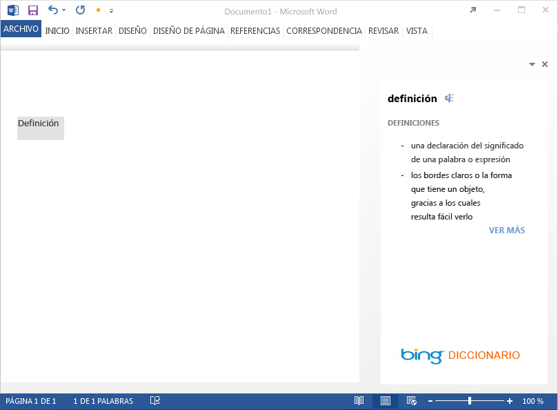
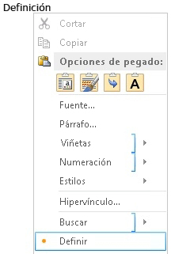
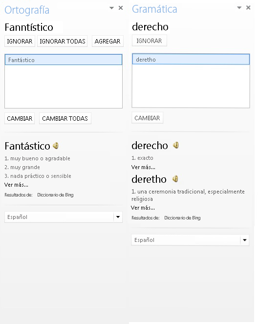
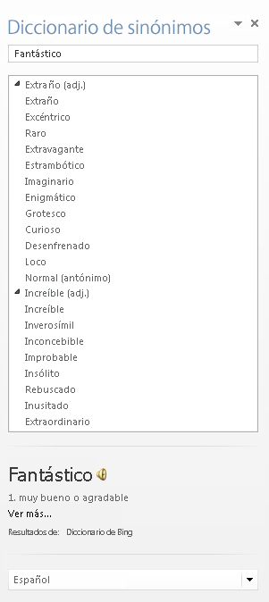
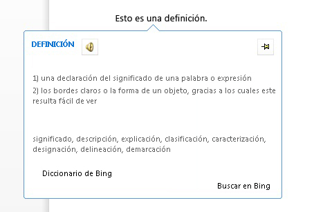
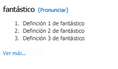

# <a name="create-a-dictionary-task-pane-add-in"></a>Crear un complemento de panel de tareas de diccionario


En este artículo se muestra un ejemplo de un complemento de panel de tareas y el servicio web asociado que proporciona definiciones de diccionarios o sinónimos para la selección actual del usuario en un documento de Word 2013. 

Una Complemento de Office de diccionario se basa en el complemento de panel de tareas estándar con funciones complementarias para la consulta y presentación de definiciones de un servicio web XML de diccionarios en lugares adicionales de la interfaz de usuario de la aplicación de Office. 

En un complemento de panel de tareas de diccionario normal, un usuario selecciona una palabra o frase en el documento y, después, la lógica de JavaScript que hay detrás del complemento pasa esta selección al servicio web XML del proveedor de diccionario. Luego, se actualiza la página web del proveedor de diccionario para mostrar las definiciones de la selección al usuario. El componente de servicio web XML devuelve tres definiciones como máximo en el formato definido por el esquema XML de OfficeDefinitions, que se muestran al usuario en otros lugares de la UI de la aplicación host de Office. La figura 1 muestra la experiencia de visualización y selección de un complemento de diccionario de marca Bing que se ejecuta en Word 2013.

**Figura 1: Complemento de diccionario que muestra definiciones para la palabra seleccionada**




Tiene que decidir si, al hacer clic en el vínculo **Ver más** de la interfaz de usuario HTML del complemento de diccionario, se mostrará más información en el panel de tareas o se abrirá una ventana independiente del explorador con la página web completa para la palabra o frase seleccionada. En la ilustración 2 se muestra el comando de menú contextual **Definir** que permite a los usuarios abrir rápidamente los diccionarios instalados. En las ilustraciones 3, 4 y 5 se muestran los lugares de la interfaz de usuario de Office donde se usan los servicios XML de diccionarios para proporcionar las definiciones en Word 2013.

**Figura 2: Comando Definir del menú contextual**




**Figura 3: Definiciones en los paneles Ortografía y Gramática**




**Figura 4: Definiciones en el panel Sinónimos**




**Figura 5: Definiciones en modo de lectura**




Para crear un complemento de panel de tareas que ofrezca una búsqueda en diccionarios, es necesario crear dos componentes principales: 


- Un servicio web XML que busque las definiciones en un servicio de diccionarios y devuelva los valores en un formato XML que el complemento de diccionario pueda usar y mostrar.
    
- Un complemento de panel de tareas que envíe la selección actual del usuario al servicio web de diccionarios, muestre las definiciones y, opcionalmente, pueda insertar los valores en el documento.
    
Las secciones siguientes muestran la manera de crear estos componentes.

## <a name="creating-a-dictionary-xml-web-service"></a>Creación de un servicio web XML de diccionarios


El servicio web XML debe devolver las consultas al servicio web XML que cumple con el esquema XML de OfficeDefinitions. Las dos secciones siguientes describen el esquema XML de OfficeDefinitions y muestran un ejemplo de cómo codificar un servicio web XML que devuelva las consultas en ese formato XML.


### <a name="officedefinitions-xml-schema"></a>Esquema XML OfficeDefinitions

El código siguiente muestra el XSD para el esquema XML de OfficeDefinitions.


```XML
<?xml version="1.0" encoding="utf-8"?>
<xs:schema
  xmlns:xsi="http://www.w3.org/2001/XMLSchema-instance"
  xmlns:xs="http://www.w3.org/2001/XMLSchema"
  targetNamespace="http://schemas.microsoft.com/NLG/2011/OfficeDefinitions"
  xmlns="http://schemas.microsoft.com/NLG/2011/OfficeDefinitions">
  <xs:element name="Result">
    <xs:complexType>
      <xs:sequence>
        <xs:element name="SeeMoreURL" type="xs:anyURI"/>
        <xs:element name="Definitions" type="DefinitionListType"/>
      </xs:sequence>
    </xs:complexType>
  </xs:element>
  <xs:complexType name="DefinitionListType">
    <xs:sequence>
      <xs:element name="Definition" maxOccurs="3">
        <xs:simpleType>
          <xs:restriction base="xs:normalizedString">
            <xs:maxLength value="400"/>
          </xs:restriction>
        </xs:simpleType>
      </xs:element>
    </xs:sequence>
  </xs:complexType>
</xs:schema>
```

El XML devuelto que cumple con el esquema de OfficeDefinitions consta de un elemento  **Result** raíz que contiene un elemento **Definitions** con un número de elementos secundarios **Definition** que oscilan entre cero y tres, cada uno de los cuales contiene definiciones que no superan los 400 caracteres. Además, en el elemento **SeeMoreURL** es necesario proporcionar la dirección URL que apunta a la página completa del sitio de diccionarios. En el siguiente ejemplo se muestra la estructura del XML devuelto que cumple con el esquema de OfficeDefinitions.


```XML
<?xml version="1.0" encoding="utf-8"?>
<Result xmlns="http://schemas.microsoft.com/NLG/2011/OfficeDefinitions">
  <SeeMoreURL xmlns="">www.bing.com/dictionary/search?q=example</SeeMoreURL>
  <Definitions xmlns="">
    <Definition>Definition1</Definition>
    <Definition>Definition2</Definition>
    <Definition>Definition3</Definition>
  </Definitions>
 </Result>

```


### <a name="sample-dictionary-xml-web-service"></a>Servicio web de XML de diccionarios de muestra

El código de C# siguiente presenta un ejemplo sencillo de cómo escribir código para un servicio web XML que devuelve el resultado de una consulta de diccionario en el formato XML de OfficeDefinitions.


```C#
using System;
using System.Collections.Generic;
using System.Linq;
using System.Web;
using System.Web.Services;
using System.Xml;
using System.Text;
using System.IO;
using System.Net;

/// <summary>
/// Summary description for _Default
/// </summary>
[WebService(Namespace = "http://tempuri.org/")]
[WebServiceBinding(ConformsTo = WsiProfiles.BasicProfile1_1)]
// To allow this web service to be called from script, using ASP.NET AJAX, uncomment the following line. 
// [System.Web.Script.Services.ScriptService]
public class WebService : System.Web.Services.WebService {

    public WebService () {

        // Uncomment the following line if using designed components 
        // InitializeComponent(); 
    }

    // You can replace this method entirely with your own method that gets definitions
    // from your data source, and then formats it into the OfficeDefinitions XML format. 
    // If you need a reference for constructing the returned XML, you can use this example as a basis.
    [WebMethod]
    public XmlDocument Define(string word)
    {

        StringBuilder sb = new StringBuilder();
        XmlWriter writer = XmlWriter.Create(sb);
        {
            writer.WriteStartDocument();
            
                writer.WriteStartElement("Result", "http://schemas.microsoft.com/NLG/2011/OfficeDefinitions");

            // See More URL should be changed to the dictionary publisher's page for that word on their website.
                    writer.WriteElementString("SeeMoreURL", "http://www.bing.com/search?q=" + word);

                    writer.WriteStartElement("Definitions");
            
                        writer.WriteElementString("Definition", "Definition 1 of " + word);
                        writer.WriteElementString("Definition", "Definition 2 of " + word);
                        writer.WriteElementString("Definition", "Definition 3 of " + word);
                   
                    writer.WriteEndElement();


                writer.WriteEndElement();
            
            writer.WriteEndDocument();
        }
        writer.Close();

        XmlDocument doc = new XmlDocument();
        doc.LoadXml(sb.ToString());

        return doc;
    }
   

}
```


## <a name="creating-the-components-of-a-dictionary-add-in"></a>Creación de los componentes de un complemento de diccionario


Un complemento de diccionario consta de tres archivos de componentes principales.


- Un archivo de manifiesto XML que describe el complemento.
    
- Un archivo HTML que proporciona la interfaz de usuario del complemento.
    
- Un archivo JavaScript que proporciona la lógica para obtener la selección del usuario desde el documento, envía la selección como una consulta al servicio web y muestra los resultados devueltos en la UI del complemento.
    

### <a name="creating-a-dictionary-add-ins-manifest-file"></a>Creación del archivo de manifiesto del complemento de diccionario

A continuación se muestra un ejemplo de archivo de manifiesto para un complemento de diccionario.


```XML
<?xml version="1.0" encoding="utf-8"?>
<OfficeApp xmlns="http://schemas.microsoft.com/office/appforoffice/1.0" xmlns:xsi="http://www.w3.org/2001/XMLSchema-instance" xsi:type="TaskPaneApp">
  <Id>7164e750-dc86-49c0-b548-1bac57abdc7c</Id>
  <Version>15.0</Version>
  <ProviderName>Microsoft Office Demo Dictionary</ProviderName>
  <DefaultLocale>en-us</DefaultLocale>
  <!--DisplayName is the name that will appear in the user's list of applications.-->
  <DisplayName DefaultValue="Microsoft Office Demo Dictionary" />
  <!--Description is a 2-3 sentence description of this dictionary. -->
  <Description DefaultValue="The Microsoft Office Demo Dictionary is an example built to demonstrate how a publisher could create a dictionary that integrates with Office. It does not return real definitions." />
  <!--IconUrl is the URI for the icon that will appear in the user's list of applications.-->
  <IconUrl DefaultValue="http://officeimg.vo.msecnd.net/_layouts/images/general/office_logo.jpg" />
  <!--Capabilities specifies the kind of host application your dictionary add-in will support. You shouldn't have to modify this area.-->
  <Capabilities>
    <Capability Name="Workbook"/>
    <Capability Name="Document"/>
    <Capability Name="Project"/>
  </Capabilities>
  <DefaultSettings>
    <!--SourceLocation is the URL for your dictionary-->
    <SourceLocation DefaultValue="http://christophernlg/ExampleDictionary/DictionaryHome.html" />
  </DefaultSettings>
  <!--Permissions is the set of permissions a user will have to give your dictionary. If you need write access, such as to allow a user to replace the highlighted word with a synonym, use ReadWriteDocument. -->
  <Permissions>ReadDocument</Permissions>
  <Dictionary>
    <!--TargetDialects is the set of regional languages your dictionary contains. For example, if your dictionary applies to Spanish (Mexico) and Spanish (Peru), but not Spanish (Spain), you can specify that here. Do not put more than one language (for example, Spanish and English) here. Publish separate languages as separate dictionaries. -->
    <TargetDialects>
      <TargetDialect>EN-AU</TargetDialect>
      <TargetDialect>EN-BZ</TargetDialect>
      <TargetDialect>EN-CA</TargetDialect>
      <TargetDialect>EN-029</TargetDialect>
      <TargetDialect>EN-HK</TargetDialect>
      <TargetDialect>EN-IN</TargetDialect>
      <TargetDialect>EN-ID</TargetDialect>
      <TargetDialect>EN-IE</TargetDialect>
      <TargetDialect>EN-JM</TargetDialect>
      <TargetDialect>EN-MY</TargetDialect>
      <TargetDialect>EN-NZ</TargetDialect>
      <TargetDialect>EN-PH</TargetDialect>
      <TargetDialect>EN-SG</TargetDialect>
      <TargetDialect>EN-ZA</TargetDialect>
      <TargetDialect>EN-TT</TargetDialect>
      <TargetDialect>EN-GB</TargetDialect>
      <TargetDialect>EN-US</TargetDialect>
      <TargetDialect>EN-ZW</TargetDialect>
    </TargetDialects>
    <!--QueryUri is the address of this dictionary's XML web service (which is used to put definitions in additional contexts, such as the spelling checker.)-->
    <QueryUri DefaultValue="http://christophernlg/ExampleDictionary/WebService.asmx/Define?word="/>
    <!--Citation Text, Dictionary Name, and Dictionary Home Page will be combined to form the citation line (for example, this would produce "Examples by: Microsoft", where "Microsoft" is a hyperlink to http://www.microsoft.com).-->
    <CitationText DefaultValue="Examples by: " />
    <DictionaryName DefaultValue="Microsoft" />
    <DictionaryHomePage DefaultValue="http://www.microsoft.com" />
  </Dictionary>
</OfficeApp>
```

El elemento  **Dictionary** y sus componentes secundarios que son específicos para crear el archivo de manifiesto de un complemento de diccionario se describen en las secciones siguientes. Para más información sobre los otros elementos del archivo de manifiesto, visite [Manifiesto XML de complementos para Office](../../docs/overview/add-in-manifests.md).


### <a name="dictionary-element"></a>Elemento de diccionario


Especifica la configuración para los complementos de diccionario.

 **Elemento primario**

 `<OfficeApp>`

 **Elementos secundarios**

 `<TargetDialects>`,  `<QueryUri>`,  `<CitationText>`,  `<DictionaryName>`,  `<DictionaryHomePage>`

 **Comentarios**

El elemento **Dictionary** y sus elementos secundarios se agregan al manifiesto de un complemento de panel de tareas cuando se crea un complemento de diccionario.


#### <a name="targetdialects-element"></a>Elemento TargetDialects


Especifica las variedades regionales que admite el diccionario. Es obligatorio (para complementos de diccionario).

 **Elemento primario**

 `<Dictionary>`

 **Elemento secundario**

 `<TargetDialect>`

 **Comentarios**

El elemento **TargetDialects** y sus elementos secundarios especifican el conjunto de variedades regionales que contiene el diccionario. Por ejemplo, si el diccionario se aplicable para español (México) y español (Perú), pero no español (España), puede especificarlo en este elemento. No especifique más de un idioma (por ejemplo, español e inglés) en este manifiesto. Publique idiomas separados como diccionarios independientes.

 **Ejemplo**


```XML
<TargetDialects>
  <TargetDialect>EN-AU</TargetDialect>
  <TargetDialect>EN-BZ</TargetDialect>
  <TargetDialect>EN-CA</TargetDialect>
  <TargetDialect>EN-029</TargetDialect>
  <TargetDialect>EN-HK</TargetDialect>
  <TargetDialect>EN-IN</TargetDialect>
  <TargetDialect>EN-ID</TargetDialect>
  <TargetDialect>EN-IE</TargetDialect>
  <TargetDialect>EN-JM</TargetDialect>
  <TargetDialect>EN-MY</TargetDialect>
  <TargetDialect>EN-NZ</TargetDialect>
  <TargetDialect>EN-PH</TargetDialect>
  <TargetDialect>EN-SG</TargetDialect>
  <TargetDialect>EN-ZA</TargetDialect>
  <TargetDialect>EN-TT</TargetDialect>
  <TargetDialect>EN-GB</TargetDialect>
  <TargetDialect>EN-US</TargetDialect>
  <TargetDialect>EN-ZW</TargetDialect>
</TargetDialects>
```


#### <a name="targetdialect-element"></a>Elemento TargetDialect


Especifica las variedades regionales que admite el diccionario. Es obligatorio (para complementos de diccionario).

 **Elemento primario**

 `<TargetDialects>`

 **Comentarios**

Especifique el valor de una variedad regional en el formato de etiqueta `language` RFC1766, como ES-ES.

 **Ejemplo**


```XML
<TargetDialect>EN-US</TargetDialect>
```


#### <a name="queryuri-element"></a>Elemento QueryUri


Especifica el punto de conexión para el servicio de consulta del diccionario. Es obligatorio para complementos de diccionario.

 **Elemento primario**

 `<Dictionary>`

 **Comentarios**

Este es el URI del servicio web XML para el proveedor del diccionario. La consulta realizada correctamente se anexará a este URI. 

 **Ejemplo**


```XML
<QueryUri DefaultValue="http://msranlc-lingo1/proof.aspx?q="/>
```


#### <a name="citationtext-element"></a>Elemento CitationText


Especifica el texto que se debe usar en las citas. Es obligatorio para complementos de diccionario.

 **Elemento primario**

 `<Dictionary>`

 **Comentarios**

Este elemento especifica el principio del texto de cita que se mostrará en una línea debajo del contenido devuelto desde el servicio web (por ejemplo, "Resultados de:" o "Con la tecnología de:").

Para este elemento, se pueden especificar valores para configuraciones regionales adicionales con el elemento  **Override**. Por ejemplo, si un usuario está ejecutando la SKU de español de Office, pero usa un diccionario en inglés, esto permite que la línea de cita muestre "Resultados por: Bing" en vez de "Results by: Bing". Para más información sobre cómo especificar valores para configuraciones regionales adicionales, consulte la sección "Configuración para configuraciones regionales diferentes" en [Manifiesto XML de complementos para Office](../../docs/overview/add-in-manifests.md).

 **Ejemplo**


```XML
<CitationText DefaultValue="Results by: " />
```


#### <a name="dictionaryname-element"></a>Elemento DictionaryName


Especifica el nombre de este diccionario. Es obligatorio para complementos de diccionario.

 **Elemento primario**

 `<Dictionary>`

 **Comentarios**

Este elemento especifica el texto del vínculo en el texto de la cita. El texto de la cita se muestra en una línea debajo del contenido devuelto desde el servicio web.

Para este elemento, se pueden especificar valores para configuraciones regionales adicionales.

 **Ejemplo**


```XML
<DictionaryName DefaultValue="Bing Dictionary" />
```


#### <a name="dictionaryhomepage-element"></a>Elemento DictionaryHomePage


Especifica la dirección URL de la página de inicio del diccionario. Es obligatorio para complementos de diccionario.

 **Elemento primario**

 `<Dictionary>`

 **Comentarios**

Este elemento especifica la dirección URL del vínculo en el texto de la cita. El texto de la cita se muestra en una línea debajo del contenido devuelto desde el servicio web.

Para este elemento, se pueden especificar valores para configuraciones regionales adicionales.

 **Ejemplo**


```XML
<DictionaryHomePage DefaultValue="http://www.bing.com" />
```


### <a name="creating-a-dictionary-add-ins-html-user-interface"></a>Creación de una interfaz de usuario HTML del complemento de diccionario


Los dos ejemplos siguientes muestran los archivos HTML y CSS para la UI del complemento de la demo del diccionario. Para ver cómo se muestra la UI en el panel de tareas del complemento, consulte la Figura 6, después del código. Para conocer la manera en que la implementación de JavaScript en el archivo Dictionary.js proporciona la lógica de programación para esta UI de HTML, consulte "Escritura de la implementación de JavaScript", inmediatamente después de esta sección.


```HTML
<!DOCTYPE html>
<html>

<head>
<meta http-equiv="X-UA-Compatible" content="IE=Edge"/>

<!--The title will not be shown but is supplied to ensure valid HTML.-->
<title>Example Dictionary</title>

<!--Required library includes.-->
<script type="text/javascript" src="http://ajax.microsoft.com/ajax/4.0/1/MicrosoftAjax.js"></script>
<script type="text/javascript" src="office.js"></script>

<!--Optional library includes.-->
<script type="text/javascript" src="http://ajax.aspnetcdn.com/ajax/jQuery/jquery-1.5.1.js"></script>

<!--App-specific CSS and JS.-->
<link rel="Stylesheet" type="text/css" href="style.css" />
<script type="text/ecmascript" src="dictionary.js"></script>
</head>

<body>
<div id="mainContainer">
    <div id="header">
        <span id="headword"></span>
        <span id="pronunciation">(<a id="pronunciationLink">Pronounce</a>)</span>
    </div>
    <ol id="definitions">
    </ol>
    <div id="SeeMore">
    <a id="SeeMoreLink">See More...</a>
    </div>
</div>
</body>

</html>
```

En el ejemplo siguiente se muestra el contenido de Style.css.


```
#mainContainer
{
    font-family: Segoe UI;
    font-size: 11pt;
}

#headword
{
    font-family: Segoe UI Semibold;
    color: #262626;
}

#pronunciation
{
    margin-left: 2px;
    margin-right: 2px;
}

#definitions
{
    font-size: 8.5pt;
}
a
{
    font-size: 8pt;
    color: #336699;
    text-decoration: none;
}
a:visited
{
    color: #993366;
}
a:hover, a:active
{  
    text-decoration: underline;
}
```


**Figura 6: IU de la demo del diccionario**




### <a name="writing-the-javascript-implementation"></a>Escritura de la implementación de JavaScript


En el ejemplo siguiente se muestra la implementación de JavaScript en el archivo Dictionary.js, que se llama desde la página HTML del complemento para proporcionar la lógica de programación para el complemento del Diccionario de demostración. Esta secuencia de comandos vuelve a usar el servicio web XML descrito anteriormente. Cuando se coloca en el mismo directorio que el servicio web de ejemplo, la secuencia de comandos obtiene las definiciones de dicho servicio. La secuencia de comandos se puede usar con un servicio web XML público que cumpla con OfficeDefinitions modificando la variable  `xmlServiceURL` de la parte superior del archivo y, posteriormente, cambiando la clave de la API de Bing para pronunciaciones por una que se haya registrado correctamente.

Los miembros principales de la API de JavaScript para Office (Office.js) que se llaman desde esta implementación son los siguientes:


- El evento [initialize](../../reference/shared/office.initialize.md) del objeto **Office**, que se genera cuando el contexto de la complemento se inicializa y proporciona acceso a una instancia del objeto [Document](../../reference/shared/document.md), que representa el documento con el que la complemento está interactuando.
    
- El método [addHandlerAsync](../../reference/shared/document.addhandlerasync.md) del objeto **Document**, que se llama en la función  **initialize** para agregar un controlador de eventos al evento [SelectionChanged](../../reference/shared/document.selectionchanged.event.md) del documento, para atender los cambios de selección del usuario.
    
- El método [getSelectedDataAsync](../../reference/shared/document.getselecteddataasync.md) del objeto **Document**, que se llama en la función  `tryUpdatingSelectedWord()` cuando el controlador de eventos **SelectionChanged** se genera para obtener la palabra o frase que el usuario seleccionó, convertirla en texto sin formato y ejecutar la función de devolución de llamada asincrónica `selectedTextCallback` asynchronous callback function.
    
- Cuando se ejecuta la función de devolución de llamada asincrónica  `selectTextCallback` que se transfiere como argumento _callback_ del método **getSelectedDataAsync**, obtiene el valor del texto seleccionado cuando se devuelve la devolución de llamada. Obtiene dicho valor desde el argumento  _selectedText_ de devolución de llamada (de tipo [AsyncResult](../../reference/shared/asyncresult.md)) con la propiedad [value](../../reference/shared/asyncresult.status.md) del objeto **AsyncResult** que se devuelve.
    
- El resto del código de la función  `selectedTextCallback` busca definiciones en el servicio web XML. También llama a las API de Microsoft Translator para proporcionar la dirección URL de un archivo .wav que tenga la pronunciación de la palabra seleccionada.
    
- El código restante de Dictionary.js muestra la lista de definiciones y el vínculo de pronunciación en la UI HTML del complemento.
    


```
// The document the dictionary add-in is interacting with.
var _doc; 
// The last looked-up word, which is also the currently displayed word.
var lastLookup; 
// For demo purposes only!! Get an AppID if you intend to use the Pronunciation service for your feature.
var appID="3D8D4E1888B88B975484F0CA25CDD24AAC457ED8"; 

// The base URL for the OfficeDefinitions-conforming XML web service to query for definitions.
var xmlServiceUrl = "WebService.asmx/Define?Word="; 

// Initialize the add-in. 
// The initialize function is required for all add-ins.
Office.initialize = function (reason) {
    // Checks for the DOM to load using the jQuery ready function.
    $(document).ready(function () {
    // After the DOM is loaded, app-specific code can run.
    // Store a reference to the current document.
    _doc = Office.context.document; 
    // Check whether text is already selected.
    tryUpdatingSelectedWord(); 
    _doc.addHandlerAsync("documentSelectionChanged", tryUpdatingSelectedWord); //Add a handler to refresh when the user changes selection.
    });
}

// Executes when event is raised on user's selection changes, and at initialization time. 
// Gets the current selection and passes that to asynchronous callback method.
function tryUpdatingSelectedWord() {
    _doc.getSelectedDataAsync(Office.CoercionType.Text, selectedTextCallback); 
}

// Async callback that executes when the add-in gets the user's selection.
// Determines whether anything should be done. If so, it makes requests that will be passed to various functions.
function selectedTextCallback(selectedText) {
    selectedText = $.trim(selectedText.value);
    // Be sure user has selected text. The SelectionChanged event is raised every time the user moves the cursor, even if no selection.
    if (selectedText != "") { 
        // Check whether user selected the same word the pane is currently displaying to avoid unnecessary web calls.
        if (selectedText != lastLookup) { 
            // Update the lastLookup variable.
            lastLookup = selectedText; 
            // Set the "headword" span to the word you looked up.
            $("#headword").text(selectedText); 
            // AJAX request to get definitions for the selected word; pass that to refreshDefinitions.
            $.ajax(xmlServiceUrl + selectedText, { dataType: 'xml', success: refreshDefinitions, error: errorHandler }); 
            // AJAX request to the Microsoft Translator APIs. Gets the URL of a WAV file with pronunciation, which is passed to refreshPronunciation. See http://www.microsofttranslator.com/dev for details.
            $.ajax("http://api.microsofttranslator.com/V2/Ajax.svc/Speak?oncomplete=refreshPronunciation&amp;appId=" + appID + "&amp;text=" + selectedText + "&amp;language=en-us", { dataType: 'script', success: null, error: errorHandler }); 
        }
    }
}

// This function is called when the add-in gets back the definitions target word.
// It removes the old definitions and replaces them with the definitions for the current word.
// It also sets the "See More" link.
function refreshDefinitions(data, textStatus, jqXHR) {
    $(".definition").remove();
    // Make a new list item for each returned definition that was returned, set the CSS class, and append it to the definitions div.
    $(data).find("Definition").each(function () {
        $(document.createElement("li")).text($(this).text()).addClass("definition").appendTo($("#definitions"));
    });
    $("#SeeMoreLink").attr("href", $(data).find("SeeMoreURL").text()); //Change the "See More" link to direct to the correct URL.
}

// This function is called when the add-in gets back the link to the pronunciation
// to set the "Pronounce" link to the URL of the .WAV file.
function refreshPronunciation(data) {
    $("#pronunciationLink").attr("href", data);
}

// Basic error handler that writes to a div with id='message'.
function errorHandler(jqXHR, textStatus, errorThrown) {
    document.getElementById('message').innerText += errorThrown;
}

```

