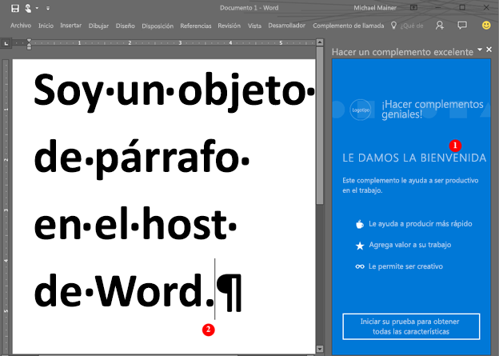

# <a name="word-add-ins-overview"></a>Información general sobre los complementos de Word

¿Quiere crear una solución que amplíe las funciones de Word (por ejemplo, una solución para el ensamblado automatizado de documentos o una que enlace y tenga acceso a datos en un documento de Word desde otros orígenes de datos)? Puede usar la plataforma de complementos de Office, que incluye la API de JavaScript para Word y la API de JavaScript para Office, para ampliar las funciones de los clientes de Word que se ejecutan en equipos de escritorio de Windows, en equipos Mac o en la nube.

Los complementos de Word son una de las muchas opciones de desarrollo que tiene en la [plataforma de complementos de Office](../overview/office-add-ins.md). Puede usar los comandos de complemento para ampliar la interfaz de usuario de Word e iniciar paneles de tareas que ejecuten código JavaScript que interactúe con el contenido de un documento de Word. Cualquier código que pueda ejecutar en un explorador también se puede ejecutar en un complemento de Word. Los complementos que interactúan con contenido en un documento de Word crean solicitudes para actuar en objetos de Word y sincronizar el estado de los objetos. 

>**Nota:** Al generar el complemento, si va a [publicar](../publish/publish.md) el complemento en la Tienda Office, asegúrese de que se ajusta a las [directivas de validación de la Tienda Office](https://msdn.microsoft.com/en-us/library/jj220035.aspx). Por ejemplo, para superar la validación, el complemento debe funcionar en todas las plataformas que sean compatibles con los métodos especificados (para más información, consulte la [sección 4.12](https://msdn.microsoft.com/en-us/library/jj220035.aspx#Anchor_3) y el [host del complemento de Office y la página de disponibilidad](https://dev.office.com/add-in-availability)).

En la ilustración siguiente se muestra un ejemplo de un complemento de Word que se ejecuta en un panel de tareas.

**Figura 1: Complemento que se ejecuta en un panel de tareas de Word**



El complemento de Word (1) puede enviar solicitudes al documento de Word (2) y usar JavaScript para tener acceso al objeto de párrafo y actualizar, eliminar o mover el párrafo. Por ejemplo, en el código siguiente se muestra cómo anexar una nueva frase al párrafo.

```js
Word.run(function (context) {
    var paragraphs = context.document.getSelection().paragraphs;
    paragraphs.load();
    return context.sync().then(function () {
        paragraphs.items[0].insertText(' New sentence in the paragraph.',
                                       Word.InsertLocation.end);
    }).then(context.sync);
});

```

Puede usar cualquier tecnología de servidor web para hospedar el complemento de Word, como ASP.NET, NodeJS o Python. Use su marco del lado cliente favorito (Ember, Backbone, Angular, React) o quédese con VanillaJS para desarrollar su solución. También puede usar servicios como Azure para [autenticar](../develop/use-the-oauth-authorization-framework-in-an-office-add-in.md) y hospedar su aplicación.

Las API de JavaScript para Word permiten que su aplicación tenga acceso a los objetos y metadatos de un documento de Word. Puede usar estas API para crear complementos para:

* Word 2013 para Windows
* Word 2016 para Windows
* Word Online
* Word 2016 para Mac
* Word para iOS

Escriba su complemento una vez y se ejecutará en todas las versiones de Word en varias plataformas. Para más información, vea [Disponibilidad de plataformas y hosts de los complementos de Office](https://dev.office.com/add-in-availability).

## <a name="javascript-apis-for-word"></a>API de JavaScript para Word

Puede usar dos API de JavaScript para interactuar con los objetos y los metadatos en un documento de Word. La primera es la [API de JavaScript para Office](https://dev.office.com/reference/add-ins/javascript-api-for-office?product=word), que se usó por primera vez en Office 2013. Es una API compartida (es decir, muchos de los objetos se pueden usar en complementos hospedados por dos o más clientes de Office). Esta API usa un gran número de devoluciones de llamada. 

La segunda es la [API de JavaScript para Word](../../reference/word/word-add-ins-reference-overview.md). Es un modelo de objetos fuertemente tipado que puede usar para crear complementos de Word para Word 2016 para Mac y Windows. Este modelo de objetos usa promesas y proporciona acceso a objetos específicos de Word, como el [cuerpo](../../reference/word/body.md), [controles de contenido](../../reference/word/contentcontrol.md), [imágenes incorporadas](../../reference/word/inlinepicture.md) y [párrafos](../../reference/word/paragraph.md). La API de JavaScript para Word incluye definiciones TypeScript y archivos vsdoc para que pueda recibir sugerencias de código en su IDE.

Actualmente, todos los clientes de Word son compatibles con la API de JavaScript para Office compartida y la mayoría de los clientes son compatibles con la API de JavaScript para Word. Para más información sobre los clientes compartidos, vea la [documentación de referencia de la API](https://dev.office.com/reference/add-ins/javascript-api-for-office?product=word).

Le recomendamos que empiece con la API de JavaScript para Word, ya que le modelo de objetos es más fácil de usar. Use la API de JavaScript para Word si necesita:

* Tener acceso a objetos en un documento de Word.

Use la API de JavaScript para Office compartida si necesita:

* Usar Word 2013.
* Realizar acciones iniciales para la aplicación.
* Comprobar el conjunto de requisitos admitidos.
* Tener acceso a metadatos, configuración e información del entorno del documento.
* Enlazar a secciones de un documento y capturar eventos.
* Usar elementos XML personalizados.
* Abrir un cuadro de diálogo.

## <a name="next-steps"></a>Pasos siguientes

¿Está preparado para crear su primer complemento de Word? Vea [Crear el primer complemento de Word](word-add-ins.md). También puede probar nuestra [experiencia de introducción](http://dev.office.com/getting-started/addins?product=Word) interactiva. Use el [manifiesto del complemento](../overview/add-in-manifests.md) para describir dónde se hospedará el complemento y cómo se mostrará, así como para definir permisos y otra información.

Para más información sobre cómo diseñar un complemento de Word de primer nivel que cree una experiencia atractiva para sus usuarios, vea [Directrices de diseño](../design/add-in-design.md) y [Procedimientos recomendados](../design/add-in-development-best-practices.md).

Después de desarrollar el complemento, puede [publicarlo](../publish/publish.md) en un recurso compartido de red, en un catálogo de aplicaciones o en la Tienda Office.

## <a name="whats-coming-up-for-word-add-ins"></a>¿Qué novedades habrá próximamente para los complementos de Word?

Cuando diseñemos y desarrollemos nuevas API para complementos de Word, estarán disponibles y nos podrá enviar sus comentarios en la página [Especificaciones de la API abierta](../../reference/openspec.md). Descubra las nuevas características que están en proceso para las API de JavaScript para Word y envíe sus comentarios sobre nuestras especificaciones de diseño.

También puede ver las novedades en la API de JavaScript para Word en la página del [registro de cambios](http://dev.office.com/changelog).

## <a name="additional-resources"></a>Recursos adicionales

* [Office Add-ins platform overview (Información general sobre la plataforma de complementos para Office)](../overview/office-add-ins.md)
* [Referencia de la API de JavaScript de Word](../../reference/word/word-add-ins-reference-overview.md)

