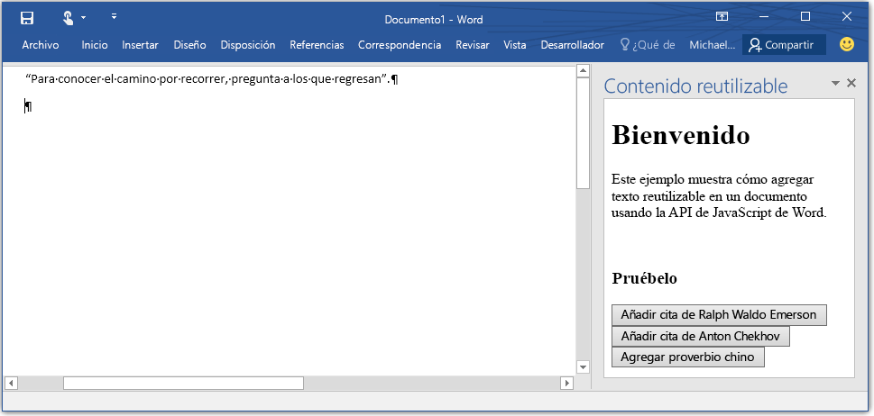

# <a name="build-your-first-word-add-in"></a>Crear el primer complemento de Word

_Se aplica a: Word 2016, Word para iPad, Word para Mac_

La API de JavaScript para Word forma parte del modelo de programación de complementos de Office para extender las aplicaciones de Office. El modelo de programación de complementos usa aplicaciones web para hospedar la extensión en Word. Ahora puede ampliar Word con cualquier plataforma web o con el lenguaje que prefiera.

> **Nota**: Si quiere desarrollar complementos de Word 2013, deberá usar la [API de Javascript de Office]( https://dev.office.com/docs/add-ins/word/word-add-ins-programming-overview#javascript-apis-for-word) compartida. Puede obtener más información sobre las plataformas y las API disponibles [en esta página](https://dev.office.com/add-in-availability). Los temas se aplican en todos los hosts, excepto si se especifica que se aplican a Word 2016.

Un complemento de Word se ejecuta en Word y puede interactuar con el contenido del documento con las nuevas API de JavaScript para Word disponibles en Word 2016. Internamente, crear un complemento es un proceso de dos partes: 1) una aplicación web que puede hospedar en cualquier lugar y 2) el [manifiesto del complemento](../../docs/overview/add-in-manifests.md) que Word usa para conocer dónde se hospeda la aplicación web (el manifiesto proporciona mucha más información, como puede ver en la [introducción a la programación](word-add-ins-programming-overview.md)).

>**Complemento de Word = manifest.xml + aplicación web**

### <a name="set-it-up"></a>Configúrelo
En esta sección va a crear una sencilla aplicación web y el manifiesto de aplicación. La aplicación web le permitirá agregar texto reutilizable en el documento de Word.

1- Cree una carpeta en la unidad local denominada BoilerplateAddin (por ejemplo, C:\\BoilerplateAddin). Guarde en esta carpeta todos los archivos creados en los pasos siguientes.

2- Cree un archivo llamado home.html para la vista del complemento. El complemento tendrá tres botones que, cuando se seleccionen, agregarán texto reutilizable. Pegue el código siguiente en home.html.

```html
    <!DOCTYPE html>
    <html>
      <head>
        <meta charset="UTF-8" />
        <meta http-equiv="X-UA-Compatible" content="IE=Edge" />
        <title>Boilerplate text app</title>
        <script src="https://ajax.aspnetcdn.com/ajax/jQuery/jquery-2.1.4.min.js"></script>
        <script src="https://appsforoffice.microsoft.com/lib/1/hosted/office.js" type="text/javascript"></script>
        <script src="home.js" type="text/javascript"></script>
        </head>
        <body>
            <div>
                    <h1>Welcome</h1>
            </div>
            <div>
                    <p>This sample shows how to add boilerplate text to a document by using the Word JavaScript API.</p>
                    <br />
                    <h3>Try it out</h3>
                    <button id="emerson">Add quote from Ralph Waldo Emerson</button>
                    <button id="checkhov">Add quote from Anton Chekhov</button>
                    <button id="proverb">Add Chinese proverb</button>
            </div>
            <h3><div id="supportedVersion"/></h3>
        </body>
    </html>
```

3- Cree un archivo denominado home.js y pegue el código siguiente en el archivo. Contiene código de inicialización y todo el código del complemento para realizar cambios en el documento de Word. Este código inserta texto basándose en el cursor o en la selección del documento de Word.

```javascript
    (function () {
        "use strict";

        // The initialize function is run each time the page is loaded.
        Office.initialize = function (reason) {
            $(document).ready(function () {

                // Use this to check whether the API is supported in the Word client.
                if (Office.context.requirements.isSetSupported('WordApi', 1.1)) {
                    // Do something that is only available via the new APIs
                    $('#emerson').click(insertEmersonQuoteAtSelection);
                    $('#checkhov').click(insertChekhovQuoteAtTheBeginning);
                    $('#proverb').click(insertChineseProverbAtTheEnd);
                    $('#supportedVersion').html('This code is using Word 2016 or greater.');
                }
                else {
                    // Just letting you know that this code will not work with your version of Word.
                    $('#supportedVersion').html('This code requires Word 2016 or greater.');
                }
            });
        };

        function insertEmersonQuoteAtSelection() {
            Word.run(function (context) {

                // Create a proxy object for the document.
                var thisDocument = context.document;

                // Queue a command to get the current selection.
                // Create a proxy range object for the selection.
                var range = thisDocument.getSelection();

                // Queue a command to replace the selected text.
                range.insertText('"Hitch your wagon to a star."\n', Word.InsertLocation.replace);

                // Synchronize the document state by executing the queued commands,
                // and return a promise to indicate task completion.
                return context.sync().then(function () {
                    console.log('Added a quote from Ralph Waldo Emerson.');
                });
            })
            .catch(function (error) {
                console.log('Error: ' + JSON.stringify(error));
                if (error instanceof OfficeExtension.Error) {
                    console.log('Debug info: ' + JSON.stringify(error.debugInfo));
                }
            });
        }

        function insertChekhovQuoteAtTheBeginning() {
            Word.run(function (context) {

                // Create a proxy object for the document body.
                var body = context.document.body;

                // Queue a command to insert text at the start of the document body.
                body.insertText('"Knowledge is of no value unless you put it into practice."\n', Word.InsertLocation.start);

                // Synchronize the document state by executing the queued commands,
                // and return a promise to indicate task completion.
                return context.sync().then(function () {
                    console.log('Added a quote from Anton Chekhov.');
                });
            })
            .catch(function (error) {
                console.log('Error: ' + JSON.stringify(error));
                if (error instanceof OfficeExtension.Error) {
                    console.log('Debug info: ' + JSON.stringify(error.debugInfo));
                }
            });
        }

        function insertChineseProverbAtTheEnd() {
            Word.run(function (context) {

                // Create a proxy object for the document body.
                var body = context.document.body;

                // Queue a command to insert text at the end of the document body.
                body.insertText('"To know the road ahead, ask those coming back."\n', Word.InsertLocation.end);

                // Synchronize the document state by executing the queued commands,
                // and return a promise to indicate task completion.
                return context.sync().then(function () {
                    console.log('Added a quote from a Chinese proverb.');
                });
            })
            .catch(function (error) {
                console.log('Error: ' + JSON.stringify(error));
                if (error instanceof OfficeExtension.Error) {
                    console.log('Debug info: ' + JSON.stringify(error.debugInfo));
                }
            });
        }
    })();
```

4- Cree un archivo XML denominado BoilerplateManifest.xml y pegue el código siguiente en el archivo. Este es el archivo de manifiesto que Word usa para descubrir información sobre un complemento, como su ubicación o su nombre para mostrar.
```xml
<?xml version="1.0" encoding="UTF-8"?>
    <OfficeApp xmlns="http://schemas.microsoft.com/office/appforoffice/1.1"
               xmlns:xsi="http://www.w3.org/2001/XMLSchema-instance"
               xsi:type="TaskPaneApp">
        <Id>2b88100c-656e-4bab-9f1e-f6731d86e464</Id>
        <Version>1.0.0.0</Version>
        <ProviderName>Microsoft</ProviderName>
        <DefaultLocale>en-US</DefaultLocale>
        <DisplayName DefaultValue="Boilerplate content" />
        <Description DefaultValue="Insert boilerplate content into a Word document." />
        <Hosts>
            <Host Name="Document"/>
        </Hosts>
        <DefaultSettings>
            <SourceLocation DefaultValue="\\MyShare\boilerplate\home.html" />
        </DefaultSettings>
        <Permissions>ReadWriteDocument</Permissions>
    </OfficeApp>
```

5- Genere un GUID y reemplace el valor del elemento <code>OfficeApp/Id</code> con su GUID.

6- Guarde todos los archivos. Acaba de escribir su primer complemento de Word.

7- Copie home.js, home.html y BoilerplateManifest.xml a una [carpeta compartida en la red](https://technet.microsoft.com/en-us/library/cc770880.aspx) (Windows) u hospédelos en un servidor local (Mac).

8- Edite el elemento [SourceLocation](../../reference/manifest/sourcelocation.md) de BoilerplateManifest.xml para que apunte a la ubicación de home.html.

En este punto, tiene implementado su primer complemento. Ahora debe indicarle a Word dónde encontrar el complemento.

#### <a name="try-this-out-in-word-2016-for-windows"></a>Pruebe esto en Word 2016 para Windows

1. Inicie Word y abra un documento.
2. Seleccione la pestaña **Archivo** y haga clic en **Opciones**.
3. Haga clic en **Centro de confianza** y seleccione el botón **Configuración del Centro de confianza**.
4. Seleccione **Catálogos de complementos de confianza**.
5. En el cuadro **URL de catálogo**, escriba la ruta de acceso al recurso compartido de carpeta que contiene BoilerplateManifest.xml y elija **Agregar catálogo**.
6. Active la casilla **Mostrar en menú** y haga clic en **Aceptar**.
7. Aparecerá un mensaje para informarle de que la configuración se aplicará la próxima vez que inicie Office. Cierre y vuelva a iniciar Word.

Ahora puede ejecutar el complemento que creó. Siga estos pasos para verlo en acción:

1. Abra un documento de Word.
2. En la pestaña **Insertar** de Word 2016, elija **Mis complementos**.
3. Seleccione la pestaña **Carpeta compartida**.
4. Elija **Contenido reutilizable** y seleccione **Insertar**.
5. El complemento se cargará en un panel de tareas. Consulte la figura 1 para ver el aspecto que tendrá cuando se cargue.
6. Seleccione los botones para que el texto reutilizable se introduzca en el documento de Word.


### <a name="try-it-out-in-word-2016-for-mac"></a>Pruebe esto en Word 2016 para Mac

Ahora puede ejecutar el complemento que creó. Siga estos pasos para verlo en acción:

1. Cree una carpeta llamada “wef” en Users/Library/Containers/com.microsoft.word/Data/Documents/
2. Guarde el manifiesto, BoilerplateManifest.xml, en la carpeta wef (Users/Library/Containers/com.microsoft.word/Data/Documents/wef)
3. Abra Word 2016 en el equipo Mac y haga clic en la pestaña Insertar > lista desplegable Mis complementos. Verá el complemento en la lista desplegable. Selecciónelo para cargar el complemento.

__Figura 1. Complemento de contenido reutilizable cargado en Word__


## <a name="give-us-your-feedback"></a>Denos su opinión

Su opinión es importante para nosotros.

* Consulte los documentos e infórmenos sobre las dudas y problemas que encuentre con una [incidencia de soporte técnico](https://github.com/OfficeDev/office-js-docs/issues).
* Envíenos comentarios sobre su experiencia en programación y lo que le gustaría ver en versiones futuras o ejemplos de código. Use el [sitio de UserVoice](http://officespdev.uservoice.com/) para publicar sugerencias e ideas.

## <a name="additional-resources"></a>Recursos adicionales

* [Introducción a los complementos de Office](https://dev.office.com/getting-started/addins?product=word)
* [Complementos de Word en GitHub](https://github.com/OfficeDev?utf8=%E2%9C%93&query=Word)
