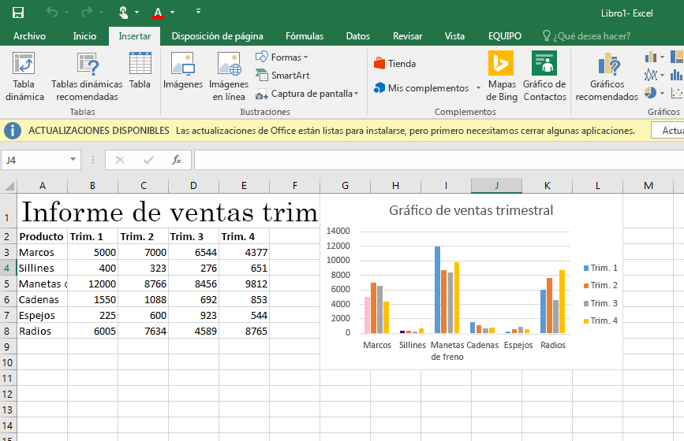
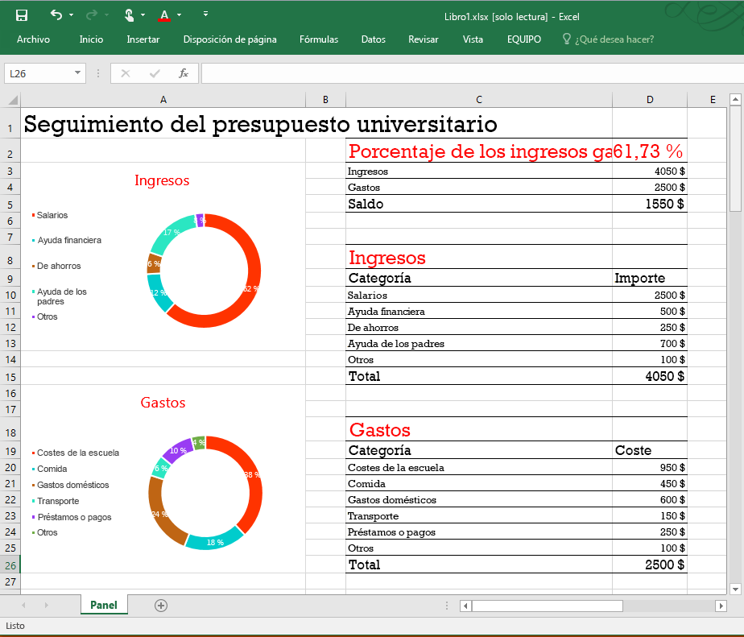
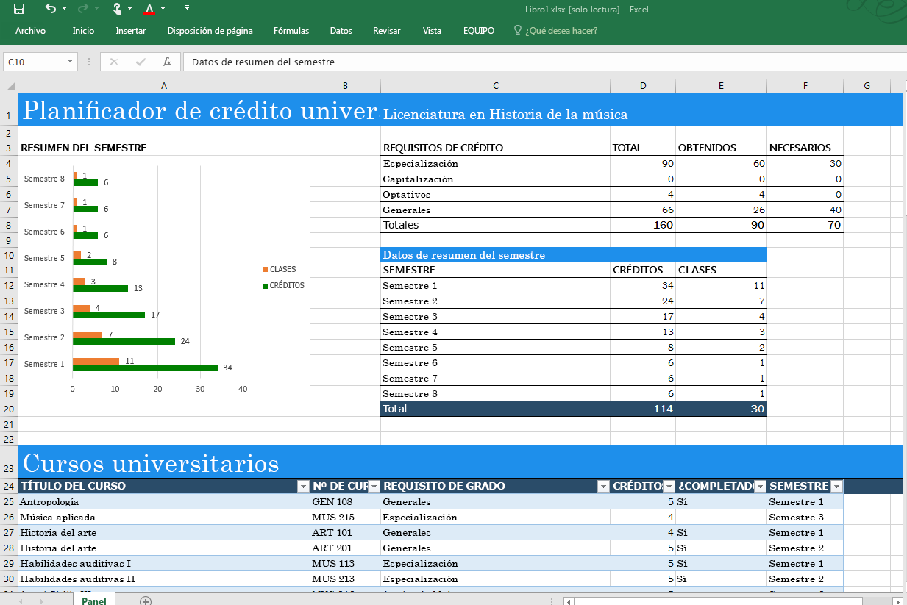
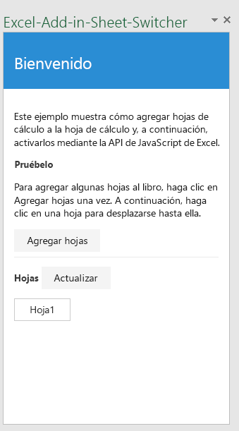
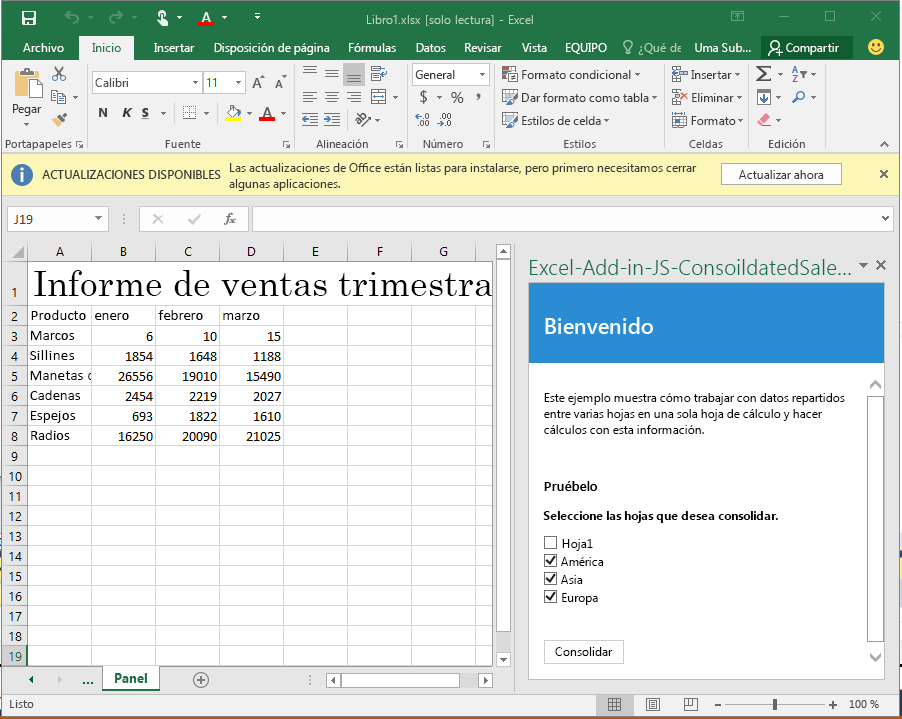
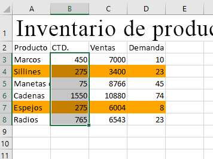

# Ejemplos de código de complementos de Excel

_Se aplica a: Excel 2016, Office 2016_

A continuación se indican como referencia rápida ejemplos de código de complementos que usan la API de JavaScript de Excel 2016. 

**[Ejemplo de informe de ventas trimestrales](https://github.com/OfficeDev/Excel-Add-in-JS-QuarterlySalesReport)**: sencillo complemento del panel de tareas que carga datos en una hoja de cálculo y crea un gráfico básico en Excel 2016. 

**[Ejemplo de rastreador de presupuestos universitarios](https://github.com/OfficeDev/Excel-Add-in-JS-CollegeBudgetTracker)**: complemento del panel de tareas que muestra cómo crear un rastreador de presupuestos universitarios usando las API de JavaScript de Excel 2016. 

**[Ejemplo de rastreador de créditos universitarios](https://github.com/OfficeDev/Excel-Add-in-JS-CollegeCreditsTracker)**: complemento del panel de tareas que muestra cómo crear un rastreador de créditos universitarios usando las API de JavaScript de Excel 2016. 

**[Ejemplo de conmutador de hojas](https://github.com/OfficeDev/Excel-Add-in-JS-SheetSwitcher)**: complemento del panel de tareas que proporciona una forma de agregar hojas nuevas a un libro e ir a ellas en Excel 2016. 

**[Ejemplo de informe de ventas consolidadas](https://github.com/OfficeDev/Excel-Add-in-JS-ConsolidatedSalesReport)**: complemento del panel de tareas que muestra cómo consolidar datos de varias hojas de cálculo usando las API de JavaScript de Excel 2016. 

**[Ejemplo de marcador de resaltado de intervalos](https://github.com/OfficeDev/Excel-Add-in-JS-RangeHighlighter)**: complemento del panel de tareas que muestra cómo realizar operaciones comunes usando la API de intervalo en Excel 2016.

Puede usar el [Explorador de fragmentos de código de JavaScript de Office 2016](http://officesnippetexplorer.azurewebsites.net/#/snippets/excel) para examinar ejemplos de código de escenarios comunes y aprender cómo funcionan las nuevas API. 

### Recursos adicionales

Las API de JavaScript de Excel tienen mucho que ofrecer para el desarrollo de complementos. A continuación se muestran algunos de los recursos disponibles. 

*  [Crear el primer complemento de Excel](build-your-first-excel-add-in.md)
*  [Introducción a la programación de complementos de Excel](excel-add-ins-programming-overview.md)
*  [Referencia de la API de JavaScript de complementos de Excel](excel-add-ins-javascript-reference.md)
