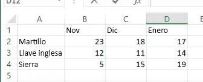

# Funciones de hoja de cálculo
Se usa como contenedor de las funciones de hoja de cálculo de Microsoft Excel que pueden llamarse a través de JavaScript o REST.

## Tipo de valor devuelto
Las funciones de hoja de cálculo devuelven un objeto FunctionResult. Un objeto FunctionResult tiene dos propiedades.

| Propiedad       | Tipo    |Descripción|Notas |
|:---------------|:--------|:----------|:-----|
|value|string|Devuelve el resultado de aplicar la función de hoja de cálculo especificada.|
|error|string|Devuelve información de error al aplicar las funciones de hoja de cálculo especificadas.|


## Sintaxis
```js
workbook.functions.functionMethod();
```

## Ejemplos
A continuación se muestra una tabla de ejemplo con un seguimiento de las ventas de diversas herramientas en Excel. Usaremos los datos de esta tabla para explicar cómo funcionan las funciones de hoja de cálculo.




En el ejemplo siguiente, se aplicará la función vlookup a la tabla anterior y se encontrarán las unidades de llaves inglesas vendidas en noviembre.
```js
    Excel.run(function (ctx) {
        var range = ctx.workbook.worksheets.getItem("Sheet1").getRange("A1:D4");
        var unitSoldInNov = ctx.workbook.functions.vlookup("Wrench", range, 2, false);
        unitSoldInNov.load();
        return ctx.sync()
        .then(function () {
            console.log(unitSoldInNov.value);
        });
    })
    .catch(function(error) {
	    console.log("Error: " + error);
	    if (error instanceof OfficeExtension.Error) {
	        console.log("Debug info: " + JSON.stringify(error.debugInfo));
	    }
	});
```


En el ejemplo siguiente, se usará la función vlookup para encontrar primero las unidades de llaves inglesas vendidas en noviembre y en diciembre por separado. A continuación, se aplicará la función sum para obtener la suma de las unidades vendidas en esos dos meses. Tenga en cuenta que solo necesita cargar el resultado final. Los resultados intermedios se calcularán y se usarán al aplicar la fórmula final.

```js
    Excel.run(function (ctx) {
        var range = ctx.workbook.worksheets.getItem("Sheet1").getRange("A1:D4");
        var sumOfTwoLookups = ctx.workbook.functions.sum(
        	ctx.workbook.functions.vlookup("Wrench", range, 2, false), 
        	ctx.workbook.functions.vlookup("Wrench", range, 3, false)
        	);
        sumOfTwoLookups.load();
        return ctx.sync()
        .then(function () {
            console.log(sumOfTwoLookups.value);
        });
    })
    .catch(function(error) {
	    console.log("Error: " + error);
	    if (error instanceof OfficeExtension.Error) {
	        console.log("Debug info: " + JSON.stringify(error.debugInfo));
	    }
	});


```

## Lista de funciones de hoja de cálculo admitidas

| Método           | Tipo de valor devuelto    |Descripción|Notas |
|:---------------|:--------|:----------|:-----|
|[Función ABS](https://support.office.com/en-us/article/ABS-function-3420200f-5628-4e8c-99da-c99d7c87713c)| FunctionResult |Devuelve el valor absoluto de un número.|
|[Función ACCRINT](https://support.office.com/en-us/article/ACCRINT-function-fe45d089-6722-4fb3-9379-e1f911d8dc74)| FunctionResult |Devuelve el interés devengado de un valor bursátil que paga intereses periódicos.|
|[Función ACCRINTM](https://support.office.com/en-us/article/ACCRINTM-function-f62f01f9-5754-4cc4-805b-0e70199328a7)| FunctionResult |Devuelve el interés devengado de un valor bursátil que paga intereses a su vencimiento.|
|[Función ACOS](https://support.office.com/en-us/article/ACOS-function-cb73173f-d089-4582-afa1-76e5524b5d5b)| FunctionResult |Devuelve el arcocoseno de un número.|
|[Función ACOSH](https://support.office.com/en-us/article/ACOSH-function-e3992cc1-103f-4e72-9f04-624b9ef5ebfe)| FunctionResult |Devuelve el coseno hiperbólico inverso de un número.|
|[Función ACOT](https://support.office.com/en-us/article/ACOT-function-dc7e5008-fe6b-402e-bdd6-2eea8383d905)| FunctionResult |Devuelve el arco cotangente de un número.|
|[Función ACOTH](https://support.office.com/en-us/article/ACOTH-function-cc49480f-f684-4171-9fc5-73e4e852300f)| FunctionResult |Devuelve el arco cotangente hiperbólico de un número.|
|[Función AMORDEGRC](https://support.office.com/en-us/article/AMORDEGRC-function-a14d0ca1-64a4-42eb-9b3d-b0dededf9e51)| FunctionResult |Devuelve la depreciación de cada período contable mediante un coeficiente de depreciación.|
|[Función AMORLINC](https://support.office.com/en-us/article/AMORLINC-function-7d417b45-f7f5-4dba-a0a5-3451a81079a8)| FunctionResult |Devuelve la depreciación de cada período contable.|
|[Función AND](https://support.office.com/en-us/article/AND-function-5f19b2e8-e1df-4408-897a-ce285a19e9d9)| FunctionResult |Devuelve TRUE si todos sus argumentos son TRUE.|
|[Función ARABIC](https://support.office.com/en-us/article/ARABIC-function-9a8da418-c17b-4ef9-a657-9370a30a674f)| FunctionResult |Convierte un número romano en arábigo, como un número.|
|[Función AREAS](https://support.office.com/en-us/article/AREAS-function-8392ba32-7a41-43b3-96b0-3695d2ec6152)| FunctionResult |Devuelve el número de áreas de una referencia.|
|[Función ASC](https://support.office.com/en-us/article/ASC-function-0b6abf1c-c663-4004-a964-ebc00b723266)| FunctionResult |Cambia letras inglesas o katakana de ancho completo (doble byte) en una cadena de caracteres por caracteres de ancho medio (bit sencillo).|
|[Función ASIN](https://support.office.com/en-us/article/ASIN-function-81fb95e5-6d6f-48c4-bc45-58f955c6d347)| FunctionResult |Devuelve el arcoseno de un número.|
|[Función ASINH](https://support.office.com/en-us/article/ASINH-function-4e00475a-067a-43cf-926a-765b0249717c)| FunctionResult |Devuelve el seno hiperbólico inverso de un número.|
|[Función ATAN](https://support.office.com/en-us/article/ATAN-function-50746fa8-630a-406b-81d0-4a2aed395543)| FunctionResult |Devuelve el arco tangente de un número.|
|[Función ATAN2](https://support.office.com/en-us/article/ATAN2-function-c04592ab-b9e3-4908-b428-c96b3a565033)| FunctionResult |Devuelve el arco tangente de las coordenadas x e y.|
|[Función ATANH](https://support.office.com/en-us/article/ATANH-function-3cd65768-0de7-4f1d-b312-d01c8c930d90)| FunctionResult |Devuelve la tangente hiperbólica inversa de un número.|
|[Función AVEDEV](https://support.office.com/en-us/article/AVEDEV-function-58fe8d65-2a84-4dc7-8052-f3f87b5c6639)| FunctionResult |Devuelve el promedio de las desviaciones absolutas de la media para los puntos de datos.|
|[Función AVERAGE](https://support.office.com/en-us/article/AVERAGE-function-047bac88-d466-426c-a32b-8f33eb960cf6)| FunctionResult |Devuelve el promedio de sus argumentos.|
|[Función AVERAGEA](https://support.office.com/en-us/article/AVERAGEA-function-f5f84098-d453-4f4c-bbba-3d2c66356091)| FunctionResult |Devuelve el promedio de sus argumentos, incluidos números, texto y valores lógicos.|
|[Función AVERAGEIF](https://support.office.com/en-us/article/AVERAGEIF-function-faec8e2e-0dec-4308-af69-f5576d8ac642)| FunctionResult |Devuelve el promedio (media aritmética) de todas las celdas de un intervalo que cumplen unos criterios dados.|
|[Función AVERAGEIFS](https://support.office.com/en-us/article/AVERAGEIFS-function-48910c45-1fc0-4389-a028-f7c5c3001690)| FunctionResult |Devuelve el promedio (media aritmética) de todas las celdas que cumplen varios criterios.|
|[Función BAHTTEXT](https://support.office.com/en-us/article/BAHTTEXT-function-5ba4d0b4-abd3-4325-8d22-7a92d59aab9c)| FunctionResult |Convierte un número en texto usando el formato de moneda ß (baht).|
|[Función BASE](https://support.office.com/en-us/article/BASE-function-2ef61411-aee9-4f29-a811-1c42456c6342)| FunctionResult |Convierte un número en una representación de texto con la base dada.|
|[Función BESSELI](https://support.office.com/en-us/article/BESSELI-function-8d33855c-9a8d-444b-98e0-852267b1c0df)| FunctionResult |Devuelve la función Bessel modificada In(x).|
|[Función BESSELJ](https://support.office.com/en-us/article/BESSELJ-function-839cb181-48de-408b-9d80-bd02982d94f7)| FunctionResult |Devuelve la función Bessel Jn(x).|
|[Función BESSELK](https://support.office.com/en-us/article/BESSELK-function-606d11bc-06d3-4d53-9ecb-2803e2b90b70)| FunctionResult |Devuelve la función Bessel modificada Kn(x).|
|[Función BESSELY](https://support.office.com/en-us/article/BESSELY-function-f3a356b3-da89-42c3-8974-2da54d6353a2)| FunctionResult |Devuelve la función Bessel Yn(x).|
|[Función BETA.DIST](https://support.office.com/en-us/article/BETADIST-function-11188c9c-780a-42c7-ba43-9ecb5a878d31)| FunctionResult |Devuelve la función de distribución beta acumulativa.|
|[Función BETA.INV](https://support.office.com/en-us/article/BETAINV-function-e84cb8aa-8df0-4cf6-9892-83a341d252eb)| FunctionResult |Devuelve el inverso de la función de distribución acumulativa para una distribución beta especificada.|
|[Función BIN2DEC](https://support.office.com/en-us/article/BIN2DEC-function-63905b57-b3a0-453d-99f4-647bb519cd6c)| FunctionResult |Convierte un número binario en decimal.|
|[Función BIN2HEX](https://support.office.com/en-us/article/BIN2HEX-function-0375e507-f5e5-4077-9af8-28d84f9f41cc)| FunctionResult |Convierte un número binario en hexadecimal.|
|[Función BIN2OCT](https://support.office.com/en-us/article/BIN2OCT-function-0a4e01ba-ac8d-4158-9b29-16c25c4c23fd)| FunctionResult |Convierte un número binario en octal.|
|[Función BINOM.DIST](https://support.office.com/en-us/article/BINOMDIST-function-c5ae37b6-f39c-4be2-94c2-509a1480770c)| FunctionResult |Devuelve la probabilidad de la distribución binomial del término individual.|
|[Función BINOM.DIST.RANGE](https://support.office.com/en-us/article/BINOMDISTRANGE-function-17331329-74c7-4053-bb4c-6653a7421595)| FunctionResult |Devuelve la probabilidad de un resultado de prueba mediante una distribución binomial.|
|[Función BINOM.INV](https://support.office.com/en-us/article/BINOMINV-function-80a0370c-ada6-49b4-83e7-05a91ba77ac9)| FunctionResult |Devuelve el menor valor cuya distribución binomial acumulada es menor o igual que un valor de criterio.|
|[Función BITAND](https://support.office.com/en-us/article/BITAND-function-8a2be3d7-91c3-4b48-9517-64548008563a)| FunctionResult |Devuelve una operación "AND bit a bit" de dos números.|
|[Función BITLSHIFT](https://support.office.com/en-us/article/BITLSHIFT-function-c55bb27e-cacd-4c7c-b258-d80861a03c9c)| FunctionResult |Devuelve un número de valor desplazado una determinada cantidad de bits hacia la izquierda.|
|[Función BITOR](https://support.office.com/en-us/article/BITOR-function-f6ead5c8-5b98-4c9e-9053-8ad5234919b2)| FunctionResult |Devuelve una operación "OR bit a bit" de dos números.|
|[Función BITRSHIFT](https://support.office.com/en-us/article/BITRSHIFT-function-274d6996-f42c-4743-abdb-4ff95351222c)| FunctionResult |Devuelve un número de valor desplazado una determinada cantidad de bits hacia la derecha.|
|[Función BITXOR](https://support.office.com/en-us/article/BITXOR-function-c81306a1-03f9-4e89-85ac-b86c3cba10e4)| FunctionResult |Devuelve una operación "OR exclusivo" de dos números.|
|[Función CEILING.MATH](https://support.office.com/en-us/article/CEILINGMATH-function-80f95d2f-b499-4eee-9f16-f795a8e306c8)| FunctionResult |Redondea un número hacia arriba al entero mayor más cercano o al múltiplo más cercano de la cifra significativa.|
|[Función CEILING.PRECISE](https://support.office.com/en-us/article/CEILINGPRECISE-function-f366a774-527a-4c92-ba49-af0a196e66cb)| FunctionResult |Redondea un número al entero mayor más cercano o al múltiplo más cercano de la cifra significativa. Independientemente del signo del número, el número se redondea hacia arriba.|
|[Función CHAR](https://support.office.com/en-us/article/CHAR-function-bbd249c8-b36e-4a91-8017-1c133f9b837a)| FunctionResult |Devuelve el carácter especificado por el número de código.|
|[Función CHISQ.DIST](https://support.office.com/en-us/article/CHISQDIST-function-8486b05e-5c05-4942-a9ea-f6b341518732)| FunctionResult |Devuelve la función de densidad de probabilidad beta acumulativa.|
|[Función CHISQ.DIST.RT](https://support.office.com/en-us/article/CHISQDISTRT-function-dc4832e8-ed2b-49ae-8d7c-b28d5804c0f2)| FunctionResult |Devuelve la probabilidad de una sola cola en una distribución chi cuadrado.|
|[Función CHISQ.INV](https://support.office.com/en-us/article/CHISQINV-function-400db556-62b3-472d-80b3-254723e7092f)| FunctionResult |Devuelve la función de densidad de probabilidad beta acumulativa.|
|[Función CHISQ.INV.RT](https://support.office.com/en-us/article/CHISQINVRT-function-435b5ed8-98d5-4da6-823f-293e2cbc94fe)| FunctionResult |Devuelve el inverso de una probabilidad dada, de una sola cola, en una distribución chi cuadrado.|
|[Función CHOOSE](https://support.office.com/en-us/article/CHOOSE-function-fc5c184f-cb62-4ec7-a46e-38653b98f5bc)| FunctionResult |Elige un valor de una lista de valores.|
|[Función CLEAN](https://support.office.com/en-us/article/CLEAN-function-26f3d7c5-475f-4a9c-90e5-4b8ba987ba41)| FunctionResult |Quita del texto todos los caracteres no imprimibles.|
|[Función CODE](https://support.office.com/en-us/article/CODE-function-c32b692b-2ed0-4a04-bdd9-75640144b928)| FunctionResult |Devuelve un código numérico para el primer carácter de una cadena de texto.|
|[Función COLUMNS](https://support.office.com/en-us/article/COLUMNS-function-4e8e7b4e-e603-43e8-b177-956088fa48ca)| FunctionResult |Devuelve el número de columnas de una referencia.|
|[Función COMBIN](https://support.office.com/en-us/article/COMBIN-function-12a3f276-0a21-423a-8de6-06990aaf638a)| FunctionResult |Devuelve el número de combinaciones para un número de objetos determinado.|
|[Función COMBINA](https://support.office.com/en-us/article/COMBINA-function-efb49eaa-4f4c-4cd2-8179-0ddfcf9d035d)| FunctionResult |Devuelve el número de combinaciones con repeticiones para un número de elementos determinado.|
|[Función COMPLEX](https://support.office.com/en-us/article/COMPLEX-function-f0b8f3a9-51cc-4d6d-86fb-3a9362fa4128)| FunctionResult |Convierte coeficientes reales e imaginarios en números complejos.|
|[Función CONCATENATE](https://support.office.com/en-us/article/CONCATENATE-function-8f8ae884-2ca8-4f7a-b093-75d702bea31d)| FunctionResult |Une varios elementos de texto en un elemento de texto.|
|[Función CONFIDENCE.NORM](https://support.office.com/en-us/article/CONFIDENCENORM-function-7cec58a6-85bb-488d-91c3-63828d4fbfd4)| FunctionResult |Devuelve el intervalo de confianza para la media de una población.|
|[Función CONFIDENCE.T](https://support.office.com/en-us/article/CONFIDENCET-function-e8eca395-6c3a-4ba9-9003-79ccc61d3c53)| FunctionResult |Devuelve el intervalo de confianza para la media de una población con distribución t de Student.|
|[Función CONVERT](https://support.office.com/en-us/article/CONVERT-function-d785bef1-808e-4aac-bdcd-666c810f9af2)| FunctionResult |Convierte un número de un sistema de medidas en otro.|
|[Función COS](https://support.office.com/en-us/article/COS-function-0fb808a5-95d6-4553-8148-22aebdce5f05)| FunctionResult |Devuelve el coseno de un número.|
|[Función COSH](https://support.office.com/en-us/article/COSH-function-e460d426-c471-43e8-9540-a57ff3b70555)| FunctionResult |Devuelve el coseno hiperbólico de un número.|
|[Función COT](https://support.office.com/en-us/article/COT-function-c446f34d-6fe4-40dc-84f8-cf59e5f5e31a)| FunctionResult |Devuelve la cotangente de un ángulo.|
|[Función COTH](https://support.office.com/en-us/article/COTH-function-2e0b4cb6-0ba0-403e-aed4-deaa71b49df5)| FunctionResult |Devuelve la cotangente hiperbólica de un número.|
|[Función COUNT](https://support.office.com/en-us/article/COUNT-function-a59cd7fc-b623-4d93-87a4-d23bf411294c)| FunctionResult |Cuenta cuántos números hay en la lista de argumentos.|
|[Función COUNTA](https://support.office.com/en-us/article/COUNTA-function-7dc98875-d5c1-46f1-9a82-53f3219e2509)| FunctionResult |Cuenta cuántos valores hay en la lista de argumentos.|
|[Función COUNTBLANK](https://support.office.com/en-us/article/COUNTBLANK-function-6a92d772-675c-4bee-b346-24af6bd3ac22)| FunctionResult |Cuenta el número de celdas en blanco en un intervalo.|
|[Función COUNTIF](https://support.office.com/en-us/article/COUNTIF-function-e0de10c6-f885-4e71-abb4-1f464816df34)| FunctionResult |Cuenta las celdas contenidas en un intervalo que cumplen los criterios especificados.|
|[Función COUNTIFS](https://support.office.com/en-us/article/COUNTIFS-function-dda3dc6e-f74e-4aee-88bc-aa8c2a866842)| FunctionResult |Cuenta las celdas contenidas en un intervalo que cumplen varios criterios.|
|[Función COUPDAYBS](https://support.office.com/en-us/article/COUPDAYBS-function-eb9a8dfb-2fb2-4c61-8e5d-690b320cf872)| FunctionResult |Devuelve el número de días desde el principio del período de un cupón hasta la fecha de liquidación.|
|[Función COUPDAYS](https://support.office.com/en-us/article/COUPDAYS-function-cc64380b-315b-4e7b-950c-b30b0a76f671)| FunctionResult |Devuelve el número de días del período de un cupón donde se encuentra la fecha de liquidación.|
|[Función COUPDAYSNC](https://support.office.com/en-us/article/COUPDAYSNC-function-5ab3f0b2-029f-4a8b-bb65-47d525eea547)| FunctionResult |Devuelve el número de días desde la fecha de liquidación hasta la fecha del próximo cupón.|
|[Función COUPNCD](https://support.office.com/en-us/article/COUPNCD-function-fd962fef-506b-4d9d-8590-16df5393691f)| FunctionResult |Devuelve la fecha del próximo cupón desde la fecha de liquidación.|
|[Función COUPNUM](https://support.office.com/en-us/article/COUPNUM-function-a90af57b-de53-4969-9c99-dd6139db2522)| FunctionResult |Devuelve el número de cupones a pagar entre la fecha de liquidación y la fecha de vencimiento.|
|[Función COUPPCD](https://support.office.com/en-us/article/COUPPCD-function-2eb50473-6ee9-4052-a206-77a9a385d5b3)| FunctionResult |Devuelve la fecha del cupón anterior antes de la fecha de liquidación.|
|[Función CSC](https://support.office.com/en-us/article/CSC-function-07379361-219a-4398-8675-07ddc4f135c1)| FunctionResult |Devuelve la cosecante de un ángulo.|
|[Función CSCH](https://support.office.com/en-us/article/CSCH-function-f58f2c22-eb75-4dd6-84f4-a503527f8eeb)| FunctionResult |Devuelve la cosecante hiperbólica de un ángulo.|
|[Función CUMIPMT](https://support.office.com/en-us/article/CUMIPMT-function-61067bb0-9016-427d-b95b-1a752af0e606)| FunctionResult |Devuelve el interés acumulativo pagado entre dos períodos.|
|[Función CUMPRINC](https://support.office.com/en-us/article/CUMPRINC-function-94a4516d-bd65-41a1-bc16-053a6af4c04d)| FunctionResult |Devuelve la cantidad acumulada de capital pagado de un préstamo entre dos períodos.|
|[Función DATE](https://support.office.com/en-us/article/DATE-function-e36c0c8c-4104-49da-ab83-82328b832349)| FunctionResult |Devuelve el número de serie de una fecha determinada.|
|[Función DATEVALUE](https://support.office.com/en-us/article/DATEVALUE-function-df8b07d4-7761-4a93-bc33-b7471bbff252)| FunctionResult |Convierte en un número de serie una fecha en formato de texto.|
|[Función DAVERAGE](https://support.office.com/en-us/article/DAVERAGE-function-a6a2d5ac-4b4b-48cd-a1d8-7b37834e5aee)| FunctionResult |Devuelve el promedio de entradas seleccionadas de una base de datos.|
|[Función DAY](https://support.office.com/en-us/article/DAY-function-8a7d1cbb-6c7d-4ba1-8aea-25c134d03101)| FunctionResult |Convierte un número de serie en un día del mes.|
|[Función DAYS](https://support.office.com/en-us/article/DAYS-function-57740535-d549-4395-8728-0f07bff0b9df)| FunctionResult |Devuelve el número de días entre dos fechas.|
|[Función DAYS360](https://support.office.com/en-us/article/DAYS360-function-b9a509fd-49ef-407e-94df-0cbda5718c2a)| FunctionResult |Calcula el número de días entre dos fechas basándose en un año de 360 días.|
|[Función DB](https://support.office.com/en-us/article/DB-function-354e7d28-5f93-4ff1-8a52-eb4ee549d9d7)| FunctionResult |Devuelve la depreciación de un activo durante un período específico usando el método de depreciación de saldo fijo.|
|[Función DBCS](https://support.office.com/en-us/article/DBCS-function-a4025e73-63d2-4958-9423-21a24794c9e5)| FunctionResult |Cambia letras inglesas o katakana de ancho medio (bit sencillo) en una cadena de caracteres por caracteres de ancho completo (doble byte).|
|[Función DCOUNT](https://support.office.com/en-us/article/DCOUNT-function-c1fc7b93-fb0d-4d8d-97db-8d5f076eaeb1)| FunctionResult |Cuenta las celdas que contienen números en una base de datos.|
|[Función DCOUNTA](https://support.office.com/en-us/article/DCOUNTA-function-00232a6d-5a66-4a01-a25b-c1653fda1244)| FunctionResult |Cuenta las celdas que no están en blanco en una base de datos.|
|[Función DDB](https://support.office.com/en-us/article/DDB-function-519a7a37-8772-4c96-85c0-ed2c209717a5)| FunctionResult |Devuelve la depreciación de un activo en un período específico con el método de doble disminución del saldo u otro método que se especifique.|
|[Función DEC2BIN](https://support.office.com/en-us/article/DEC2BIN-function-0f63dd0e-5d1a-42d8-b511-5bf5c6d43838)| FunctionResult |Convierte un número decimal en binario.|
|[Función DEC2HEX](https://support.office.com/en-us/article/DEC2HEX-function-6344ee8b-b6b5-4c6a-a672-f64666704619)| FunctionResult |Convierte un número decimal en hexadecimal.|
|[Función DEC2OCT](https://support.office.com/en-us/article/DEC2OCT-function-c9d835ca-20b7-40c4-8a9e-d3be351ce00f)| FunctionResult |Convierte un número decimal en octal.|
|[Función DECIMAL](https://support.office.com/en-us/article/DECIMAL-function-ee554665-6176-46ef-82de-0a283658da2e)| FunctionResult |Convierte una representación de texto de un número en una base especificada en un número decimal.|
|[Función DEGREES](https://support.office.com/en-us/article/DEGREES-function-4d6ec4db-e694-4b94-ace0-1cc3f61f9ba1)| FunctionResult |Convierte radianes en grados.|
|[Función DELTA](https://support.office.com/en-us/article/DELTA-function-2f763672-c959-4e07-ac33-fe03220ba432)| FunctionResult |Comprueba si dos valores son iguales.|
|[Función DEVSQ](https://support.office.com/en-us/article/DEVSQ-function-8b739616-8376-4df5-8bd0-cfe0a6caf444)| FunctionResult |Devuelve la suma de los cuadrados de las desviaciones.|
|[Función DGET](https://support.office.com/en-us/article/DGET-function-455568bf-4eef-45f7-90f0-ec250d00892e)| FunctionResult |Extrae de una base de datos un único registro que coincide con los criterios especificados.|
|[Función DISC](https://support.office.com/en-us/article/DISC-function-71fce9f3-3f05-4acf-a5a3-eac6ef4daa53)| FunctionResult |Devuelve la tasa de descuento de un valor bursátil.|
|[Función DMAX](https://support.office.com/en-us/article/DMAX-function-f4e8209d-8958-4c3d-a1ee-6351665d41c2)| FunctionResult |Devuelve el valor máximo de las entradas seleccionadas de una base de datos.|
|[Función DMIN](https://support.office.com/en-us/article/DMIN-function-4ae6f1d9-1f26-40f1-a783-6dc3680192a3)| FunctionResult |Devuelve el valor mínimo de las entradas seleccionadas de una base de datos.|
|[Función DOLLAR](https://support.office.com/en-us/article/DOLLAR-function-a6cd05d9-9740-4ad3-a469-8109d18ff611)| FunctionResult |Convierte un número en texto usando el formato de moneda $ (dólar).|
|[Función DOLLARDE](https://support.office.com/en-us/article/DOLLARDE-function-db85aab0-1677-428a-9dfd-a38476693427)| FunctionResult |Convierte un precio en dólares expresado como una fracción en un precio en dólares expresado como un número decimal.|
|[Función DOLLARFR](https://support.office.com/en-us/article/DOLLARFR-function-0835d163-3023-4a33-9824-3042c5d4f495)| FunctionResult |Convierte un precio en dólares expresado como un número decimal en un precio en dólares expresado como una fracción.|
|[Función DPRODUCT](https://support.office.com/en-us/article/DPRODUCT-function-4f96b13e-d49c-47a7-b769-22f6d017cb31)| FunctionResult |Multiplica los valores de un campo determinado de los registros que cumplen los criterios de una base de datos.|
|[Función DSTDEV](https://support.office.com/en-us/article/DSTDEV-function-026b8c73-616d-4b5e-b072-241871c4ab96)| FunctionResult |Calcula la desviación estándar en función de una muestra de entradas seleccionadas de una base de datos.|
|[Función DSTDEVP](https://support.office.com/en-us/article/DSTDEVP-function-04b78995-da03-4813-bbd9-d74fd0f5d94b)| FunctionResult |Calcula la desviación estándar en función de toda la población de entradas seleccionadas de una base de datos.|
|[Función DSUM](https://support.office.com/en-us/article/DSUM-function-53181285-0c4b-4f5a-aaa3-529a322be41b)| FunctionResult |Suma los números de la columna de campo de los registros de la base de datos que coinciden con los criterios.|
|[Función DURATION](https://support.office.com/en-us/article/DURATION-function-b254ea57-eadc-4602-a86a-c8e369334038)| FunctionResult |Devuelve la duración anual de un valor bursátil con pagos de intereses periódicos.|
|[Función DVAR](https://support.office.com/en-us/article/DVAR-function-d6747ca9-99c7-48bb-996e-9d7af00f3ed1)| FunctionResult |Calcula la varianza en función de una muestra de entradas seleccionadas de una base de datos.|
|[Función DVARP](https://support.office.com/en-us/article/DVARP-function-eb0ba387-9cb7-45c8-81e9-0394912502fc)| FunctionResult |Calcula la varianza en función de toda la población de entradas seleccionadas de una base de datos.|
|[Función EDATE](https://support.office.com/en-us/article/EDATE-function-3c920eb2-6e66-44e7-a1f5-753ae47ee4f5)| FunctionResult |Devuelve el número de serie de la fecha que es el número indicado de meses antes o después de la fecha de inicio.|
|[Función EFFECT](https://support.office.com/en-us/article/EFFECT-function-910d4e4c-79e2-4009-95e6-507e04f11bc4)| FunctionResult |Devuelve la tasa de interés anual efectiva.|
|[Función EOMONTH](https://support.office.com/en-us/article/EOMONTH-function-7314ffa1-2bc9-4005-9d66-f49db127d628)| FunctionResult |Devuelve el número de serie del último día del mes antes o después de un número de meses especificado.|
|[Función ERF](https://support.office.com/en-us/article/ERF-function-c53c7e7b-5482-4b6c-883e-56df3c9af349)| FunctionResult |Devuelve la función de error.|
|[Función ERF.PRECISE](https://support.office.com/en-us/article/ERFPRECISE-function-9a349593-705c-4278-9a98-e4122831a8e0)| FunctionResult |Devuelve la función de error.|
|[Función ERFC](https://support.office.com/en-us/article/ERFC-function-736e0318-70ba-4e8b-8d08-461fe68b71b3)| FunctionResult |Devuelve la función de error complementaria.|
|[Función ERFC.PRECISE](https://support.office.com/en-us/article/ERFCPRECISE-function-e90e6bab-f45e-45df-b2ac-cd2eb4d4a273)| FunctionResult |Devuelve la función ERF complementaria integrada entre x e infinito.|
|[Función ERROR.TYPE](https://support.office.com/en-us/article/ERRORTYPE-function-10958677-7c8d-44f7-ae77-b9a9ee6eefaa)| FunctionResult |Devuelve un número que se corresponde con un tipo de error.|
|[Función EVEN](https://support.office.com/en-us/article/EVEN-function-197b5f06-c795-4c1e-8696-3c3b8a646cf9)| FunctionResult |Redondea un número hacia arriba hasta el próximo entero par.|
|[Función EXACT](https://support.office.com/en-us/article/EXACT-function-d3087698-fc15-4a15-9631-12575cf29926)| FunctionResult |Comprueba si dos valores de texto son idénticos.|
|[Función EXP](https://support.office.com/en-us/article/EXP-function-c578f034-2c45-4c37-bc8c-329660a63abe)| FunctionResult |Devuelve e elevado a la potencia de un número dado.|
|[Función EXPON.DIST](https://support.office.com/en-us/article/EXPONDIST-function-4c12ae24-e563-4155-bf3e-8b78b6ae140e)| FunctionResult |Devuelve la distribución exponencial.|
|[Función F.DIST](https://support.office.com/en-us/article/FDIST-function-a887efdc-7c8e-46cb-a74a-f884cd29b25d)| FunctionResult |Devuelve la distribución de probabilidad F.|
|[Función F.DIST.RT](https://support.office.com/en-us/article/FDISTRT-function-d74cbb00-6017-4ac9-b7d7-6049badc0520)| FunctionResult |Devuelve la distribución de probabilidad F.|
|[Función F.INV](https://support.office.com/en-us/article/FINV-function-0dda0cf9-4ea0-42fd-8c3c-417a1ff30dbe)| FunctionResult |Devuelve el inverso de la distribución de probabilidad F.|
|[Función F.INV.RT](https://support.office.com/en-us/article/FINVRT-function-d371aa8f-b0b1-40ef-9cc2-496f0693ac00)| FunctionResult |Devuelve el inverso de la distribución de probabilidad F.|
|[Función FACT](https://support.office.com/en-us/article/FACT-function-ca8588c2-15f2-41c0-8e8c-c11bd471a4f3)| FunctionResult |Devuelve el factorial de un número.|
|[Función FACTDOUBLE](https://support.office.com/en-us/article/FACTDOUBLE-function-e67697ac-d214-48eb-b7b7-cce2589ecac8)| FunctionResult |Devuelve el factorial doble de un número.|
|[Función FALSE](https://support.office.com/en-us/article/FALSE-function-2d58dfa5-9c03-4259-bf8f-f0ae14346904)| FunctionResult |Devuelve el valor lógico FALSE.|
|[Funciones FIND, FINDB](https://support.office.com/en-us/article/FIND-FINDB-functions-c7912941-af2a-4bdf-a553-d0d89b0a0628)| FunctionResult |Busca un valor de texto dentro de otro (distingue mayúsculas de minúsculas).|
|[Función FISHER](https://support.office.com/en-us/article/FISHER-function-d656523c-5076-4f95-b87b-7741bf236c69)| FunctionResult |Devuelve la transformación Fisher.|
|[Función FISHERINV](https://support.office.com/en-us/article/FISHERINV-function-62504b39-415a-4284-a285-19c8e82f86bb)| FunctionResult |Devuelve la función inversa de la transformación Fisher.|
|[Función FIXED](https://support.office.com/en-us/article/FIXED-function-ffd5723c-324c-45e9-8b96-e41be2a8274a)| FunctionResult |Da formato a un número como texto con un número fijo de decimales.|
|[Función FLOOR](https://support.office.com/en-us/article/FLOOR-function-14bb497c-24f2-4e04-b327-b0b4de5a8886)| FunctionResult |Redondea un número hacia abajo, hacia cero.|
|[Función FLOOR.MATH](https://support.office.com/en-us/article/FLOORMATH-function-c302b599-fbdb-4177-ba19-2c2b1249a2f5)| FunctionResult |Redondea un número hacia abajo al entero más cercano o al múltiplo más cercano de la cifra significativa.|
|[Función FLOOR.PRECISE](https://support.office.com/en-us/article/FLOORPRECISE-function-f769b468-1452-4617-8dc3-02f842a0702e)| FunctionResult |Redondea un número hacia abajo al entero más cercano o al múltiplo más cercano de la cifra significativa. Independientemente del signo del número, el número se redondea hacia abajo.|
|[Función FORECAST](https://support.office.com/en-us/article/FORECAST-function-50ca49c9-7b40-4892-94e4-7ad38bbeda99)| FunctionResult |Devuelve un valor en una tendencia lineal.|
|[Función FORECAST.ETS](https://support.office.com/en-us/article/FORECASTETS-function-897a2fe9-6595-4680-a0b0-93e0308d5f6e)| FunctionResult |Devuelve un valor futuro en función de los valores existentes (históricos) mediante la versión AAA del algoritmo de suavizado exponencial (ETS).|
|[Función FORECAST.ETS.CONFINT](https://support.office.com/en-us/article/FORECASTETSCONFINT-function-897a2fe9-6595-4680-a0b0-93e0308d5f6e)| FunctionResult |Devuelve un intervalo de confianza para el valor de previsión en la fecha de destino especificada.|
|[Función FORECAST.ETS.SEASONALITY](https://support.office.com/en-us/article/FORECASTETSSEASONALITY-function-897a2fe9-6595-4680-a0b0-93e0308d5f6e)| FunctionResult |Devuelve la longitud del patrón repetitivo que Excel detecta para la serie de tiempo especificado.|
|[Función FORECAST.ETS.STAT](https://support.office.com/en-us/article/FORECASTETSSTAT-function-897a2fe9-6595-4680-a0b0-93e0308d5f6e)| FunctionResult |Devuelve un valor estadístico como resultado de una previsión de serie temporal.|
|[Función FORECAST.LINEAR](https://support.office.com/en-us/article/FORECASTLINEAR-function-897a2fe9-6595-4680-a0b0-93e0308d5f6e)| FunctionResult |Devuelve un valor futuro en función de los valores existentes.|
|[Función FV](https://support.office.com/en-us/article/FV-function-2eef9f44-a084-4c61-bdd8-4fe4bb1b71b3)| FunctionResult |Devuelve el valor futuro de una inversión.|
|[Función FVSCHEDULE](https://support.office.com/en-us/article/FVSCHEDULE-function-bec29522-bd87-4082-bab9-a241f3fb251d)| FunctionResult |Devuelve el valor futuro del capital principal inicial después de aplicar una serie de tasas de interés compuesto.|
|[Función GAMMA](https://support.office.com/en-us/article/GAMMA-function-ce1702b1-cf55-471d-8307-f83be0fc5297)| FunctionResult |Devuelve el valor de la función gamma.|
|[Función GAMMA.DIST](https://support.office.com/en-us/article/GAMMADIST-function-9b6f1538-d11c-4d5f-8966-21f6a2201def)| FunctionResult |Devuelve la distribución gamma.|
|[Función GAMMA.INV](https://support.office.com/en-us/article/GAMMAINV-function-74991443-c2b0-4be5-aaab-1aa4d71fbb18)| FunctionResult |Devuelve el inverso de la distribución gamma acumulativa.|
|[Función GAMMALN](https://support.office.com/en-us/article/GAMMALN-function-b838c48b-c65f-484f-9e1d-141c55470eb9)| FunctionResult |Devuelve el logaritmo natural de la función gamma, Γ(x).|
|[Función GAMMALN.PRECISE](https://support.office.com/en-us/article/GAMMALNPRECISE-function-5cdfe601-4e1e-4189-9d74-241ef1caa599)| FunctionResult |Devuelve el logaritmo natural de la función gamma, Γ(x).|
|[Función GAUSS](https://support.office.com/en-us/article/GAUSS-function-069f1b4e-7dee-4d6a-a71f-4b69044a6b33)| FunctionResult |Devuelve un 0,5 menos que la distribución acumulativa normal estándar.|
|[Función GCD](https://support.office.com/en-us/article/GCD-function-d5107a51-69e3-461f-8e4c-ddfc21b5073a)| FunctionResult |Devuelve el máximo común divisor.|
|[Función GEOMEAN](https://support.office.com/en-us/article/GEOMEAN-function-db1ac48d-25a5-40a0-ab83-0b38980e40d5)| FunctionResult |Devuelve la media geométrica.|
|[Función GESTEP](https://support.office.com/en-us/article/GESTEP-function-f37e7d2a-41da-4129-be95-640883fca9df)| FunctionResult |Comprueba si un número es mayor que un valor de umbral.|
|[Función HARMEAN](https://support.office.com/en-us/article/HARMEAN-function-5efd9184-fab5-42f9-b1d3-57883a1d3bc6)| FunctionResult |Devuelve la media armónica.|
|[Función HEX2BIN](https://support.office.com/en-us/article/HEX2BIN-function-a13aafaa-5737-4920-8424-643e581828c1)| FunctionResult |Convierte un número hexadecimal en binario.|
|[Función HEX2DEC](https://support.office.com/en-us/article/HEX2DEC-function-8c8c3155-9f37-45a5-a3ee-ee5379ef106e)| FunctionResult |Convierte un número hexadecimal en decimal.|
|[Función HEX2OCT](https://support.office.com/en-us/article/HEX2OCT-function-54d52808-5d19-4bd0-8a63-1096a5d11912)| FunctionResult |Convierte un número hexadecimal en octal.|
|[Función HLOOKUP](https://support.office.com/en-us/article/HLOOKUP-function-a3034eec-b719-4ba3-bb65-e1ad662ed95f)| FunctionResult |Busca en la fila superior de una matriz y devuelve el valor de la celda indicada.|
|[Función HOUR](https://support.office.com/en-us/article/HOUR-function-a3afa879-86cb-4339-b1b5-2dd2d7310ac7)| FunctionResult |Convierte un número de serie en una hora.|
|[Función HYPERLINK](https://support.office.com/en-us/article/HYPERLINK-function-333c7ce6-c5ae-4164-9c47-7de9b76f577f)| FunctionResult |Crea un acceso directo o salto que abre un documento almacenado en un servidor de red, una intranet o Internet.|
|[Función HYPGEOM.DIST](https://support.office.com/en-us/article/HYPGEOMDIST-function-6dbd547f-1d12-4b1f-8ae5-b0d9e3d22fbf)| FunctionResult |Devuelve la distribución hipergeométrica.|
|[Función IF](https://support.office.com/en-us/article/IF-function-69aed7c9-4e8a-4755-a9bc-aa8bbff73be2)| FunctionResult |Especifica una prueba lógica que se va a realizar.|
|[Función IMABS](https://support.office.com/en-us/article/IMABS-function-b31e73c6-d90c-4062-90bc-8eb351d765a1)| FunctionResult |Devuelve el valor absoluto (módulo) de un número complejo.|
|[Función IMAGINARY](https://support.office.com/en-us/article/IMAGINARY-function-dd5952fd-473d-44d9-95a1-9a17b23e428a)| FunctionResult |Devuelve el coeficiente imaginario de un número complejo.|
|[Función IMARGUMENT](https://support.office.com/en-us/article/IMARGUMENT-function-eed37ec1-23b3-4f59-b9f3-d340358a034a)| FunctionResult |Devuelve el argumento theta, un ángulo expresado en radianes.|
|[Función IMCONJUGATE](https://support.office.com/en-us/article/IMCONJUGATE-function-2e2fc1ea-f32b-4f9b-9de6-233853bafd42)| FunctionResult |Devuelve el conjugado complejo de un número complejo.|
|[Función IMCOS](https://support.office.com/en-us/article/IMCOS-function-dad75277-f592-4a6b-ad6c-be93a808a53c)| FunctionResult |Devuelve el coseno de un número complejo.|
|[Función IMCOSH](https://support.office.com/en-us/article/IMCOSH-function-053e4ddb-4122-458b-be9a-457c405e90ff)| FunctionResult |Devuelve el coseno hiperbólico de un número complejo.|
|[Función IMCOT](https://support.office.com/en-us/article/IMCOT-function-dc6a3607-d26a-4d06-8b41-8931da36442c)| FunctionResult |Devuelve la cotangente de un número complejo.|
|[Función IMCSC](https://support.office.com/en-us/article/IMCSC-function-9e158d8f-2ddf-46cd-9b1d-98e29904a323)| FunctionResult |Devuelve la cosecante de un número complejo.|
|[Función IMCSCH](https://support.office.com/en-us/article/IMCSCH-function-c0ae4f54-5f09-4fef-8da0-dc33ea2c5ca9)| FunctionResult |Devuelve la cosecante hiperbólica de un número complejo.|
|[Función IMDIV](https://support.office.com/en-us/article/IMDIV-function-a505aff7-af8a-4451-8142-77ec3d74d83f)| FunctionResult |Devuelve el cociente de dos números complejos.|
|[Función IMEXP](https://support.office.com/en-us/article/IMEXP-function-c6f8da1f-e024-4c0c-b802-a60e7147a95f)| FunctionResult |Devuelve el valor exponencial de un número complejos.|
|[Función IMLN](https://support.office.com/en-us/article/IMLN-function-32b98bcf-8b81-437c-a636-6fb3aad509d8)| FunctionResult |Devuelve el logaritmo natural de un número complejo.|
|[Función IMLOG10](https://support.office.com/en-us/article/IMLOG10-function-58200fca-e2a2-4271-8a98-ccd4360213a5)| FunctionResult |Devuelve el logaritmo en base 10 de un número complejo.|
|[Función IMLOG2](https://support.office.com/en-us/article/IMLOG2-function-152e13b4-bc79-486c-a243-e6a676878c51)| FunctionResult |Devuelve el logaritmo en base 2 de un número complejo.|
|[Función IMPOWER](https://support.office.com/en-us/article/IMPOWER-function-210fd2f5-f8ff-4c6a-9d60-30e34fbdef39)| FunctionResult |Devuelve un número complejo elevado a una potencia entera.|
|[Función IMPRODUCT](https://support.office.com/en-us/article/IMPRODUCT-function-2fb8651a-a4f2-444f-975e-8ba7aab3a5ba)| FunctionResult |Devuelve el producto de entre 2 y 255 números complejos.|
|[Función IMREAL](https://support.office.com/en-us/article/IMREAL-function-d12bc4c0-25d0-4bb3-a25f-ece1938bf366)| FunctionResult |Devuelve el coeficiente real de un número complejo.|
|[Función IMSEC](https://support.office.com/en-us/article/IMSEC-function-6df11132-4411-4df4-a3dc-1f17372459e0)| FunctionResult |Devuelve la secante de un número complejo.|
|[Función IMSECH](https://support.office.com/en-us/article/IMSECH-function-f250304f-788b-4505-954e-eb01fa50903b)| FunctionResult |Devuelve la secante hiperbólica de un número complejo.|
|[Función IMSIN](https://support.office.com/en-us/article/IMSIN-function-1ab02a39-a721-48de-82ef-f52bf37859f6)| FunctionResult |Devuelve el seno de un número complejo.|
|[Función IMSINH](https://support.office.com/en-us/article/IMSINH-function-dfb9ec9e-8783-4985-8c42-b028e9e8da3d)| FunctionResult |Devuelve el seno hiperbólico de un número complejo.|
|[Función IMSQRT](https://support.office.com/en-us/article/IMSQRT-function-e1753f80-ba11-4664-a10e-e17368396b70)| FunctionResult |Devuelve la raíz cuadrada de un número complejo.|
|[Función IMSUB](https://support.office.com/en-us/article/IMSUB-function-2e404b4d-4935-4e85-9f52-cb08b9a45054)| FunctionResult |Devuelve la diferencia entre dos números complejos.|
|[Función IMSUM](https://support.office.com/en-us/article/IMSUM-function-81542999-5f1c-4da6-9ffe-f1d7aaa9457f)| FunctionResult |Devuelve la suma de números complejos.|
|[Función IMTAN](https://support.office.com/en-us/article/IMTAN-function-8478f45d-610a-43cf-8544-9fc0b553a132)| FunctionResult |Devuelve la tangente de un número complejo.|
|[Función INT](https://support.office.com/en-us/article/INT-function-a6c4af9e-356d-4369-ab6a-cb1fd9d343ef)| FunctionResult |Redondea un número hacia abajo hasta el próximo entero.|
|[Función INTRATE](https://support.office.com/en-us/article/INTRATE-function-5cb34dde-a221-4cb6-b3eb-0b9e55e1316f)| FunctionResult |Devuelve la tasa de interés para la inversión total en un valor bursátil.|
|[Función IPMT](https://support.office.com/en-us/article/IPMT-function-5cce0ad6-8402-4a41-8d29-61a0b054cb6f)| FunctionResult |Devuelve el pago de intereses por una inversión durante un período determinado.|
|[Función IRR](https://support.office.com/en-us/article/IRR-function-64925eaa-9988-495b-b290-3ad0c163c1bc)| FunctionResult |Devuelve la tasa interna de retorno de una inversión para una serie de valores en efectivo.|
|[Función ISERR](https://support.office.com/en-us/article/ISERR-function-0f2d7971-6019-40a0-a171-f2d869135665)| FunctionResult |Devuelve TRUE si el valor es cualquier valor de error excepto #N/A.|
|[Función ISERROR](https://support.office.com/en-us/article/ISERROR-function-0f2d7971-6019-40a0-a171-f2d869135665)| FunctionResult |Devuelve TRUE si el valor es cualquier valor de error.|
|[Función ISEVEN](https://support.office.com/en-us/article/ISEVEN-function-aa15929a-d77b-4fbb-92f4-2f479af55356)| FunctionResult |Devuelve TRUE si el número es par.|
|[Función ISFORMULA](https://support.office.com/en-us/article/ISFORMULA-function-e4d1355f-7121-4ef2-801e-3839bfd6b1e5)| FunctionResult |Devuelve TRUE si hay una referencia a una celda que contiene una fórmula.|
|[Función ISLOGICAL](https://support.office.com/en-us/article/ISLOGICAL-function-0f2d7971-6019-40a0-a171-f2d869135665)| FunctionResult |Devuelve TRUE si el valor es un valor lógico.|
|[Función ISNA](https://support.office.com/en-us/article/ISNA-function-0f2d7971-6019-40a0-a171-f2d869135665)| FunctionResult |Devuelve TRUE si el valor es el valor de error #N/A.|
|[Función ISNONTEXT](https://support.office.com/en-us/article/ISNONTEXT-function-0f2d7971-6019-40a0-a171-f2d869135665)| FunctionResult |Devuelve TRUE si el valor no es texto.|
|[Función ISNUMBER](https://support.office.com/en-us/article/ISNUMBER-function-0f2d7971-6019-40a0-a171-f2d869135665)| FunctionResult |Devuelve TRUE si el valor es un número.|
|[Función ISO.CEILING](https://support.office.com/en-us/article/ISOCEILING-function-e587bb73-6cc2-4113-b664-ff5b09859a83)| FunctionResult |Devuelve un número redondeado al entero más cercano o al múltiplo más cercano de la cifra significativa.|
|[Función ISODD](https://support.office.com/en-us/article/ISODD-function-0f2d7971-6019-40a0-a171-f2d869135665)| FunctionResult |Devuelve TRUE si el número es impar.|
|[Función ISOWEEKNUM](https://support.office.com/en-us/article/ISOWEEKNUM-function-1c2d0afe-d25b-4ab1-8894-8d0520e90e0e)| FunctionResult |Devuelve el número de semana ISO del año para una fecha determinada.|
|[Función ISPMT](https://support.office.com/en-us/article/ISPMT-function-fa58adb6-9d39-4ce0-8f43-75399cea56cc)| FunctionResult |Calcula el interés pagado durante un período específico de una inversión.|
|[Función ISREF](https://support.office.com/en-us/article/ISREF-function-0f2d7971-6019-40a0-a171-f2d869135665)| FunctionResult |Devuelve TRUE si el valor es una referencia.|
|[Función ISTEXT](https://support.office.com/en-us/article/ISTEXT-function-0f2d7971-6019-40a0-a171-f2d869135665)| FunctionResult |Devuelve TRUE si el valor es texto.|
|[Función KURT](https://support.office.com/en-us/article/KURT-function-bc3a265c-5da4-4dcb-b7fd-c237789095ab)| FunctionResult |Devuelve la curtosis de un conjunto de datos.|
|[Función LARGE](https://support.office.com/en-us/article/LARGE-function-3af0af19-1190-42bb-bb8b-01672ec00a64)| FunctionResult |Devuelve el valor k-ésimo mayor de un conjunto de datos.|
|[Función LCM](https://support.office.com/en-us/article/LCM-function-7152b67a-8bb5-4075-ae5c-06ede5563c94)| FunctionResult |Devuelve el mínimo común múltiplo.|
|[Funciones LEFT, LEFTB](https://support.office.com/en-us/article/LEFT-LEFTB-functions-9203d2d2-7960-479b-84c6-1ea52b99640c)| FunctionResult |Devuelve los caracteres del extremo izquierdo de un valor de texto.|
|[Funciones LEN, LENB](https://support.office.com/en-us/article/LEN-LENB-functions-29236f94-cedc-429d-affd-b5e33d2c67cb)| FunctionResult |Devuelve el número de caracteres de una cadena de texto.|
|[Función LN](https://support.office.com/en-us/article/LN-function-81fe1ed7-dac9-4acd-ba1d-07a142c6118f)| FunctionResult |Devuelve el logaritmo natural de un número.|
|[Función LOG](https://support.office.com/en-us/article/LOG-function-4e82f196-1ca9-4747-8fb0-6c4a3abb3280)| FunctionResult |Devuelve el logaritmo de un número en la base especificada.|
|[Función LOG10](https://support.office.com/en-us/article/LOG10-function-c75b881b-49dd-44fb-b6f4-37e3486a0211)| FunctionResult |Devuelve el logaritmo en base 10 de un número.|
|[Función LOGNORM.DIST](https://support.office.com/en-us/article/LOGNORMDIST-function-eb60d00b-48a9-4217-be2b-6074aee6b070)| FunctionResult |Devuelve la distribución logarítmico-normal acumulativa.|
|[Función LOGNORM.INV](https://support.office.com/en-us/article/LOGNORMINV-function-fe79751a-f1f2-4af8-a0a1-e151b2d4f600)| FunctionResult |Devuelve el inverso de la distribución logarítmico-normal acumulativa.|
|[Función LOOKUP](https://support.office.com/en-us/article/LOOKUP-function-446d94af-663b-451d-8251-369d5e3864cb)| FunctionResult |Busca valores en un vector o matriz.|
|[Función LOWER](https://support.office.com/en-us/article/LOWER-function-3f21df02-a80c-44b2-afaf-81358f9fdeb4)| FunctionResult |Convierte texto en minúsculas.|
|[Función MATCH](https://support.office.com/en-us/article/MATCH-function-e8dffd45-c762-47d6-bf89-533f4a37673a)| FunctionResult |Busca valores en una referencia o matriz.|
|[Función MAX](https://support.office.com/en-us/article/MAX-function-e0012414-9ac8-4b34-9a47-73e662c08098)| FunctionResult |Devuelve el valor máximo de una lista de argumentos.|
|[Función MAXA](https://support.office.com/en-us/article/MAXA-function-814bda1e-3840-4bff-9365-2f59ac2ee62d)| FunctionResult |Devuelve el valor máximo de una lista de argumentos, incluidos números, texto y valores lógicos.|
|[Función MDURATION](https://support.office.com/en-us/article/MDURATION-function-b3786a69-4f20-469a-94ad-33e5b90a763c)| FunctionResult |Devuelve la duración modificada de Macauley de un valor bursátil con un valor nominal supuesto de 100 $.|
|[Función MEDIAN](https://support.office.com/en-us/article/MEDIAN-function-d0916313-4753-414c-8537-ce85bdd967d2)| FunctionResult |Devuelve la mediana de los números dados.|
|[Funciones MID, MIDB](https://support.office.com/en-us/article/MID-MIDB-functions-d5f9e25c-d7d6-472e-b568-4ecb12433028)| FunctionResult |Devuelve un número específico de caracteres de una cadena de texto a partir de la posición especificada.|
|[Función MIN](https://support.office.com/en-us/article/MIN-function-61635d12-920f-4ce2-a70f-96f202dcc152)| FunctionResult |Devuelve el valor mínimo de una lista de argumentos.|
|[Función MINA](https://support.office.com/en-us/article/MINA-function-245a6f46-7ca5-4dc7-ab49-805341bc31d3)| FunctionResult |Devuelve el menor valor de una lista de argumentos, incluidos números, texto y valores lógicos.|
|[Función MINUTE](https://support.office.com/en-us/article/MINUTE-function-af728df0-05c4-4b07-9eed-a84801a60589)| FunctionResult |Convierte un número de serie en un minuto.|
|[Función MIRR](https://support.office.com/en-us/article/MIRR-function-b020f038-7492-4fb4-93c1-35c345b53524)| FunctionResult |Devuelve la tasa interna de retorno donde se financian flujos de efectivo positivos y negativos a tasas diferentes.|
|[Función MOD](https://support.office.com/en-us/article/MOD-function-9b6cd169-b6ee-406a-a97b-edf2a9dc24f3)| FunctionResult |Devuelve el resto de la división.|
|[Función MONTH](https://support.office.com/en-us/article/MONTH-function-579a2881-199b-48b2-ab90-ddba0eba86e8)| FunctionResult |Convierte un número de serie en un mes.|
|[Función MROUND](https://support.office.com/en-us/article/MROUND-function-c299c3b0-15a5-426d-aa4b-d2d5b3baf427)| FunctionResult |Devuelve un número redondeado al múltiplo deseado.|
|[Función MULTINOMIAL](https://support.office.com/en-us/article/MULTINOMIAL-function-6fa6373c-6533-41a2-a45e-a56db1db1bf6)| FunctionResult |Devuelve el polinomio de un conjunto de números.|
|[Función N](https://support.office.com/en-us/article/N-function-a624cad1-3635-4208-b54a-29733d1278c9)| FunctionResult |Devuelve un valor convertido en un número.|
|[Función NA](https://support.office.com/en-us/article/NA-function-5469c2d1-a90c-4fb5-9bbc-64bd9bb6b47c)| FunctionResult |Devuelve el valor de error #N/A.|
|[Función NEGBINOM.DIST](https://support.office.com/en-us/article/NEGBINOMDIST-function-c8239f89-c2d0-45bd-b6af-172e570f8599)| FunctionResult |Devuelve la distribución binomial negativa.|
|[Función NETWORKDAYS](https://support.office.com/en-us/article/NETWORKDAYS-function-48e717bf-a7a3-495f-969e-5005e3eb18e7)| FunctionResult |Devuelve el número total de días laborables entre dos fechas.|
|[Función NETWORKDAYS.INTL](https://support.office.com/en-us/article/NETWORKDAYSINTL-function-a9b26239-4f20-46a1-9ab8-4e925bfd5e28)| FunctionResult |Devuelve el número total de días laborables entre dos fechas usando parámetros para indicar cuáles y cuántos son días de fin de semana.|
|[Función NOMINAL](https://support.office.com/en-us/article/NOMINAL-function-7f1ae29b-6b92-435e-b950-ad8b190ddd2b)| FunctionResult |Devuelve la tasa de interés nominal anual.|
|[Función NORM.DIST](https://support.office.com/en-us/article/NORMDIST-function-edb1cc14-a21c-4e53-839d-8082074c9f8d)| FunctionResult |Devuelve la distribución acumulativa normal.|
|[Función NORM.INV](https://support.office.com/en-us/article/NORMINV-function-54b30935-fee7-493c-bedb-2278a9db7e13)| FunctionResult |Devuelve el inverso de la distribución acumulativa normal.|
|[Función NORM.S.DIST](https://support.office.com/en-us/article/NORMSDIST-function-1e787282-3832-4520-a9ae-bd2a8d99ba88)| FunctionResult |Devuelve la distribución acumulativa normal estándar.|
|[Función NORM.S.INV](https://support.office.com/en-us/article/NORMSINV-function-d6d556b4-ab7f-49cd-b526-5a20918452b1)| FunctionResult |Devuelve el inverso de la distribución acumulativa normal estándar.|
|[Función NOT](https://support.office.com/en-us/article/NOT-function-9cfc6011-a054-40c7-a140-cd4ba2d87d77)| FunctionResult |Invierte la lógica de su argumento.|
|[Función NOW](https://support.office.com/en-us/article/NOW-function-3337fd29-145a-4347-b2e6-20c904739c46)| FunctionResult |Devuelve el número de serie de la fecha y hora actuales.|
|[Función NPER](https://support.office.com/en-us/article/NPER-function-240535b5-6653-4d2d-bfcf-b6a38151d815)| FunctionResult |Devuelve el número de períodos de una inversión.|
|[Función NPV](https://support.office.com/en-us/article/NPV-function-8672cb67-2576-4d07-b67b-ac28acf2a568)| FunctionResult |Devuelve el valor presente neto de una inversión basado en una serie de flujos de efectivos periódicos y una tasa de descuento.|
|[Función NUMBERVALUE](https://support.office.com/en-us/article/NUMBERVALUE-function-1b05c8cf-2bfa-4437-af70-596c7ea7d879)| FunctionResult |Convierte texto en número de forma independiente de la configuración regional.|
|[Función OCT2BIN](https://support.office.com/en-us/article/OCT2BIN-function-55383471-3c56-4d27-9522-1a8ec646c589)| FunctionResult |Convierte un número octal en binario.|
|[Función OCT2DEC](https://support.office.com/en-us/article/OCT2DEC-function-87606014-cb98-44b2-8dbb-e48f8ced1554)| FunctionResult |Convierte un número octal en decimal.|
|[Función OCT2HEX](https://support.office.com/en-us/article/OCT2HEX-function-912175b4-d497-41b4-a029-221f051b858f)| FunctionResult |Convierte un número octal en hexadecimal.|
|[Función ODD](https://support.office.com/en-us/article/ODD-function-deae64eb-e08a-4c88-8b40-6d0b42575c98)| FunctionResult |Redondea un número hacia arriba hasta el próximo entero impar.|
|[Función ODDFPRICE](https://support.office.com/en-us/article/ODDFPRICE-function-d7d664a8-34df-4233-8d2b-922bcf6a69e1)| FunctionResult |Devuelve el precio de un valor nominal de 100 $ de un valor bursátil con un período inicial impar.|
|[Función ODDFYIELD](https://support.office.com/en-us/article/ODDFYIELD-function-66bc8b7b-6501-4c93-9ce3-2fd16220fe37)| FunctionResult |Devuelve el rendimiento de un valor bursátil con un período inicial impar.|
|[Función ODDLPRICE](https://support.office.com/en-us/article/ODDLPRICE-function-fb657749-d200-4902-afaf-ed5445027fc4)| FunctionResult |Devuelve el precio de un valor nominal de 100 $ de un valor bursátil con un período final impar.|
|[Función ODDLYIELD](https://support.office.com/en-us/article/ODDLYIELD-function-c873d088-cf40-435f-8d41-c8232fee9238)| FunctionResult |Devuelve el rendimiento de un valor bursátil con un período final impar.|
|[Función OR](https://support.office.com/en-us/article/OR-function-7d17ad14-8700-4281-b308-00b131e22af0)| FunctionResult |Devuelve TRUE si algún argumento es TRUE.|
|[Función PDURATION](https://support.office.com/en-us/article/PDURATION-function-44f33460-5be5-4c90-b857-22308892adaf)| FunctionResult |Devuelve el número de períodos que requiere una inversión para alcanzar un valor especificado.|
|[Función PERCENTILE.EXC](https://support.office.com/en-us/article/PERCENTILEEXC-function-bbaa7204-e9e1-4010-85bf-c31dc5dce4ba)| FunctionResult |Devuelve el k-ésimo percentil de los valores en un intervalo, donde k está en el intervalo de 0 a 1, ambos no incluidos.|
|[Función PERCENTILE.INC](https://support.office.com/en-us/article/PERCENTILEINC-function-680f9539-45eb-410b-9a5e-c1355e5fe2ed)| FunctionResult |Devuelve el k-ésimo percentil de los valores de un intervalo.|
|[Función PERCENTRANK.EXC](https://support.office.com/en-us/article/PERCENTRANKEXC-function-d8afee96-b7e2-4a2f-8c01-8fcdedaa6314)| FunctionResult |Devuelve el rango de un valor en un conjunto de datos como un porcentaje (de 0 a 1, ambos no incluidos) del conjunto de datos.|
|[Función PERCENTRANK.INC](https://support.office.com/en-us/article/PERCENTRANKINC-function-149592c9-00c0-49ba-86c1-c1f45b80463a)| FunctionResult |Devuelve el rango porcentual de un valor de un conjunto de datos.|
|[Función PERMUT](https://support.office.com/en-us/article/PERMUT-function-3bd1cb9a-2880-41ab-a197-f246a7a602d3)| FunctionResult |Devuelve el número de permutaciones para un número de objetos determinado.|
|[Función PERMUTATIONA](https://support.office.com/en-us/article/PERMUTATIONA-function-6c7d7fdc-d657-44e6-aa19-2857b25cae4e)| FunctionResult |Devuelve el número de permutaciones para un número de objetos determinado (con repeticiones) que se pueden seleccionar entre los objetos totales.|
|[Función PHI](https://support.office.com/en-us/article/PHI-function-23e49bc6-a8e8-402d-98d3-9ded87f6295c)| FunctionResult |Devuelve el valor de la función de densidad de una distribución normal estándar.|
|[Función PI](https://support.office.com/en-us/article/PI-function-264199d0-a3ba-46b8-975a-c4a04608989b)| FunctionResult |Devuelve el valor de pi.|
|[Función PMT](https://support.office.com/en-us/article/PMT-function-0214da64-9a63-4996-bc20-214433fa6441)| FunctionResult |Devuelve el pago periódico de una anualidad.|
|[Función POISSON.DIST](https://support.office.com/en-us/article/POISSONDIST-function-8fe148ff-39a2-46cb-abf3-7772695d9636)| FunctionResult |Devuelve la distribución de Poisson.|
|[Función POWER](https://support.office.com/en-us/article/POWER-function-d3f2908b-56f4-4c3f-895a-07fb519c362a)| FunctionResult |Devuelve el resultado de elevar un número a una potencia.|
|[Función PPMT](https://support.office.com/en-us/article/PPMT-function-c370d9e3-7749-4ca4-beea-b06c6ac95e1b)| FunctionResult |Devuelve el pago del capital de una inversión durante un período determinado.|
|[Función PRICE](https://support.office.com/en-us/article/PRICE-function-3ea9deac-8dfa-436f-a7c8-17ea02c21b0a)| FunctionResult |Devuelve el precio por 100 $ de valor nominal de un valor bursátil que paga una tasa de interés periódica.|
|[Función PRICEDISC](https://support.office.com/en-us/article/PRICEDISC-function-d06ad7c1-380e-4be7-9fd9-75e3079acfd3)| FunctionResult |Devuelve el precio por 100 $ de valor nominal de un valor bursátil con descuento.|
|[Función PRICEMAT](https://support.office.com/en-us/article/PRICEMAT-function-52c3b4da-bc7e-476a-989f-a95f675cae77)| FunctionResult |Devuelve el precio por 100 $ de valor nominal de un valor bursátil que genera intereses al vencimiento.|
|[Función PROB](https://support.office.com/en-us/article/PROB-function-9ac30561-c81c-4259-8253-34f0a238fc49)| FunctionResult |Devuelve la probabilidad de que los valores de un intervalo se encuentren entre dos límites.|
|[Función PRODUCT](https://support.office.com/en-us/article/PRODUCT-function-8e6b5b24-90ee-4650-aeec-80982a0512ce)| FunctionResult |Multiplica sus argumentos.|
|[Función PROPER](https://support.office.com/en-us/article/PROPER-function-52a5a283-e8b2-49be-8506-b2887b889f94)| FunctionResult |Pone en mayúscula la primera letra de cada palabra de un valor de texto.|
|[Función PV](https://support.office.com/en-us/article/PV-function-23879d31-0e02-4321-be01-da16e8168cbd)| FunctionResult |Devuelve el valor presente de una inversión.|
|[Función QUARTILE.EXC](https://support.office.com/en-us/article/QUARTILEEXC-function-5a355b7a-840b-4a01-b0f1-f538c2864cad)| FunctionResult |Devuelve el cuartil del conjunto de datos, según los valores de percentil de 0 a 1, ambos no incluidos.|
|[Función QUARTILE.INC](https://support.office.com/en-us/article/QUARTILEINC-function-1bbacc80-5075-42f1-aed6-47d735c4819d)| FunctionResult |Devuelve el cuartil de un conjunto de datos.|
|[Función QUOTIENT](https://support.office.com/en-us/article/QUOTIENT-function-9f7bf099-2a18-4282-8fa4-65290cc99dee)| FunctionResult |Devuelve la parte entera de una división.|
|[Función RADIANS](https://support.office.com/en-us/article/RADIANS-function-ac409508-3d48-45f5-ac02-1497c92de5bf)| FunctionResult |Convierte grados en radianes.|
|[Función RAND](https://support.office.com/en-us/article/RAND-function-4cbfa695-8869-4788-8d90-021ea9f5be73)| FunctionResult |Devuelve un número aleatorio entre 0 y 1.|
|[Función RANDBETWEEN](https://support.office.com/en-us/article/RANDBETWEEN-function-4cc7f0d1-87dc-4eb7-987f-a469ab381685)| FunctionResult |Devuelve un número aleatorio entre los números especificados.|
|[Función RANK.AVG](https://support.office.com/en-us/article/RANKAVG-function-bd406a6f-eb38-4d73-aa8e-6d1c3c72e83a)| FunctionResult |Devuelve el rango de un número de una lista de números.|
|[Función RANK.EQ](https://support.office.com/en-us/article/RANKEQ-function-284858ce-8ef6-450e-b662-26245be04a40)| FunctionResult |Devuelve el rango de un número de una lista de números.|
|[Función RATE](https://support.office.com/en-us/article/RATE-function-9f665657-4a7e-4bb7-a030-83fc59e748ce)| FunctionResult |Devuelve la tasa de interés por período de una anualidad.|
|[Función RECEIVED](https://support.office.com/en-us/article/RECEIVED-function-7a3f8b93-6611-4f81-8576-828312c9b5e5)| FunctionResult |Devuelve la cantidad recibida al vencimiento de un valor bursátil completamente invertido.|
|[Funciones REPLACE, REPLACEB](https://support.office.com/en-us/article/REPLACE-REPLACEB-functions-8d799074-2425-4a8a-84bc-82472868878a)| FunctionResult |Reemplaza caracteres dentro del texto.|
|[Función REPT](https://support.office.com/en-us/article/REPT-function-04c4d778-e712-43b4-9c15-d656582bb061)| FunctionResult |Repite el texto un número determinado de veces.|
|[Funciones RIGHT, RIGHTB](https://support.office.com/en-us/article/RIGHT-RIGHTB-functions-240267ee-9afa-4639-a02b-f19e1786cf2f)| FunctionResult |Devuelve los caracteres del extremo derecho de un valor de texto.|
|[Función ROMAN](https://support.office.com/en-us/article/ROMAN-function-d6b0b99e-de46-4704-a518-b45a0f8b56f5)| FunctionResult |Convierte un número arábigo en número romano como texto.|
|[Función ROUND](https://support.office.com/en-us/article/ROUND-function-c018c5d8-40fb-4053-90b1-b3e7f61a213c)| FunctionResult |Redondea un número al número de dígitos especificado.|
|[Función ROUNDDOWN](https://support.office.com/en-us/article/ROUNDDOWN-function-2ec94c73-241f-4b01-8c6f-17e6d7968f53)| FunctionResult |Redondea un número hacia abajo, hacia cero.|
|[Función ROUNDUP](https://support.office.com/en-us/article/ROUNDUP-function-f8bc9b23-e795-47db-8703-db171d0c42a7)| FunctionResult |Redondea un número hacia arriba, en dirección contraria a cero.|
|[Función ROWS](https://support.office.com/en-us/article/ROWS-function-b592593e-3fc2-47f2-bec1-bda493811597)| FunctionResult |Devuelve el número de filas de una referencia.|
|[Función RRI](https://support.office.com/en-us/article/RRI-function-6f5822d8-7ef1-4233-944c-79e8172930f4)| FunctionResult |Devuelve una tasa de interés equivalente para el crecimiento de una inversión.|
|[Función RTD](https://support.office.com/en-us/article/RTD-function-e0cc001a-56f0-470a-9b19-9455dc0eb593)| FunctionResult |Recupera datos en tiempo real de un programa compatible con automatizaciones COM.|
|[Función SEC](https://support.office.com/en-us/article/SEC-function-ff224717-9c87-4170-9b58-d069ced6d5f7)| FunctionResult |Devuelve la secante de un ángulo.|
|[Función SECH](https://support.office.com/en-us/article/SECH-function-e05a789f-5ff7-4d7f-984a-5edb9b09556f)| FunctionResult |Devuelve la secante hiperbólica de un ángulo.|
|[Función SECOND](https://support.office.com/en-us/article/SECOND-function-740d1cfc-553c-4099-b668-80eaa24e8af1)| FunctionResult |Convierte un número de serie en un segundo.|
|[Función SERIESSUM](https://support.office.com/en-us/article/SERIESSUM-function-a3ab25b5-1093-4f5b-b084-96c49087f637)| FunctionResult |Devuelve la suma de una serie de potencias basada en la fórmula.|
|[Función SHEET](https://support.office.com/en-us/article/SHEET-function-44718b6f-8b87-47a1-a9d6-b701c06cff24)| FunctionResult |Devuelve el número de hoja de la hoja a la que se hace referencia.|
|[Función SHEETS](https://support.office.com/en-us/article/SHEETS-function-770515eb-e1e8-45ce-8066-b557e5e4b80b)| FunctionResult |Devuelve el número de hojas de una referencia.|
|[Función SIGN](https://support.office.com/en-us/article/SIGN-function-109c932d-fcdc-4023-91f1-2dd0e916a1d8)| FunctionResult |Devuelve el signo de un número.|
|[Función SIN](https://support.office.com/en-us/article/SIN-function-cf0e3432-8b9e-483c-bc55-a76651c95602)| FunctionResult |Devuelve el seno de un ángulo dado.|
|[Función SINH](https://support.office.com/en-us/article/SINH-function-1e4e8b9f-2b65-43fc-ab8a-0a37f4081fa7)| FunctionResult |Devuelve el seno hiperbólico de un número.|
|[Función SKEW](https://support.office.com/en-us/article/SKEW-function-bdf49d86-b1ef-4804-a046-28eaea69c9fa)| FunctionResult |Devuelve el sesgo de una distribución.|
|[Función SKEW.P](https://support.office.com/en-us/article/SKEWP-function-76530a5c-99b9-48a1-8392-26632d542fcb)| FunctionResult |Devuelve el sesgo de una distribución en función de una población: una caracterización del grado de asimetría de una distribución alrededor de su media.|
|[Función SLN](https://support.office.com/en-us/article/SLN-function-cdb666e5-c1c6-40a7-806a-e695edc2f1c8)| FunctionResult |Devuelve la depreciación por método directo de un bien en un período dado.|
|[Función SMALL](https://support.office.com/en-us/article/SMALL-function-17da8222-7c82-42b2-961b-14c45384df07)| FunctionResult |Devuelve el valor k-ésimo menor de un conjunto de datos.|
|[Función SQRT](https://support.office.com/en-us/article/SQRT-function-654975c2-05c4-4831-9a24-2c65e4040fdf)| FunctionResult |Devuelve una raíz cuadrada positiva.|
|[Función SQRTPI](https://support.office.com/en-us/article/SQRTPI-function-1fb4e63f-9b51-46d6-ad68-b3e7a8b519b4)| FunctionResult |Devuelve la raíz cuadrada de un número multiplicado por pi (número * pi).|
|[Función STANDARDIZE](https://support.office.com/en-us/article/STANDARDIZE-function-81d66554-2d54-40ec-ba83-6437108ee775)| FunctionResult |Devuelve un valor normalizado.|
|[Función STDEV.P](https://support.office.com/en-us/article/STDEVP-function-6e917c05-31a0-496f-ade7-4f4e7462f285)| FunctionResult |Calcula la desviación estándar en función de toda la población.|
|[Función STDEV.S](https://support.office.com/en-us/article/STDEVS-function-7d69cf97-0c1f-4acf-be27-f3e83904cc23)| FunctionResult |Calcula la desviación estándar en función de una muestra.|
|[Función STDEVA](https://support.office.com/en-us/article/STDEVA-function-5ff38888-7ea5-48de-9a6d-11ed73b29e9d)| FunctionResult |Calcula la desviación estándar en función de una muestra, incluidos números, texto y valores lógicos.|
|[Función STDEVPA](https://support.office.com/en-us/article/STDEVPA-function-5578d4d6-455a-4308-9991-d405afe2c28c)| FunctionResult |Calcula la desviación estándar en función de toda la población, incluidos números, texto y valores lógicos.|
|[Función SUBSTITUTE](https://support.office.com/en-us/article/SUBSTITUTE-function-6434944e-a904-4336-a9b0-1e58df3bc332)| FunctionResult |Sustituye texto nuevo por texto antiguo en una cadena de texto.|
|[Función SUBTOTAL](https://support.office.com/en-us/article/SUBTOTAL-function-7b027003-f060-4ade-9040-e478765b9939)| FunctionResult |Devuelve un subtotal en una lista o base de datos.|
|[Función SUM](https://support.office.com/en-us/article/SUM-function-043e1c7d-7726-4e80-8f32-07b23e057f89)| FunctionResult |Suma sus argumentos.|
|[Función SUMIF](https://support.office.com/en-us/article/SUMIF-function-169b8c99-c05c-4483-a712-1697a653039b)| FunctionResult |Suma las celdas especificadas según un criterio determinado.|
|[Función SUMIFS](https://support.office.com/en-us/article/SUMIFS-function-c9e748f5-7ea7-455d-9406-611cebce642b)| FunctionResult |Suma las celdas de un intervalo que cumplen varios criterios.|
|[Función SUMSQ](https://support.office.com/en-us/article/SUMSQ-function-e3313c02-51cc-4963-aae6-31442d9ec307)| FunctionResult |Devuelve la suma de los cuadrados de los argumentos.|
|[Función SYD](https://support.office.com/en-us/article/SYD-function-069f8106-b60b-4ca2-98e0-2a0f206bdb27)| FunctionResult |Devuelve la depreciación por método de anualidades de un activo durante un período específico.|
|[Función T](https://support.office.com/en-us/article/T-function-fb83aeec-45e7-4924-af95-53e073541228)| FunctionResult |Convierte sus argumentos en texto.|
|[Función T.DIST](https://support.office.com/en-us/article/TDIST-function-4329459f-ae91-48c2-bba8-1ead1c6c21b2)| FunctionResult |Devuelve los puntos porcentuales (probabilidad) de la distribución t de Student.|
|[Función T.DIST.2T](https://support.office.com/en-us/article/TDIST2T-function-198e9340-e360-4230-bd21-f52f22ff5c28)| FunctionResult |Devuelve los puntos porcentuales (probabilidad) de la distribución t de Student.|
|[Función T.DIST.RT](https://support.office.com/en-us/article/TDISTRT-function-20a30020-86f9-4b35-af1f-7ef6ae683eda)| FunctionResult |Devuelve la distribución t de Student.|
|[Función T.INV](https://support.office.com/en-us/article/TINV-function-2908272b-4e61-4942-9df9-a25fec9b0e2e)| FunctionResult |Devuelve el valor t de la distribución t de Student como función de la probabilidad y los grados de libertad.|
|[Función T.INV.2T](https://support.office.com/en-us/article/TINV2T-function-ce72ea19-ec6c-4be7-bed2-b9baf2264f17)| FunctionResult |Devuelve el inverso de la distribución t de Student.|
|[Función TAN](https://support.office.com/en-us/article/TAN-function-08851a40-179f-4052-b789-d7f699447401)| FunctionResult |Devuelve la tangente de un número.|
|[Función TANH](https://support.office.com/en-us/article/TANH-function-017222f0-a0c3-4f69-9787-b3202295dc6c)| FunctionResult |Devuelve la tangente hiperbólica de un número.|
|[Función TBILLEQ](https://support.office.com/en-us/article/TBILLEQ-function-2ab72d90-9b4d-4efe-9fc2-0f81f2c19c8c)| FunctionResult |Devuelve el rendimiento para un bono equivalente a una letra de tesorería.|
|[Función TBILLPRICE](https://support.office.com/en-us/article/TBILLPRICE-function-eacca992-c29d-425a-9eb8-0513fe6035a2)| FunctionResult |Devuelve el precio de un valor nominal de 100 $ para una letra de tesorería.|
|[Función TBILLYIELD](https://support.office.com/en-us/article/TBILLYIELD-function-6d381232-f4b0-4cd5-8e97-45b9c03468ba)| FunctionResult |Devuelve el rendimiento de una letra de tesorería.|
|[Función TEXT](https://support.office.com/en-us/article/TEXT-function-20d5ac4d-7b94-49fd-bb38-93d29371225c)| FunctionResult |Da formato a un número y lo convierte en texto.|
|[Función TIME](https://support.office.com/en-us/article/TIME-function-9a5aff99-8f7d-4611-845e-747d0b8d5457)| FunctionResult |Devuelve el número de serie de una hora determinada.|
|[Función TIMEVALUE](https://support.office.com/en-us/article/TIMEVALUE-function-0b615c12-33d8-4431-bf3d-f3eb6d186645)| FunctionResult |Convierte en un número de serie una hora en formato de texto.|
|[Función TODAY](https://support.office.com/en-us/article/TODAY-function-5eb3078d-a82c-4736-8930-2f51a028fdd9)| FunctionResult |Devuelve el número de serie de la fecha de hoy.|
|[Función TRIM](https://support.office.com/en-us/article/TRIM-function-410388fa-c5df-49c6-b16c-9e5630b479f9)| FunctionResult |Quita los espacios del texto.|
|[Función TRIMMEAN](https://support.office.com/en-us/article/TRIMMEAN-function-d90c9878-a119-4746-88fa-63d988f511d3)| FunctionResult |Devuelve la media del interior de un conjunto de datos.|
|[Función TRUE](https://support.office.com/en-us/article/TRUE-function-7652c6e3-8987-48d0-97cd-ef223246b3fb)| FunctionResult |Devuelve el valor lógico TRUE.|
|[Función TRUNC](https://support.office.com/en-us/article/TRUNC-function-8b86a64c-3127-43db-ba14-aa5ceb292721)| FunctionResult |Trunca un número en un entero.|
|[Función TYPE](https://support.office.com/en-us/article/TYPE-function-45b4e688-4bc3-48b3-a105-ffa892995899)| FunctionResult |Devuelve un número que indica el tipo de datos de un valor.|
|[Función UNICHAR](https://support.office.com/en-us/article/UNICHAR-function-ffeb64f5-f131-44c6-b332-5cd72f0659b8)| FunctionResult |Devuelve el carácter Unicode al que hace referencia el valor numérico indicado.|
|[Función UNICODE](https://support.office.com/en-us/article/UNICODE-function-adb74aaa-a2a5-4dde-aff6-966e4e81f16f)| FunctionResult |Devuelve el número (punto de código) que corresponde con el primer carácter del texto.|
|[Función UPPER](https://support.office.com/en-us/article/UPPER-function-c11f29b3-d1a3-4537-8df6-04d0049963d6)| FunctionResult |Convierte texto en mayúsculas.|
|[Función VALUE](https://support.office.com/en-us/article/VALUE-function-257d0108-07dc-437d-ae1c-bc2d3953d8c2)| FunctionResult |Convierte un argumento de texto en un número.|
|[Función VAR.P](https://support.office.com/en-us/article/VARP-function-73d1285c-108c-4843-ba5d-a51f90656f3a)| FunctionResult |Calcula la varianza en función de toda la población.|
|[Función VAR.S](https://support.office.com/en-us/article/VARS-function-913633de-136b-449d-813e-65a00b2b990b)| FunctionResult |Calcula la varianza en función de una muestra.|
|[Función VARA](https://support.office.com/en-us/article/VARA-function-3de77469-fa3a-47b4-85fd-81758a1e1d07)| FunctionResult |Calcula la varianza en función de una muestra, incluidos números, texto y valores lógicos.|
|[Función VARPA](https://support.office.com/en-us/article/VARPA-function-59a62635-4e89-4fad-88ac-ce4dc0513b96)| FunctionResult |Calcula la varianza en función de toda la población, incluidos números, texto y valores lógicos.|
|[Función VDB](https://support.office.com/en-us/article/VDB-function-dde4e207-f3fa-488d-91d2-66d55e861d73)| FunctionResult |Devuelve la depreciación de un activo durante un período específico o parcial usando el método de depreciación de saldo.|
|[Función VLOOKUP](https://support.office.com/en-us/article/VLOOKUP-function-0bbc8083-26fe-4963-8ab8-93a18ad188a1)| FunctionResult |Busca en la primera columna de una matriz y se desplaza por la fila para devolver el valor de una celda.|
|[Función WEEKDAY](https://support.office.com/en-us/article/WEEKDAY-function-60e44483-2ed1-439f-8bd0-e404c190949a)| FunctionResult |Convierte un número de serie en un día de la semana.|
|[Función WEEKNUM](https://support.office.com/en-us/article/WEEKNUM-function-e5c43a03-b4ab-426c-b411-b18c13c75340)| FunctionResult |Convierte un número de serie en un número que indica dónde cae numéricamente la semana en un año.|
|[Función WEIBULL.DIST](https://support.office.com/en-us/article/WEIBULLDIST-function-4e783c39-9325-49be-bbc9-a83ef82b45db)| FunctionResult |Devuelve la distribución Weibull.|
|[Función WORKDAY](https://support.office.com/en-us/article/WORKDAY-function-f764a5b7-05fc-4494-9486-60d494efbf33)| FunctionResult |Devuelve el número de serie de la fecha antes o después de un número de días laborables especificado.|
|[Función WORKDAY.INTL](https://support.office.com/en-us/article/WORKDAYINTL-function-a378391c-9ba7-4678-8a39-39611a9bf81d)| FunctionResult |Devuelve el número de serie de la fecha antes o después de un número de días laborables especificado usando parámetros para indicar cuáles y cuántos son días de fin de semana.|
|[Función XIRR](https://support.office.com/en-us/article/XIRR-function-de1242ec-6477-445b-b11b-a303ad9adc9d)| FunctionResult |Devuelve la tasa interna de retorno para una programación de flujo de caja que no es necesariamente periódica.|
|[Función XNPV](https://support.office.com/en-us/article/XNPV-function-1b42bbf6-370f-4532-a0eb-d67c16b664b7)| FunctionResult |Devuelve el valor neto actual para una programación de flujo de caja que no es necesariamente periódica.|
|[Función XOR](https://support.office.com/en-us/article/XOR-function-1548d4c2-5e47-4f77-9a92-0533bba14f37)| FunctionResult |Devuelve una operación "OR exclusivo" lógica de todos los argumentos.|
|[Función YEAR](https://support.office.com/en-us/article/YEAR-function-c64f017a-1354-490d-981f-578e8ec8d3b9)| FunctionResult |Convierte un número de serie en un año.|
|[Función YEARFRAC](https://support.office.com/en-us/article/YEARFRAC-function-3844141e-c76d-4143-82b6-208454ddc6a8)| FunctionResult |Devuelve la fracción del año que representa el número de días completos entre la fecha_inicial y la fecha_final.|
|[Función YIELD](https://support.office.com/en-us/article/YIELD-function-f5f5ca43-c4bd-434f-8bd2-ed3c9727a4fe)| FunctionResult |Devuelve el rendimiento de un valor bursátil que genera intereses periódicos.|
|[Función YIELDDISC](https://support.office.com/en-us/article/YIELDDISC-function-a9dbdbae-7dae-46de-b995-615faffaaed7)| FunctionResult |Devuelve el rendimiento anual para un valor bursátil con descuento. Por ejemplo, una letra de tesorería.|
|[Función YIELDMAT](https://support.office.com/en-us/article/YIELDMAT-function-ba7d1809-0d33-4bcb-96c7-6c56ec62ef6f)| FunctionResult |Devuelve el rendimiento anual de un valor bursátil que genera intereses al vencimiento.|
|[Función Z.TEST](https://support.office.com/en-us/article/ZTEST-function-d633d5a3-2031-4614-a016-92180ad82bee)| FunctionResult |Devuelve el valor de probabilidad de una sola cola de una prueba z.|

