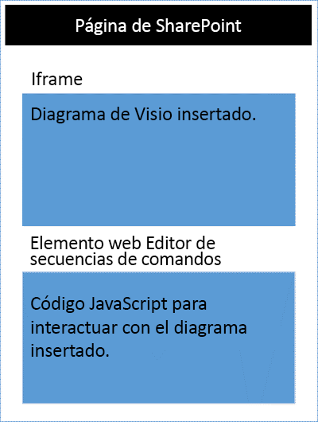

# <a name="visio-javascript-apis-reference"></a>Referencia de las API de JavaScript para Visio

Puede utilizar las API de JavaScript Visio para incrustar los diagramas de Visio en SharePoint Online. Un diagrama de Visio incrustado es un diagrama que se almacena en una biblioteca de documentos de SharePoint y que se muestra en una página de SharePoint. Para incrustar un diagrama de Visio, visualícelo en un elemento HTML &lt;iframe&gt;. A continuación, puede utilizar las API de JavaScript de Visio para trabajar mediante programación con el diagrama incrustado.



Puede utilizar las API de JavaScript para Visio para:

* Interactuar con elementos del diagrama de Visio como páginas y formas 
* Crear un marcado visual en el lienzo del diagrama de Visio 
* Escribir controladores personalizados para los eventos del mouse dentro del dibujo 
* Exponer los datos del diagrama, como texto de forma, datos de forma e hipervínculos, a su solución.

En este artículo se describe cómo usar las API de JavaScript para Visio con Visio Online para crear sus soluciones para SharePoint Online. Es una introducción a conceptos clave que son fundamentales para usar las API, como **EmbeddedSession**, **RequestContext** y objetos proxy de JavaScript, y los métodos **sync()**, **Visio.run()** y **load()**. Los ejemplos de código muestran cómo aplicar estos conceptos.

## <a name="embeddedsession"></a>EmbeddedSession

El objeto EmbeddedSession inicializa la comunicación entre el marco del desarrollador y el marco de Visio Online.

```js
       var session = new OfficeExtension.EmbeddedSession(url, { id: "embed-iframe",container: document.getElementById("iframeHost") });
       session.init().then(function () {     
              OfficeExtension.ClientRequestContext._overrideSession = session;
       });
```

## <a name="requestcontext"></a>RequestContext

El objeto RequestContext facilita las solicitudes para la aplicación de Visio. Debido a que el marco de desarrollador y la aplicación de Visio Online se ejecutan en dos iframes diferentes, el contexto de la solicitud es necesario para obtener acceso a Visio y a los objetos relacionados, como páginas y formas, desde el marco del desarrollador. En el siguiente ejemplo se muestra cómo crear un contexto de solicitud.

```js
var ctx = new Visio.RequestContext();
```

## <a name="proxy-objects"></a>Objetos proxy

Los objetos de JavaScript de Visio declarados y usados en un complemento son objetos proxy para los objetos reales de un documento de Visio. Las acciones llevadas a cabo en los objetos proxy no se realizan en Visio y el estado del documento de Visio no se realiza en los objetos proxy mientras no se sincronice el estado del documento. El estado del documento se sincroniza cuando se ejecuta ```context.sync()```.

Por ejemplo, el objeto de JavaScript local getActivePage se declara para que haga referencia a la página seleccionada. Esto puede usarse para poner en cola la configuración de sus propiedades y métodos de invocación. Las acciones en dichos objetos no se realizan hasta que se ejecuta el método sync().

```js
var activePage = ctx.document.getActivePage();
```

## <a name="sync"></a>sync()

El método **sync()**, disponible en el contexto de solicitud, sincroniza el estado entre los objetos proxy de JavaScript y los objetos reales de Visio. Para ello, ejecuta las instrucciones situadas en la cola en el contexto y recupera las propiedades de los objetos de Office cargados para usarlos en el código. Este método devuelve una promesa, que se resuelve cuando se completa la sincronización. 

## <a name="visiorunfunctioncontext--batch-"></a>Visio.run(function(context) { batch })

**Visio.run()** ejecuta un script por lotes que realiza acciones en el modelo de objetos de Visio. Los comandos por lotes incluyen definiciones de objetos proxy locales de JavaScript y métodos **sync()** que sincronizan el estado entre los objetos locales y de Visio y la resolución de la promesa. La ventaja de procesamiento por lotes de las solicitudes en **Visio.run()** es que, cuando se resuelve la promesa, los objetos de la página de los que se realiza el seguimiento y que se asignaron durante la ejecución se liberarán automáticamente. El método de ejecución toma RequestContext y devuelve una promesa que, normalmente, solo es el resultado de **ctx.sync()**. Es posible ejecutar la operación por lotes fuera de **Visio.run()**. Sin embargo, en este caso, todas las referencias a objetos de página deben seguirse y administrarse manualmente. 

## <a name="load"></a>load()

El método **load()** se usa para rellenar los objetos proxy creados en la capa de JavaScript del complemento. Al intentar recuperar un objeto, como un documento, se crea en primer lugar un objeto proxy local en la capa de JavaScript. Dicho objeto puede usarse para poner en cola la configuración de sus propiedades y métodos de invocación. Sin embargo, para leer las propiedades o las relaciones de los objetos, deben invocarse primero los métodos **load()** y **sync()**. El método load() toma las propiedades y las relaciones que necesitan cargarse cuando se llama al método**sync()**.

A continuación, se muestra la sintaxis para el método **load()**.

```js
object.load(string: properties); //or object.load(array: properties); //or object.load({loadOption});
```

1. **propiedades** es la lista de propiedades o nombres de relaciones que se van a cargar, especificados como cadenas delimitadas por comas o como una matriz de nombres. Consulte los métodos **.load()** de cada objeto para obtener más detalles.
2. **loadOption** especifica un objeto que describe las opciones Selection, Expansion, Top y Skip. Consulte las [opciones](loadoption) de carga de objetos para obtener más detalles.

## <a name="example-printing-all-shapes-text-in-active-page"></a>Ejemplo: Impresión de todas las formas de texto en la página activa

En el ejemplo siguiente se muestra cómo imprimir el valor de texto de forma de un objeto de formas de matriz. El método **Visio.run()** contiene un lote de instrucciones. Como parte de este lote, se crea un objeto proxy que hace referencia a formas del documento activo. Todos estos comandos se ponen en cola y se ejecutan cuando se llama a **ctx.sync()**. El método **sync()** devuelve una promesa que puede usarse para encadenarla con otras operaciones.

```js
Visio.run(function (ctx) {
   var page = ctx.document.getActivePage();
   var shapes = page.shapes;
   shapes.load();
   return ctx.sync().then(function () {
        for(var i=0; i<shapes.items.length;i++)
 {
            var shape = shapes.items[i];
     console.log("Shape Text: " + shape.text );
 }
});
}).catch(function(error) {
  richApiLog("Error: " + error);
  if (error instanceof OfficeExtension.Error) {
       console.log ("Debug info: " + JSON.stringify(error.debugInfo));
  }
});
```

## <a name="error-messages"></a>Mensajes de error

Los errores se devuelven usando un objeto de error que consta de un código y un mensaje. En la siguiente tabla se proporciona una lista de las posibles condiciones de error que pueden producirse.

| error.code            | error.message |
|-----------------------|----------------------------------------------------------------|
|  InvalidArgument      | El argumento no es válido, o falta o tiene un formato incorrecto. |
| GeneralException      | Se produjo un error interno al procesar la solicitud. |
| NotImplemented        | La característica solicitada no se implementó.  |
| UnsupportedOperation  | No se admite la operación que se está intentando. |
| AccessDenied          | No se puede realizar la operación solicitada. |
| ItemNotFound          | El recurso solicitado no existe. |

## <a name="get-started"></a>Introducción

Puede utilizar el ejemplo de esta sección para empezar. En este ejemplo se muestra cómo visualizar el texto de la forma de la forma seleccionada. Para empezar, cree una página en SharePoint Online o edite una página existente. Agregue un elemento web editor de scripts en la página y copie y pegue el código siguiente. Después, lo único que necesita es agregar la URL de un diagrama de Visio que esté almacenada en SharePoint Online.

```js
<script src='https://visioonlineapi.azurewebsites.net/visio.js' type='text/javascript'></script>

Enter Visio File Url:<br/>
<script language="javascript">
document.write("<input type='text' id='fileUrl' size='120'/>");
document.write("<input type='button' value='InitEmbeddedFrame' onclick='initEmbeddedFrame()' />");
document.write("<br />");
document.write("<input type='button' value='SelectedShapeText' onclick='getSelectedShapeText()' />");
document.write("<textarea id='ResultOutput' style='width:350px;height:60px'> </textarea>");
document.write("<div id='iframeHost' />");

var textArea;
// Loads the Visio application and Initializes communication between devloper frame and Visio online frame
function initEmbeddedFrame() {
        textArea = document.getElementById('ResultOutput');
    var url = document.getElementById('fileUrl').value;
    if (!url) {
        window.alert("File URL should not be empty");
    }
    // APIs are enabled for EmbedView action only.   
    url = url.replace("action=view","action=embedview");
    url = url.replace("action=interactivepreview","action=embedview");
  
       var session = new OfficeExtension.EmbeddedSession(url, { id: "embed-iframe",container: document.getElementById("iframeHost") });
       return session.init().then(function () {
        // Initilization is successful 
        textArea.value  = "Initilization is successful";
        OfficeExtension.ClientRequestContext._overrideSession = session;
    });
     }

// Code for getting selected Shape Text using the shapes collection object
function getSelectedShapeText() {
    Visio.run(function (ctx) {     
       var page = ctx.document.getActivePage();
        var shapes = page.shapes;
          shapes.load();
           return ctx.sync().then(function () {
                textArea.value = "Please select a Shape in the Diagram";
                for(var i=0; i<shapes.items.length;i++)
            {
               var shape = shapes.items[i];
                   if ( shape.select == true)
                  {
                   textArea.value = shape.text;
                    return;
                   }
            }
      });
     }).catch(function(error) {
        textArea.value = "Error: ";
        if (error instanceof OfficeExtension.Error) {
            textArea.value += "Debug info: " + JSON.stringify(error.debugInfo);
        }
    });
}
</script>
```

## <a name="open-api-specifications"></a>Especificaciones de la API pública

Cuando diseñemos y desarrollemos nuevas API, estarán disponibles y nos podrá enviar sus comentarios en la página [Especificaciones de la API abierta](https://dev.office.com/reference/add-ins/openspec). Descubra las nuevas características que están en proceso y envíe sus comentarios sobre nuestras especificaciones de diseño. 
