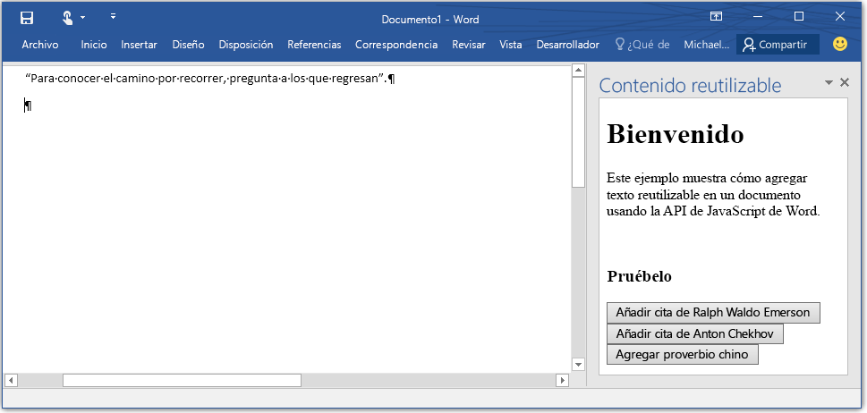

# Complementos de Word

_Se aplica a: Word 2016, Word para iPad, Word para Mac_

Bienvenido a la documentación de la API de JavaScript de complementos de Word. La API de JavaScript de Word forma parte del modelo de programación de complementos de Office para extender las aplicaciones de Microsoft Office. El modelo de programación de complementos usa aplicaciones web para hospedar la extensión en Word. Ahora puede ampliar Word con cualquier plataforma web o con el lenguaje que prefiera. 

## Introducción a la API

Antes de ver en detalle la API de JavaScript para Word, es importante saber que este nuevo modelo de objetos de complemento de Word es diferente del modelo para Word en Office 2013. El modelo de complemento de Office 2013 no tenía tipo y proporcionaba una API genérica para ampliar los clientes de Office. Aunque el modelo anterior todavía es aplicable a Word 2016, le sugerimos que empiece a usar el nuevo modelo de objetos de Word. Le aconsejamos que lea la [introducción a la plataforma](https://msdn.microsoft.com/EN-US/library/office/jj220082.aspx) si no está familiarizado con la plataforma de complementos. 

Las nuevas API de JavaScript para Word cambian la forma en que se puede interactuar con objetos como documentos y párrafos. En lugar de proporcionar API asincrónicas individuales para recuperar y actualizar cada uno de estos objetos, las nuevas API proporcionan objetos "proxy" de JavaScript que corresponden a los objetos reales que se ejecutan en Word.  Puede interactuar directamente con estos objetos proxy leyendo y escribiendo sus propiedades de forma sincrónica y llamando a métodos sincrónicos para realizar operaciones en ellos.  Estas interacciones con objetos proxy no se realizan inmediatamente en el script que se está ejecutando, por lo que proporcionamos un método en el contexto denominado **sync()**. El método context.sync sincroniza el estado entre el JavaScript que se está ejecutando y los objetos reales de Office. Para ello, ejecuta las instrucciones situadas en la cola del script y recupera las propiedades de los objetos de Word cargados para usarlos en el script.  

## Crear el primer complemento de Word

Un complemento de Word se ejecuta en Word y puede interactuar con el contenido del documento usando las nuevas API de JavaScript de Word disponibles en Word 2016. Internamente, la creación de un complemento consta de dos partes: 1) una aplicación web que puede hospedar en cualquier lugar y 2) el [manifiesto del complemento](https://msdn.microsoft.com/EN-US/library/office/fp161044.aspx) que Word usa para descubrir dónde se hospeda la aplicación web (el manifiesto proporciona mucho más, descúbralo en la [información de programación](word-add-ins-programming-guide.md)).

&gt;**Complemento de Word = manifest.xml + aplicación web**

### Configúrelo
En esta sección va a crear una sencilla aplicación web y el manifiesto de aplicación. La aplicación web le permitirá agregar texto reutilizable en el documento de Word. 

1- Cree una carpeta en la unidad local denominada BoilerplateAddin (por ejemplo, C:\\BoilerplateAddin). Guarde en esta carpeta todos los archivos creados en los pasos siguientes.

2- Cree un archivo llamado home.html para la vista del complemento. El complemento tendrá tres botones que, cuando se seleccionen, agregarán texto reutilizable. Pegue el código siguiente en home.html.

```html
    <!DOCTYPE html>
    <html>
      <head>
        <meta charset="UTF-8" />
        <meta http-equiv="X-UA-Compatible" content="IE=Edge" />
        <title>Boilerplate text app</title>    
        <script src="https://ajax.aspnetcdn.com/ajax/jQuery/jquery-2.1.4.min.js"></script>
        <script src="https://appsforoffice.microsoft.com/lib/1/hosted/office.js" type="text/javascript"></script>
        <script src="home.js" type="text/javascript"></script>
        </head>
        <body>
            <div>
                    <h1>Welcome</h1>
            </div>
            <div>
                    <p>This sample shows how to add boilerplate text to a document by using the Word JavaScript API.</p>
                    <br />
                    <h3>Try it out</h3>
                    <button id="emerson">Add quote from Ralph Waldo Emerson</button>
                    <button id="checkhov">Add quote from Anton Chekhov</button>
                    <button id="proverb">Add Chinese proverb</button>
            </div>
            <h3><div id="supportedVersion"/></h3>
        </body>
    </html>
```

3- Cree un archivo denominado home.js y pegue el código siguiente en el archivo. Contiene código de inicialización y todo el código del complemento para realizar cambios en el documento de Word. Este código inserta texto basándose en el cursor o en la selección del documento de Word. 

```javascript
    (function () {
        "use strict";

        // The initialize function is run each time the page is loaded.
        Office.initialize = function (reason) {
            $(document).ready(function () {
                
                // Use this to check whether the API is supported in the Word client.
                if (Office.context.requirements.isSetSupported('WordApi', 1.1)) {
                    // Do something that is only available via the new APIs
                    $('#emerson').click(insertEmersonQuoteAtSelection);
                    $('#checkhov').click(insertChekhovQuoteAtTheBeginning);
                    $('#proverb').click(insertChineseProverbAtTheEnd);
                    $('#supportedVersion').html('This code is using Word 2016 or greater.');
                }
                else {
                    // Just letting you know that this code will not work with your version of Word.
                    $('#supportedVersion').html('This code requires Word 2016 or greater.');
                }    
            });
        };

        function insertEmersonQuoteAtSelection() {
            Word.run(function (context) {

                // Create a proxy object for the document.
                var thisDocument = context.document;

                // Queue a command to get the current selection. 
                // Create a proxy range object for the selection.
                var range = thisDocument.getSelection();

                // Queue a command to replace the selected text.
                range.insertText('"Hitch your wagon to a star."\n', Word.InsertLocation.replace);

                // Synchronize the document state by executing the queued commands, 
                // and return a promise to indicate task completion.
                return context.sync().then(function () {
                    console.log('Added a quote from Ralph Waldo Emerson.');
                });  
            })
            .catch(function (error) {
                console.log('Error: ' + JSON.stringify(error));
                if (error instanceof OfficeExtension.Error) {
                    console.log('Debug info: ' + JSON.stringify(error.debugInfo));
                }
            });
        }

        function insertChekhovQuoteAtTheBeginning() {
            Word.run(function (context) {

                // Create a proxy object for the document body.
                var body = context.document.body;

                // Queue a command to insert text at the start of the document body.
                body.insertText('"Knowledge is of no value unless you put it into practice."\n', Word.InsertLocation.start);

                // Synchronize the document state by executing the queued commands, 
                // and return a promise to indicate task completion.
                return context.sync().then(function () {
                    console.log('Added a quote from Anton Chekhov.');
                });  
            })
            .catch(function (error) {
                console.log('Error: ' + JSON.stringify(error));
                if (error instanceof OfficeExtension.Error) {
                    console.log('Debug info: ' + JSON.stringify(error.debugInfo));
                }
            });
        }    

        function insertChineseProverbAtTheEnd() {
            Word.run(function (context) {

                // Create a proxy object for the document body.
                var body = context.document.body;

                // Queue a command to insert text at the end of the document body.
                body.insertText('"To know the road ahead, ask those coming back."\n', Word.InsertLocation.end);

                // Synchronize the document state by executing the queued commands, 
                // and return a promise to indicate task completion.
                return context.sync().then(function () {
                    console.log('Added a quote from a Chinese proverb.');
                });  
            })
            .catch(function (error) {
                console.log('Error: ' + JSON.stringify(error));
                if (error instanceof OfficeExtension.Error) {
                    console.log('Debug info: ' + JSON.stringify(error.debugInfo));
                }
            });
        }    
    })();
```

4- Cree un archivo XML denominado BoilerplateManifest.xml y pegue el código siguiente en el archivo. Este es el archivo de manifiesto que Word usa para descubrir información sobre un complemento, como su ubicación o su nombre para mostrar.
```xml
<?xml version="1.0" encoding="UTF-8"?>
    <OfficeApp xmlns="http://schemas.microsoft.com/office/appforoffice/1.1" 
               xmlns:xsi="http://www.w3.org/2001/XMLSchema-instance" 
               xsi:type="TaskPaneApp">
        <Id>2b88100c-656e-4bab-9f1e-f6731d86e464</Id>
        <Version>1.0.0.0</Version>
        <ProviderName>Microsoft</ProviderName>
        <DefaultLocale>en-US</DefaultLocale>
        <DisplayName DefaultValue="Boilerplate content" />
        <Description DefaultValue="Insert boilerplate content into a Word document." />
        <Hosts>
            <Host Name="Document"/>
        </Hosts>
        <DefaultSettings>
            <SourceLocation DefaultValue="\\MyShare\boilerplate\home.html" />
        </DefaultSettings>
        <Permissions>ReadWriteDocument</Permissions>
    </OfficeApp>
```

5- Genere un GUID y reemplace el valor del elemento <code>OfficeApp/Id</code> con su GUID.

6- Guarde todos los archivos. Acaba de escribir su primer complemento de Word. 

7- Cree una carpeta de red (por ejemplo, \\\MyShare\boilerplate) o [comparta una carpeta en la red](https://technet.microsoft.com/es-es/library/cc770880.aspx), y copie home.js, home.html y BoilerplateManifest.xml en esa ubicación.

8- Edite el elemento <code>SourceLocation</code> de BoilerplateManifest.xml para que apunte a la ubicación de home.html. 

En este punto, tiene implementado su primer complemento. Ahora debe indicarle a Word dónde encontrar el complemento.

1. Inicie Word y abra un documento.
2. Seleccione la pestaña **Archivo** y haga clic en **Opciones**.
3. Haga clic en **Centro de confianza** y seleccione el botón **Configuración del Centro de confianza**.
4. Seleccione **Catálogos de complementos de confianza**.
5. En el cuadro **URL de catálogo**, escriba la ruta de acceso al recurso compartido de carpeta que contiene BoilerplateManifest.xml y elija **Agregar catálogo**.
6. Active la casilla **Mostrar en menú** y haga clic en **Aceptar**.
7. Aparecerá un mensaje para informarle de que la configuración se aplicará la próxima vez que inicie Office. Cierre y vuelva a iniciar Word. 

### Pruébelo

Ahora puede ejecutar el complemento que creó. Siga estos pasos para verlo en acción:

1. Abra un documento de Word. 
2. En la pestaña **Insertar** de Word 2016, elija **Mis complementos**. 
3. Seleccione la pestaña **Carpeta compartida**.
4. Elija **Contenido reutilizable** y seleccione **Insertar**.
5. El complemento se cargará en un panel de tareas. Consulte la figura 1 para ver el aspecto que tendrá cuando se cargue.
6. Seleccione los botones para que el texto reutilizable se introduzca en el documento de Word.


**Figura 1. Complemento de contenido reutilizable cargado en Word**


## Obtener más información

Obtenga más información sobre cómo extender Word en la [Guía de programación de complementos de Word](word-add-ins-programming-guide.md). Lea la [Referencia de JavaScript de complementos de Word](word-add-ins-javascript-reference.md) para obtener información sobre los objetos a los que puede acceder.

## Denos su opinión

Su opinión es importante para nosotros. 

* Consulte los documentos y háganos saber todas las preguntas y las dificultades que le planteen [enviando un problema](https://github.com/OfficeDev/office-js-docs/issues) directamente en este repositorio.
* Infórmenos sobre su experiencia de programación, lo que le gustaría ver en versiones futuras, ejemplos de código, etc. Use [este sitio](http://officespdev.uservoice.com/) para enviar sus sugerencias e ideas.

## Recursos adicionales

* [Complementos de Office](https://msdn.microsoft.com/en-us/library/office/jj220060.aspx)
* [Introducción a los complementos de Office](http://dev.office.com/getting-started/addins)
* &lt;a herf="https://github.com/OfficeDev?utf8=%E2%9C%93&amp;query=Word"&gt;Complementos de Word en GitHub&lt;/a&gt;
